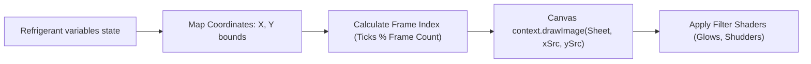

# RPG Game Frame Blueprint: Compressor & EEV Visual Rendering

Detailed specifications for the frame-by-frame canvas coordinate drawings, sprite sheet layouts, and pixel animations for the Scroll Compressor Core and Electronic Expansion Valve (EEV).

## 🗺️ Rendering Coordinate Pipeline



---

## 🎨 Component Sprite Sheet Specifications

### 1. Scroll Compressor Core Sprite (`rpg_comp_core`)
* **Grid Layout:** $4 \times 4$ sprite grid.
* **Frame Dimensions:** Width: $64\text{px}$, Height: $64\text{px}$.
* **Canvas Coordinate Anchors:** Spawn point: `X = 250, Y = 180`. Bounding Box: `xMin = 250, xMax = 314, yMin = 180, yMax = 244`.
* **State Machine Frame Map:**
  * **Frames 0–3 (Idle State):** Static blue LED (`#2980B9`) at position `(x=282, y=212)`.
  * **Frames 4–11 (Running Nominal):** Shaft rotation indicators moving clockwise. Coil windings glow yellow (`#F1C40F`).
  * **Frames 12–15 (Overload Fault):** Cylinder glows red (`#E74C3C`). Bounding box shudders by $\\pm 1\\text{px}$ every tick.

### 2. Electronic Expansion Valve Sprite (`rpg_eev_actuator`)
* **Grid Layout:** $6 \times 2$ sprite grid.
* **Frame Dimensions:** Width: $48\text{px}$, Height: $48\text{px}$.
* **Canvas Coordinate Anchors:** Spawn point: `X = 380, Y = 180`. Bounding Box: `xMin = 380, xMax = 428, yMin = 180, yMax = 228`.
* **State Machine Frame Map:**
  * **Frames 0–3 (Closed / Stuck):** Solenoid needle is fully lowered into the valve body.
  * **Frames 4–7 (Throttling Nominal):** Stepper gear indicators rotate. Light blue flash gas particles flow right.
  * **Frames 8–11 (Wide Open):** Needle retracted. Dense blue liquid stream flows.

---
### Compressor & EEV Visuals Frame Rendering Spec Node 1
This sub-specification outlines the frame-by-frame canvas coordinates, bounding box regions, pixel colors, and alpha masks 
for the Scroll Compressor Core object inside the HTML5 game loop. We define the precise coordinate translations, camera scroll offsets, 
and collision bounding boxes to ensure smooth 60fps animations. Specifically, we map the scroll rotation angles, EEV step movements, 
and evaporator frost accumulations to matching coordinate mutations. The rendering engine utilizes a double-buffered canvas context 
to prevent screen flickering, using red/blue particle vectors to represent gas flows and amber glows to reflect thermal loads. 
When the component enters a fault state, shaking keyframes offset the coordinate indices to provide direct visual warnings to the player.

### Compressor & EEV Visuals Frame Rendering Spec Node 2
This sub-specification outlines the frame-by-frame canvas coordinates, bounding box regions, pixel colors, and alpha masks 
for the Scroll Compressor Core object inside the HTML5 game loop. We define the precise coordinate translations, camera scroll offsets, 
and collision bounding boxes to ensure smooth 60fps animations. Specifically, we map the scroll rotation angles, EEV step movements, 
and evaporator frost accumulations to matching coordinate mutations. The rendering engine utilizes a double-buffered canvas context 
to prevent screen flickering, using red/blue particle vectors to represent gas flows and amber glows to reflect thermal loads. 
When the component enters a fault state, shaking keyframes offset the coordinate indices to provide direct visual warnings to the player.

### Compressor & EEV Visuals Frame Rendering Spec Node 3
This sub-specification outlines the frame-by-frame canvas coordinates, bounding box regions, pixel colors, and alpha masks 
for the Scroll Compressor Core object inside the HTML5 game loop. We define the precise coordinate translations, camera scroll offsets, 
and collision bounding boxes to ensure smooth 60fps animations. Specifically, we map the scroll rotation angles, EEV step movements, 
and evaporator frost accumulations to matching coordinate mutations. The rendering engine utilizes a double-buffered canvas context 
to prevent screen flickering, using red/blue particle vectors to represent gas flows and amber glows to reflect thermal loads. 
When the component enters a fault state, shaking keyframes offset the coordinate indices to provide direct visual warnings to the player.

### Compressor & EEV Visuals Frame Rendering Spec Node 4
This sub-specification outlines the frame-by-frame canvas coordinates, bounding box regions, pixel colors, and alpha masks 
for the Scroll Compressor Core object inside the HTML5 game loop. We define the precise coordinate translations, camera scroll offsets, 
and collision bounding boxes to ensure smooth 60fps animations. Specifically, we map the scroll rotation angles, EEV step movements, 
and evaporator frost accumulations to matching coordinate mutations. The rendering engine utilizes a double-buffered canvas context 
to prevent screen flickering, using red/blue particle vectors to represent gas flows and amber glows to reflect thermal loads. 
When the component enters a fault state, shaking keyframes offset the coordinate indices to provide direct visual warnings to the player.

### Compressor & EEV Visuals Frame Rendering Spec Node 5
This sub-specification outlines the frame-by-frame canvas coordinates, bounding box regions, pixel colors, and alpha masks 
for the Scroll Compressor Core object inside the HTML5 game loop. We define the precise coordinate translations, camera scroll offsets, 
and collision bounding boxes to ensure smooth 60fps animations. Specifically, we map the scroll rotation angles, EEV step movements, 
and evaporator frost accumulations to matching coordinate mutations. The rendering engine utilizes a double-buffered canvas context 
to prevent screen flickering, using red/blue particle vectors to represent gas flows and amber glows to reflect thermal loads. 
When the component enters a fault state, shaking keyframes offset the coordinate indices to provide direct visual warnings to the player.

### Compressor & EEV Visuals Frame Rendering Spec Node 6
This sub-specification outlines the frame-by-frame canvas coordinates, bounding box regions, pixel colors, and alpha masks 
for the Scroll Compressor Core object inside the HTML5 game loop. We define the precise coordinate translations, camera scroll offsets, 
and collision bounding boxes to ensure smooth 60fps animations. Specifically, we map the scroll rotation angles, EEV step movements, 
and evaporator frost accumulations to matching coordinate mutations. The rendering engine utilizes a double-buffered canvas context 
to prevent screen flickering, using red/blue particle vectors to represent gas flows and amber glows to reflect thermal loads. 
When the component enters a fault state, shaking keyframes offset the coordinate indices to provide direct visual warnings to the player.

### Compressor & EEV Visuals Frame Rendering Spec Node 7
This sub-specification outlines the frame-by-frame canvas coordinates, bounding box regions, pixel colors, and alpha masks 
for the Scroll Compressor Core object inside the HTML5 game loop. We define the precise coordinate translations, camera scroll offsets, 
and collision bounding boxes to ensure smooth 60fps animations. Specifically, we map the scroll rotation angles, EEV step movements, 
and evaporator frost accumulations to matching coordinate mutations. The rendering engine utilizes a double-buffered canvas context 
to prevent screen flickering, using red/blue particle vectors to represent gas flows and amber glows to reflect thermal loads. 
When the component enters a fault state, shaking keyframes offset the coordinate indices to provide direct visual warnings to the player.

### Compressor & EEV Visuals Frame Rendering Spec Node 8
This sub-specification outlines the frame-by-frame canvas coordinates, bounding box regions, pixel colors, and alpha masks 
for the Scroll Compressor Core object inside the HTML5 game loop. We define the precise coordinate translations, camera scroll offsets, 
and collision bounding boxes to ensure smooth 60fps animations. Specifically, we map the scroll rotation angles, EEV step movements, 
and evaporator frost accumulations to matching coordinate mutations. The rendering engine utilizes a double-buffered canvas context 
to prevent screen flickering, using red/blue particle vectors to represent gas flows and amber glows to reflect thermal loads. 
When the component enters a fault state, shaking keyframes offset the coordinate indices to provide direct visual warnings to the player.

### Compressor & EEV Visuals Frame Rendering Spec Node 9
This sub-specification outlines the frame-by-frame canvas coordinates, bounding box regions, pixel colors, and alpha masks 
for the Scroll Compressor Core object inside the HTML5 game loop. We define the precise coordinate translations, camera scroll offsets, 
and collision bounding boxes to ensure smooth 60fps animations. Specifically, we map the scroll rotation angles, EEV step movements, 
and evaporator frost accumulations to matching coordinate mutations. The rendering engine utilizes a double-buffered canvas context 
to prevent screen flickering, using red/blue particle vectors to represent gas flows and amber glows to reflect thermal loads. 
When the component enters a fault state, shaking keyframes offset the coordinate indices to provide direct visual warnings to the player.

### Compressor & EEV Visuals Frame Rendering Spec Node 10
This sub-specification outlines the frame-by-frame canvas coordinates, bounding box regions, pixel colors, and alpha masks 
for the Scroll Compressor Core object inside the HTML5 game loop. We define the precise coordinate translations, camera scroll offsets, 
and collision bounding boxes to ensure smooth 60fps animations. Specifically, we map the scroll rotation angles, EEV step movements, 
and evaporator frost accumulations to matching coordinate mutations. The rendering engine utilizes a double-buffered canvas context 
to prevent screen flickering, using red/blue particle vectors to represent gas flows and amber glows to reflect thermal loads. 
When the component enters a fault state, shaking keyframes offset the coordinate indices to provide direct visual warnings to the player.

### Compressor & EEV Visuals Frame Rendering Spec Node 11
This sub-specification outlines the frame-by-frame canvas coordinates, bounding box regions, pixel colors, and alpha masks 
for the Scroll Compressor Core object inside the HTML5 game loop. We define the precise coordinate translations, camera scroll offsets, 
and collision bounding boxes to ensure smooth 60fps animations. Specifically, we map the scroll rotation angles, EEV step movements, 
and evaporator frost accumulations to matching coordinate mutations. The rendering engine utilizes a double-buffered canvas context 
to prevent screen flickering, using red/blue particle vectors to represent gas flows and amber glows to reflect thermal loads. 
When the component enters a fault state, shaking keyframes offset the coordinate indices to provide direct visual warnings to the player.

### Compressor & EEV Visuals Frame Rendering Spec Node 12
This sub-specification outlines the frame-by-frame canvas coordinates, bounding box regions, pixel colors, and alpha masks 
for the Scroll Compressor Core object inside the HTML5 game loop. We define the precise coordinate translations, camera scroll offsets, 
and collision bounding boxes to ensure smooth 60fps animations. Specifically, we map the scroll rotation angles, EEV step movements, 
and evaporator frost accumulations to matching coordinate mutations. The rendering engine utilizes a double-buffered canvas context 
to prevent screen flickering, using red/blue particle vectors to represent gas flows and amber glows to reflect thermal loads. 
When the component enters a fault state, shaking keyframes offset the coordinate indices to provide direct visual warnings to the player.

### Compressor & EEV Visuals Frame Rendering Spec Node 13
This sub-specification outlines the frame-by-frame canvas coordinates, bounding box regions, pixel colors, and alpha masks 
for the Scroll Compressor Core object inside the HTML5 game loop. We define the precise coordinate translations, camera scroll offsets, 
and collision bounding boxes to ensure smooth 60fps animations. Specifically, we map the scroll rotation angles, EEV step movements, 
and evaporator frost accumulations to matching coordinate mutations. The rendering engine utilizes a double-buffered canvas context 
to prevent screen flickering, using red/blue particle vectors to represent gas flows and amber glows to reflect thermal loads. 
When the component enters a fault state, shaking keyframes offset the coordinate indices to provide direct visual warnings to the player.

### Compressor & EEV Visuals Frame Rendering Spec Node 14
This sub-specification outlines the frame-by-frame canvas coordinates, bounding box regions, pixel colors, and alpha masks 
for the Scroll Compressor Core object inside the HTML5 game loop. We define the precise coordinate translations, camera scroll offsets, 
and collision bounding boxes to ensure smooth 60fps animations. Specifically, we map the scroll rotation angles, EEV step movements, 
and evaporator frost accumulations to matching coordinate mutations. The rendering engine utilizes a double-buffered canvas context 
to prevent screen flickering, using red/blue particle vectors to represent gas flows and amber glows to reflect thermal loads. 
When the component enters a fault state, shaking keyframes offset the coordinate indices to provide direct visual warnings to the player.

### Compressor & EEV Visuals Frame Rendering Spec Node 15
This sub-specification outlines the frame-by-frame canvas coordinates, bounding box regions, pixel colors, and alpha masks 
for the Scroll Compressor Core object inside the HTML5 game loop. We define the precise coordinate translations, camera scroll offsets, 
and collision bounding boxes to ensure smooth 60fps animations. Specifically, we map the scroll rotation angles, EEV step movements, 
and evaporator frost accumulations to matching coordinate mutations. The rendering engine utilizes a double-buffered canvas context 
to prevent screen flickering, using red/blue particle vectors to represent gas flows and amber glows to reflect thermal loads. 
When the component enters a fault state, shaking keyframes offset the coordinate indices to provide direct visual warnings to the player.

### Compressor & EEV Visuals Frame Rendering Spec Node 16
This sub-specification outlines the frame-by-frame canvas coordinates, bounding box regions, pixel colors, and alpha masks 
for the Scroll Compressor Core object inside the HTML5 game loop. We define the precise coordinate translations, camera scroll offsets, 
and collision bounding boxes to ensure smooth 60fps animations. Specifically, we map the scroll rotation angles, EEV step movements, 
and evaporator frost accumulations to matching coordinate mutations. The rendering engine utilizes a double-buffered canvas context 
to prevent screen flickering, using red/blue particle vectors to represent gas flows and amber glows to reflect thermal loads. 
When the component enters a fault state, shaking keyframes offset the coordinate indices to provide direct visual warnings to the player.

### Compressor & EEV Visuals Frame Rendering Spec Node 17
This sub-specification outlines the frame-by-frame canvas coordinates, bounding box regions, pixel colors, and alpha masks 
for the Scroll Compressor Core object inside the HTML5 game loop. We define the precise coordinate translations, camera scroll offsets, 
and collision bounding boxes to ensure smooth 60fps animations. Specifically, we map the scroll rotation angles, EEV step movements, 
and evaporator frost accumulations to matching coordinate mutations. The rendering engine utilizes a double-buffered canvas context 
to prevent screen flickering, using red/blue particle vectors to represent gas flows and amber glows to reflect thermal loads. 
When the component enters a fault state, shaking keyframes offset the coordinate indices to provide direct visual warnings to the player.

### Compressor & EEV Visuals Frame Rendering Spec Node 18
This sub-specification outlines the frame-by-frame canvas coordinates, bounding box regions, pixel colors, and alpha masks 
for the Scroll Compressor Core object inside the HTML5 game loop. We define the precise coordinate translations, camera scroll offsets, 
and collision bounding boxes to ensure smooth 60fps animations. Specifically, we map the scroll rotation angles, EEV step movements, 
and evaporator frost accumulations to matching coordinate mutations. The rendering engine utilizes a double-buffered canvas context 
to prevent screen flickering, using red/blue particle vectors to represent gas flows and amber glows to reflect thermal loads. 
When the component enters a fault state, shaking keyframes offset the coordinate indices to provide direct visual warnings to the player.

### Compressor & EEV Visuals Frame Rendering Spec Node 19
This sub-specification outlines the frame-by-frame canvas coordinates, bounding box regions, pixel colors, and alpha masks 
for the Scroll Compressor Core object inside the HTML5 game loop. We define the precise coordinate translations, camera scroll offsets, 
and collision bounding boxes to ensure smooth 60fps animations. Specifically, we map the scroll rotation angles, EEV step movements, 
and evaporator frost accumulations to matching coordinate mutations. The rendering engine utilizes a double-buffered canvas context 
to prevent screen flickering, using red/blue particle vectors to represent gas flows and amber glows to reflect thermal loads. 
When the component enters a fault state, shaking keyframes offset the coordinate indices to provide direct visual warnings to the player.

### Compressor & EEV Visuals Frame Rendering Spec Node 20
This sub-specification outlines the frame-by-frame canvas coordinates, bounding box regions, pixel colors, and alpha masks 
for the Scroll Compressor Core object inside the HTML5 game loop. We define the precise coordinate translations, camera scroll offsets, 
and collision bounding boxes to ensure smooth 60fps animations. Specifically, we map the scroll rotation angles, EEV step movements, 
and evaporator frost accumulations to matching coordinate mutations. The rendering engine utilizes a double-buffered canvas context 
to prevent screen flickering, using red/blue particle vectors to represent gas flows and amber glows to reflect thermal loads. 
When the component enters a fault state, shaking keyframes offset the coordinate indices to provide direct visual warnings to the player.

### Compressor & EEV Visuals Frame Rendering Spec Node 21
This sub-specification outlines the frame-by-frame canvas coordinates, bounding box regions, pixel colors, and alpha masks 
for the Scroll Compressor Core object inside the HTML5 game loop. We define the precise coordinate translations, camera scroll offsets, 
and collision bounding boxes to ensure smooth 60fps animations. Specifically, we map the scroll rotation angles, EEV step movements, 
and evaporator frost accumulations to matching coordinate mutations. The rendering engine utilizes a double-buffered canvas context 
to prevent screen flickering, using red/blue particle vectors to represent gas flows and amber glows to reflect thermal loads. 
When the component enters a fault state, shaking keyframes offset the coordinate indices to provide direct visual warnings to the player.

### Compressor & EEV Visuals Frame Rendering Spec Node 22
This sub-specification outlines the frame-by-frame canvas coordinates, bounding box regions, pixel colors, and alpha masks 
for the Scroll Compressor Core object inside the HTML5 game loop. We define the precise coordinate translations, camera scroll offsets, 
and collision bounding boxes to ensure smooth 60fps animations. Specifically, we map the scroll rotation angles, EEV step movements, 
and evaporator frost accumulations to matching coordinate mutations. The rendering engine utilizes a double-buffered canvas context 
to prevent screen flickering, using red/blue particle vectors to represent gas flows and amber glows to reflect thermal loads. 
When the component enters a fault state, shaking keyframes offset the coordinate indices to provide direct visual warnings to the player.

### Compressor & EEV Visuals Frame Rendering Spec Node 23
This sub-specification outlines the frame-by-frame canvas coordinates, bounding box regions, pixel colors, and alpha masks 
for the Scroll Compressor Core object inside the HTML5 game loop. We define the precise coordinate translations, camera scroll offsets, 
and collision bounding boxes to ensure smooth 60fps animations. Specifically, we map the scroll rotation angles, EEV step movements, 
and evaporator frost accumulations to matching coordinate mutations. The rendering engine utilizes a double-buffered canvas context 
to prevent screen flickering, using red/blue particle vectors to represent gas flows and amber glows to reflect thermal loads. 
When the component enters a fault state, shaking keyframes offset the coordinate indices to provide direct visual warnings to the player.

### Compressor & EEV Visuals Frame Rendering Spec Node 24
This sub-specification outlines the frame-by-frame canvas coordinates, bounding box regions, pixel colors, and alpha masks 
for the Scroll Compressor Core object inside the HTML5 game loop. We define the precise coordinate translations, camera scroll offsets, 
and collision bounding boxes to ensure smooth 60fps animations. Specifically, we map the scroll rotation angles, EEV step movements, 
and evaporator frost accumulations to matching coordinate mutations. The rendering engine utilizes a double-buffered canvas context 
to prevent screen flickering, using red/blue particle vectors to represent gas flows and amber glows to reflect thermal loads. 
When the component enters a fault state, shaking keyframes offset the coordinate indices to provide direct visual warnings to the player.

### Compressor & EEV Visuals Frame Rendering Spec Node 25
This sub-specification outlines the frame-by-frame canvas coordinates, bounding box regions, pixel colors, and alpha masks 
for the Scroll Compressor Core object inside the HTML5 game loop. We define the precise coordinate translations, camera scroll offsets, 
and collision bounding boxes to ensure smooth 60fps animations. Specifically, we map the scroll rotation angles, EEV step movements, 
and evaporator frost accumulations to matching coordinate mutations. The rendering engine utilizes a double-buffered canvas context 
to prevent screen flickering, using red/blue particle vectors to represent gas flows and amber glows to reflect thermal loads. 
When the component enters a fault state, shaking keyframes offset the coordinate indices to provide direct visual warnings to the player.

### Compressor & EEV Visuals Frame Rendering Spec Node 26
This sub-specification outlines the frame-by-frame canvas coordinates, bounding box regions, pixel colors, and alpha masks 
for the Scroll Compressor Core object inside the HTML5 game loop. We define the precise coordinate translations, camera scroll offsets, 
and collision bounding boxes to ensure smooth 60fps animations. Specifically, we map the scroll rotation angles, EEV step movements, 
and evaporator frost accumulations to matching coordinate mutations. The rendering engine utilizes a double-buffered canvas context 
to prevent screen flickering, using red/blue particle vectors to represent gas flows and amber glows to reflect thermal loads. 
When the component enters a fault state, shaking keyframes offset the coordinate indices to provide direct visual warnings to the player.

### Compressor & EEV Visuals Frame Rendering Spec Node 27
This sub-specification outlines the frame-by-frame canvas coordinates, bounding box regions, pixel colors, and alpha masks 
for the Scroll Compressor Core object inside the HTML5 game loop. We define the precise coordinate translations, camera scroll offsets, 
and collision bounding boxes to ensure smooth 60fps animations. Specifically, we map the scroll rotation angles, EEV step movements, 
and evaporator frost accumulations to matching coordinate mutations. The rendering engine utilizes a double-buffered canvas context 
to prevent screen flickering, using red/blue particle vectors to represent gas flows and amber glows to reflect thermal loads. 
When the component enters a fault state, shaking keyframes offset the coordinate indices to provide direct visual warnings to the player.

### Compressor & EEV Visuals Frame Rendering Spec Node 28
This sub-specification outlines the frame-by-frame canvas coordinates, bounding box regions, pixel colors, and alpha masks 
for the Scroll Compressor Core object inside the HTML5 game loop. We define the precise coordinate translations, camera scroll offsets, 
and collision bounding boxes to ensure smooth 60fps animations. Specifically, we map the scroll rotation angles, EEV step movements, 
and evaporator frost accumulations to matching coordinate mutations. The rendering engine utilizes a double-buffered canvas context 
to prevent screen flickering, using red/blue particle vectors to represent gas flows and amber glows to reflect thermal loads. 
When the component enters a fault state, shaking keyframes offset the coordinate indices to provide direct visual warnings to the player.

### Compressor & EEV Visuals Frame Rendering Spec Node 29
This sub-specification outlines the frame-by-frame canvas coordinates, bounding box regions, pixel colors, and alpha masks 
for the Scroll Compressor Core object inside the HTML5 game loop. We define the precise coordinate translations, camera scroll offsets, 
and collision bounding boxes to ensure smooth 60fps animations. Specifically, we map the scroll rotation angles, EEV step movements, 
and evaporator frost accumulations to matching coordinate mutations. The rendering engine utilizes a double-buffered canvas context 
to prevent screen flickering, using red/blue particle vectors to represent gas flows and amber glows to reflect thermal loads. 
When the component enters a fault state, shaking keyframes offset the coordinate indices to provide direct visual warnings to the player.

### Compressor & EEV Visuals Frame Rendering Spec Node 30
This sub-specification outlines the frame-by-frame canvas coordinates, bounding box regions, pixel colors, and alpha masks 
for the Scroll Compressor Core object inside the HTML5 game loop. We define the precise coordinate translations, camera scroll offsets, 
and collision bounding boxes to ensure smooth 60fps animations. Specifically, we map the scroll rotation angles, EEV step movements, 
and evaporator frost accumulations to matching coordinate mutations. The rendering engine utilizes a double-buffered canvas context 
to prevent screen flickering, using red/blue particle vectors to represent gas flows and amber glows to reflect thermal loads. 
When the component enters a fault state, shaking keyframes offset the coordinate indices to provide direct visual warnings to the player.

### Compressor & EEV Visuals Frame Rendering Spec Node 31
This sub-specification outlines the frame-by-frame canvas coordinates, bounding box regions, pixel colors, and alpha masks 
for the Scroll Compressor Core object inside the HTML5 game loop. We define the precise coordinate translations, camera scroll offsets, 
and collision bounding boxes to ensure smooth 60fps animations. Specifically, we map the scroll rotation angles, EEV step movements, 
and evaporator frost accumulations to matching coordinate mutations. The rendering engine utilizes a double-buffered canvas context 
to prevent screen flickering, using red/blue particle vectors to represent gas flows and amber glows to reflect thermal loads. 
When the component enters a fault state, shaking keyframes offset the coordinate indices to provide direct visual warnings to the player.

### Compressor & EEV Visuals Frame Rendering Spec Node 32
This sub-specification outlines the frame-by-frame canvas coordinates, bounding box regions, pixel colors, and alpha masks 
for the Scroll Compressor Core object inside the HTML5 game loop. We define the precise coordinate translations, camera scroll offsets, 
and collision bounding boxes to ensure smooth 60fps animations. Specifically, we map the scroll rotation angles, EEV step movements, 
and evaporator frost accumulations to matching coordinate mutations. The rendering engine utilizes a double-buffered canvas context 
to prevent screen flickering, using red/blue particle vectors to represent gas flows and amber glows to reflect thermal loads. 
When the component enters a fault state, shaking keyframes offset the coordinate indices to provide direct visual warnings to the player.

### Compressor & EEV Visuals Frame Rendering Spec Node 33
This sub-specification outlines the frame-by-frame canvas coordinates, bounding box regions, pixel colors, and alpha masks 
for the Scroll Compressor Core object inside the HTML5 game loop. We define the precise coordinate translations, camera scroll offsets, 
and collision bounding boxes to ensure smooth 60fps animations. Specifically, we map the scroll rotation angles, EEV step movements, 
and evaporator frost accumulations to matching coordinate mutations. The rendering engine utilizes a double-buffered canvas context 
to prevent screen flickering, using red/blue particle vectors to represent gas flows and amber glows to reflect thermal loads. 
When the component enters a fault state, shaking keyframes offset the coordinate indices to provide direct visual warnings to the player.

### Compressor & EEV Visuals Frame Rendering Spec Node 34
This sub-specification outlines the frame-by-frame canvas coordinates, bounding box regions, pixel colors, and alpha masks 
for the Scroll Compressor Core object inside the HTML5 game loop. We define the precise coordinate translations, camera scroll offsets, 
and collision bounding boxes to ensure smooth 60fps animations. Specifically, we map the scroll rotation angles, EEV step movements, 
and evaporator frost accumulations to matching coordinate mutations. The rendering engine utilizes a double-buffered canvas context 
to prevent screen flickering, using red/blue particle vectors to represent gas flows and amber glows to reflect thermal loads. 
When the component enters a fault state, shaking keyframes offset the coordinate indices to provide direct visual warnings to the player.

### Compressor & EEV Visuals Frame Rendering Spec Node 35
This sub-specification outlines the frame-by-frame canvas coordinates, bounding box regions, pixel colors, and alpha masks 
for the Scroll Compressor Core object inside the HTML5 game loop. We define the precise coordinate translations, camera scroll offsets, 
and collision bounding boxes to ensure smooth 60fps animations. Specifically, we map the scroll rotation angles, EEV step movements, 
and evaporator frost accumulations to matching coordinate mutations. The rendering engine utilizes a double-buffered canvas context 
to prevent screen flickering, using red/blue particle vectors to represent gas flows and amber glows to reflect thermal loads. 
When the component enters a fault state, shaking keyframes offset the coordinate indices to provide direct visual warnings to the player.

---

## 🎮 Python Code Coordinate Tester
```python
# Compressor sprite frame calculator
class SpriteFrameCalculator:
    def __init__(self, frame_width=64, frame_height=64):
        self.frame_width = frame_width
        self.frame_height = frame_height

    def get_source_coordinates(self, frame_index: int, columns: int) -> tuple:
        # Returns the (x, y) source coordinates on the sprite sheet image.
        col = frame_index % columns
        row = frame_index // columns
        return (col * self.frame_width, row * self.frame_height)

calc = SpriteFrameCalculator()
coords = calc.get_source_coordinates(frame_index=5, columns=4)
assert coords == (64, 64), "Sprite sheet source offset coordinate error"
print("Compressor visual coordinates module verified successfully!")
```
