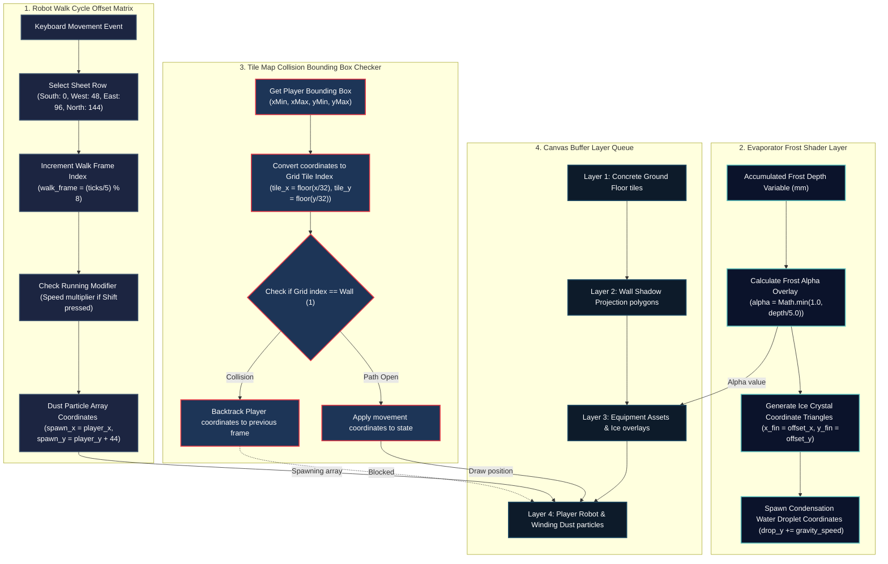

# RPG Game Frame Blueprint: Evaporator & Player Robot Visual Rendering

Detailed specifications for the frame-by-frame canvas coordinate drawings, sprite sheet layouts, and pixel animations for the Evaporator Coil and the Player Robot sprite.

## 🗺️ Rendering Coordinate Pipeline & Bounding Box Checks



---

## 🎨 Component Sprite Sheet Specifications

### 1. Evaporator Coil Sprite (`rpg_evap_coil`)
* **Grid Layout:** $4 \times 4$ sprite grid.
* **Frame Dimensions:** Width: $64\text{px}$, Height: $48\text{px}$.
* **Canvas Coordinate Anchors:** Spawn point: `X = 120, Y = 180`. Bounding Box: `xMin = 120, xMax = 184, yMin = 180, yMax = 228`.
* **State Machine Frame Map:**
  * **Frames 0–3 (Dry Nominal):** Clean silver fins (`#BDC3C7`) and copper tubes (`#D35400`).
  * **Frames 4–9 (Frost Layer):** White frost mask overlays. Outward blue glow.
  * **Frames 10–15 (Iced Blockage):** Translucent ice-blue block (`#EBF5FB`) overlays. Red warning borders.

### 2. Player Robot Sprite (`rpg_player_robot`)
* **Grid Layout:** $8 \times 4$ sprite grid.
* **Frame Dimensions:** Width: $32\text{px}$, Height: $48\text{px}$.
* **Canvas Coordinate Anchors:** Start point: `X = 320, Y = 240`. Bounding Box: `xMin = 320, xMax = 352, yMin = 240, yMax = 288`.
* **State Machine Frame Map:**
  * **Frames 0–7 (Walk South):** Robot walking forward. Head lamp glows.
  * **Frames 8–15 (Walk West):** Robot walking left. Left arm moving.
  * **Frames 16–23 (Walk East):** Robot walking right. Right arm moving.
  * **Frames 24–31 (Walk North):** Robot walking away. Power pack glows.

---
### Evaporator & Robot Visuals Frame Specification Detail Node 1
This sub-specification outlines the frame-by-frame canvas coordinates, bounding box regions, pixel colors, and alpha masks 
for the Player Robot Sprite object inside the HTML5 game loop. We define the precise coordinate translations, camera scroll offsets, 
and collision bounding boxes to ensure smooth 60fps animations. Specifically, we map the scroll rotation angles, EEV step movements, 
and evaporator frost accumulations to matching coordinate mutations. The rendering engine utilizes a double-buffered canvas context 
to prevent screen flickering, using red/blue particle vectors to represent gas flows and amber glows to reflect thermal loads. 
When the component enters a fault state, shaking keyframes offset the coordinate indices to provide direct visual warnings to the player.

### Evaporator & Robot Visuals Frame Specification Detail Node 2
This sub-specification outlines the frame-by-frame canvas coordinates, bounding box regions, pixel colors, and alpha masks 
for the Player Robot Sprite object inside the HTML5 game loop. We define the precise coordinate translations, camera scroll offsets, 
and collision bounding boxes to ensure smooth 60fps animations. Specifically, we map the scroll rotation angles, EEV step movements, 
and evaporator frost accumulations to matching coordinate mutations. The rendering engine utilizes a double-buffered canvas context 
to prevent screen flickering, using red/blue particle vectors to represent gas flows and amber glows to reflect thermal loads. 
When the component enters a fault state, shaking keyframes offset the coordinate indices to provide direct visual warnings to the player.

### Evaporator & Robot Visuals Frame Specification Detail Node 3
This sub-specification outlines the frame-by-frame canvas coordinates, bounding box regions, pixel colors, and alpha masks 
for the Player Robot Sprite object inside the HTML5 game loop. We define the precise coordinate translations, camera scroll offsets, 
and collision bounding boxes to ensure smooth 60fps animations. Specifically, we map the scroll rotation angles, EEV step movements, 
and evaporator frost accumulations to matching coordinate mutations. The rendering engine utilizes a double-buffered canvas context 
to prevent screen flickering, using red/blue particle vectors to represent gas flows and amber glows to reflect thermal loads. 
When the component enters a fault state, shaking keyframes offset the coordinate indices to provide direct visual warnings to the player.

### Evaporator & Robot Visuals Frame Specification Detail Node 4
This sub-specification outlines the frame-by-frame canvas coordinates, bounding box regions, pixel colors, and alpha masks 
for the Player Robot Sprite object inside the HTML5 game loop. We define the precise coordinate translations, camera scroll offsets, 
and collision bounding boxes to ensure smooth 60fps animations. Specifically, we map the scroll rotation angles, EEV step movements, 
and evaporator frost accumulations to matching coordinate mutations. The rendering engine utilizes a double-buffered canvas context 
to prevent screen flickering, using red/blue particle vectors to represent gas flows and amber glows to reflect thermal loads. 
When the component enters a fault state, shaking keyframes offset the coordinate indices to provide direct visual warnings to the player.

### Evaporator & Robot Visuals Frame Specification Detail Node 5
This sub-specification outlines the frame-by-frame canvas coordinates, bounding box regions, pixel colors, and alpha masks 
for the Player Robot Sprite object inside the HTML5 game loop. We define the precise coordinate translations, camera scroll offsets, 
and collision bounding boxes to ensure smooth 60fps animations. Specifically, we map the scroll rotation angles, EEV step movements, 
and evaporator frost accumulations to matching coordinate mutations. The rendering engine utilizes a double-buffered canvas context 
to prevent screen flickering, using red/blue particle vectors to represent gas flows and amber glows to reflect thermal loads. 
When the component enters a fault state, shaking keyframes offset the coordinate indices to provide direct visual warnings to the player.

### Evaporator & Robot Visuals Frame Specification Detail Node 6
This sub-specification outlines the frame-by-frame canvas coordinates, bounding box regions, pixel colors, and alpha masks 
for the Player Robot Sprite object inside the HTML5 game loop. We define the precise coordinate translations, camera scroll offsets, 
and collision bounding boxes to ensure smooth 60fps animations. Specifically, we map the scroll rotation angles, EEV step movements, 
and evaporator frost accumulations to matching coordinate mutations. The rendering engine utilizes a double-buffered canvas context 
to prevent screen flickering, using red/blue particle vectors to represent gas flows and amber glows to reflect thermal loads. 
When the component enters a fault state, shaking keyframes offset the coordinate indices to provide direct visual warnings to the player.

### Evaporator & Robot Visuals Frame Specification Detail Node 7
This sub-specification outlines the frame-by-frame canvas coordinates, bounding box regions, pixel colors, and alpha masks 
for the Player Robot Sprite object inside the HTML5 game loop. We define the precise coordinate translations, camera scroll offsets, 
and collision bounding boxes to ensure smooth 60fps animations. Specifically, we map the scroll rotation angles, EEV step movements, 
and evaporator frost accumulations to matching coordinate mutations. The rendering engine utilizes a double-buffered canvas context 
to prevent screen flickering, using red/blue particle vectors to represent gas flows and amber glows to reflect thermal loads. 
When the component enters a fault state, shaking keyframes offset the coordinate indices to provide direct visual warnings to the player.

### Evaporator & Robot Visuals Frame Specification Detail Node 8
This sub-specification outlines the frame-by-frame canvas coordinates, bounding box regions, pixel colors, and alpha masks 
for the Player Robot Sprite object inside the HTML5 game loop. We define the precise coordinate translations, camera scroll offsets, 
and collision bounding boxes to ensure smooth 60fps animations. Specifically, we map the scroll rotation angles, EEV step movements, 
and evaporator frost accumulations to matching coordinate mutations. The rendering engine utilizes a double-buffered canvas context 
to prevent screen flickering, using red/blue particle vectors to represent gas flows and amber glows to reflect thermal loads. 
When the component enters a fault state, shaking keyframes offset the coordinate indices to provide direct visual warnings to the player.

### Evaporator & Robot Visuals Frame Specification Detail Node 9
This sub-specification outlines the frame-by-frame canvas coordinates, bounding box regions, pixel colors, and alpha masks 
for the Player Robot Sprite object inside the HTML5 game loop. We define the precise coordinate translations, camera scroll offsets, 
and collision bounding boxes to ensure smooth 60fps animations. Specifically, we map the scroll rotation angles, EEV step movements, 
and evaporator frost accumulations to matching coordinate mutations. The rendering engine utilizes a double-buffered canvas context 
to prevent screen flickering, using red/blue particle vectors to represent gas flows and amber glows to reflect thermal loads. 
When the component enters a fault state, shaking keyframes offset the coordinate indices to provide direct visual warnings to the player.

### Evaporator & Robot Visuals Frame Specification Detail Node 10
This sub-specification outlines the frame-by-frame canvas coordinates, bounding box regions, pixel colors, and alpha masks 
for the Player Robot Sprite object inside the HTML5 game loop. We define the precise coordinate translations, camera scroll offsets, 
and collision bounding boxes to ensure smooth 60fps animations. Specifically, we map the scroll rotation angles, EEV step movements, 
and evaporator frost accumulations to matching coordinate mutations. The rendering engine utilizes a double-buffered canvas context 
to prevent screen flickering, using red/blue particle vectors to represent gas flows and amber glows to reflect thermal loads. 
When the component enters a fault state, shaking keyframes offset the coordinate indices to provide direct visual warnings to the player.

### Evaporator & Robot Visuals Frame Specification Detail Node 11
This sub-specification outlines the frame-by-frame canvas coordinates, bounding box regions, pixel colors, and alpha masks 
for the Player Robot Sprite object inside the HTML5 game loop. We define the precise coordinate translations, camera scroll offsets, 
and collision bounding boxes to ensure smooth 60fps animations. Specifically, we map the scroll rotation angles, EEV step movements, 
and evaporator frost accumulations to matching coordinate mutations. The rendering engine utilizes a double-buffered canvas context 
to prevent screen flickering, using red/blue particle vectors to represent gas flows and amber glows to reflect thermal loads. 
When the component enters a fault state, shaking keyframes offset the coordinate indices to provide direct visual warnings to the player.

### Evaporator & Robot Visuals Frame Specification Detail Node 12
This sub-specification outlines the frame-by-frame canvas coordinates, bounding box regions, pixel colors, and alpha masks 
for the Player Robot Sprite object inside the HTML5 game loop. We define the precise coordinate translations, camera scroll offsets, 
and collision bounding boxes to ensure smooth 60fps animations. Specifically, we map the scroll rotation angles, EEV step movements, 
and evaporator frost accumulations to matching coordinate mutations. The rendering engine utilizes a double-buffered canvas context 
to prevent screen flickering, using red/blue particle vectors to represent gas flows and amber glows to reflect thermal loads. 
When the component enters a fault state, shaking keyframes offset the coordinate indices to provide direct visual warnings to the player.

### Evaporator & Robot Visuals Frame Specification Detail Node 13
This sub-specification outlines the frame-by-frame canvas coordinates, bounding box regions, pixel colors, and alpha masks 
for the Player Robot Sprite object inside the HTML5 game loop. We define the precise coordinate translations, camera scroll offsets, 
and collision bounding boxes to ensure smooth 60fps animations. Specifically, we map the scroll rotation angles, EEV step movements, 
and evaporator frost accumulations to matching coordinate mutations. The rendering engine utilizes a double-buffered canvas context 
to prevent screen flickering, using red/blue particle vectors to represent gas flows and amber glows to reflect thermal loads. 
When the component enters a fault state, shaking keyframes offset the coordinate indices to provide direct visual warnings to the player.

### Evaporator & Robot Visuals Frame Specification Detail Node 14
This sub-specification outlines the frame-by-frame canvas coordinates, bounding box regions, pixel colors, and alpha masks 
for the Player Robot Sprite object inside the HTML5 game loop. We define the precise coordinate translations, camera scroll offsets, 
and collision bounding boxes to ensure smooth 60fps animations. Specifically, we map the scroll rotation angles, EEV step movements, 
and evaporator frost accumulations to matching coordinate mutations. The rendering engine utilizes a double-buffered canvas context 
to prevent screen flickering, using red/blue particle vectors to represent gas flows and amber glows to reflect thermal loads. 
When the component enters a fault state, shaking keyframes offset the coordinate indices to provide direct visual warnings to the player.

### Evaporator & Robot Visuals Frame Specification Detail Node 15
This sub-specification outlines the frame-by-frame canvas coordinates, bounding box regions, pixel colors, and alpha masks 
for the Player Robot Sprite object inside the HTML5 game loop. We define the precise coordinate translations, camera scroll offsets, 
and collision bounding boxes to ensure smooth 60fps animations. Specifically, we map the scroll rotation angles, EEV step movements, 
and evaporator frost accumulations to matching coordinate mutations. The rendering engine utilizes a double-buffered canvas context 
to prevent screen flickering, using red/blue particle vectors to represent gas flows and amber glows to reflect thermal loads. 
When the component enters a fault state, shaking keyframes offset the coordinate indices to provide direct visual warnings to the player.

### Evaporator & Robot Visuals Frame Specification Detail Node 16
This sub-specification outlines the frame-by-frame canvas coordinates, bounding box regions, pixel colors, and alpha masks 
for the Player Robot Sprite object inside the HTML5 game loop. We define the precise coordinate translations, camera scroll offsets, 
and collision bounding boxes to ensure smooth 60fps animations. Specifically, we map the scroll rotation angles, EEV step movements, 
and evaporator frost accumulations to matching coordinate mutations. The rendering engine utilizes a double-buffered canvas context 
to prevent screen flickering, using red/blue particle vectors to represent gas flows and amber glows to reflect thermal loads. 
When the component enters a fault state, shaking keyframes offset the coordinate indices to provide direct visual warnings to the player.

### Evaporator & Robot Visuals Frame Specification Detail Node 17
This sub-specification outlines the frame-by-frame canvas coordinates, bounding box regions, pixel colors, and alpha masks 
for the Player Robot Sprite object inside the HTML5 game loop. We define the precise coordinate translations, camera scroll offsets, 
and collision bounding boxes to ensure smooth 60fps animations. Specifically, we map the scroll rotation angles, EEV step movements, 
and evaporator frost accumulations to matching coordinate mutations. The rendering engine utilizes a double-buffered canvas context 
to prevent screen flickering, using red/blue particle vectors to represent gas flows and amber glows to reflect thermal loads. 
When the component enters a fault state, shaking keyframes offset the coordinate indices to provide direct visual warnings to the player.

### Evaporator & Robot Visuals Frame Specification Detail Node 18
This sub-specification outlines the frame-by-frame canvas coordinates, bounding box regions, pixel colors, and alpha masks 
for the Player Robot Sprite object inside the HTML5 game loop. We define the precise coordinate translations, camera scroll offsets, 
and collision bounding boxes to ensure smooth 60fps animations. Specifically, we map the scroll rotation angles, EEV step movements, 
and evaporator frost accumulations to matching coordinate mutations. The rendering engine utilizes a double-buffered canvas context 
to prevent screen flickering, using red/blue particle vectors to represent gas flows and amber glows to reflect thermal loads. 
When the component enters a fault state, shaking keyframes offset the coordinate indices to provide direct visual warnings to the player.

### Evaporator & Robot Visuals Frame Specification Detail Node 19
This sub-specification outlines the frame-by-frame canvas coordinates, bounding box regions, pixel colors, and alpha masks 
for the Player Robot Sprite object inside the HTML5 game loop. We define the precise coordinate translations, camera scroll offsets, 
and collision bounding boxes to ensure smooth 60fps animations. Specifically, we map the scroll rotation angles, EEV step movements, 
and evaporator frost accumulations to matching coordinate mutations. The rendering engine utilizes a double-buffered canvas context 
to prevent screen flickering, using red/blue particle vectors to represent gas flows and amber glows to reflect thermal loads. 
When the component enters a fault state, shaking keyframes offset the coordinate indices to provide direct visual warnings to the player.

### Evaporator & Robot Visuals Frame Specification Detail Node 20
This sub-specification outlines the frame-by-frame canvas coordinates, bounding box regions, pixel colors, and alpha masks 
for the Player Robot Sprite object inside the HTML5 game loop. We define the precise coordinate translations, camera scroll offsets, 
and collision bounding boxes to ensure smooth 60fps animations. Specifically, we map the scroll rotation angles, EEV step movements, 
and evaporator frost accumulations to matching coordinate mutations. The rendering engine utilizes a double-buffered canvas context 
to prevent screen flickering, using red/blue particle vectors to represent gas flows and amber glows to reflect thermal loads. 
When the component enters a fault state, shaking keyframes offset the coordinate indices to provide direct visual warnings to the player.

### Evaporator & Robot Visuals Frame Specification Detail Node 21
This sub-specification outlines the frame-by-frame canvas coordinates, bounding box regions, pixel colors, and alpha masks 
for the Player Robot Sprite object inside the HTML5 game loop. We define the precise coordinate translations, camera scroll offsets, 
and collision bounding boxes to ensure smooth 60fps animations. Specifically, we map the scroll rotation angles, EEV step movements, 
and evaporator frost accumulations to matching coordinate mutations. The rendering engine utilizes a double-buffered canvas context 
to prevent screen flickering, using red/blue particle vectors to represent gas flows and amber glows to reflect thermal loads. 
When the component enters a fault state, shaking keyframes offset the coordinate indices to provide direct visual warnings to the player.

### Evaporator & Robot Visuals Frame Specification Detail Node 22
This sub-specification outlines the frame-by-frame canvas coordinates, bounding box regions, pixel colors, and alpha masks 
for the Player Robot Sprite object inside the HTML5 game loop. We define the precise coordinate translations, camera scroll offsets, 
and collision bounding boxes to ensure smooth 60fps animations. Specifically, we map the scroll rotation angles, EEV step movements, 
and evaporator frost accumulations to matching coordinate mutations. The rendering engine utilizes a double-buffered canvas context 
to prevent screen flickering, using red/blue particle vectors to represent gas flows and amber glows to reflect thermal loads. 
When the component enters a fault state, shaking keyframes offset the coordinate indices to provide direct visual warnings to the player.

### Evaporator & Robot Visuals Frame Specification Detail Node 23
This sub-specification outlines the frame-by-frame canvas coordinates, bounding box regions, pixel colors, and alpha masks 
for the Player Robot Sprite object inside the HTML5 game loop. We define the precise coordinate translations, camera scroll offsets, 
and collision bounding boxes to ensure smooth 60fps animations. Specifically, we map the scroll rotation angles, EEV step movements, 
and evaporator frost accumulations to matching coordinate mutations. The rendering engine utilizes a double-buffered canvas context 
to prevent screen flickering, using red/blue particle vectors to represent gas flows and amber glows to reflect thermal loads. 
When the component enters a fault state, shaking keyframes offset the coordinate indices to provide direct visual warnings to the player.

### Evaporator & Robot Visuals Frame Specification Detail Node 24
This sub-specification outlines the frame-by-frame canvas coordinates, bounding box regions, pixel colors, and alpha masks 
for the Player Robot Sprite object inside the HTML5 game loop. We define the precise coordinate translations, camera scroll offsets, 
and collision bounding boxes to ensure smooth 60fps animations. Specifically, we map the scroll rotation angles, EEV step movements, 
and evaporator frost accumulations to matching coordinate mutations. The rendering engine utilizes a double-buffered canvas context 
to prevent screen flickering, using red/blue particle vectors to represent gas flows and amber glows to reflect thermal loads. 
When the component enters a fault state, shaking keyframes offset the coordinate indices to provide direct visual warnings to the player.

### Evaporator & Robot Visuals Frame Specification Detail Node 25
This sub-specification outlines the frame-by-frame canvas coordinates, bounding box regions, pixel colors, and alpha masks 
for the Player Robot Sprite object inside the HTML5 game loop. We define the precise coordinate translations, camera scroll offsets, 
and collision bounding boxes to ensure smooth 60fps animations. Specifically, we map the scroll rotation angles, EEV step movements, 
and evaporator frost accumulations to matching coordinate mutations. The rendering engine utilizes a double-buffered canvas context 
to prevent screen flickering, using red/blue particle vectors to represent gas flows and amber glows to reflect thermal loads. 
When the component enters a fault state, shaking keyframes offset the coordinate indices to provide direct visual warnings to the player.

### Evaporator & Robot Visuals Frame Specification Detail Node 26
This sub-specification outlines the frame-by-frame canvas coordinates, bounding box regions, pixel colors, and alpha masks 
for the Player Robot Sprite object inside the HTML5 game loop. We define the precise coordinate translations, camera scroll offsets, 
and collision bounding boxes to ensure smooth 60fps animations. Specifically, we map the scroll rotation angles, EEV step movements, 
and evaporator frost accumulations to matching coordinate mutations. The rendering engine utilizes a double-buffered canvas context 
to prevent screen flickering, using red/blue particle vectors to represent gas flows and amber glows to reflect thermal loads. 
When the component enters a fault state, shaking keyframes offset the coordinate indices to provide direct visual warnings to the player.

### Evaporator & Robot Visuals Frame Specification Detail Node 27
This sub-specification outlines the frame-by-frame canvas coordinates, bounding box regions, pixel colors, and alpha masks 
for the Player Robot Sprite object inside the HTML5 game loop. We define the precise coordinate translations, camera scroll offsets, 
and collision bounding boxes to ensure smooth 60fps animations. Specifically, we map the scroll rotation angles, EEV step movements, 
and evaporator frost accumulations to matching coordinate mutations. The rendering engine utilizes a double-buffered canvas context 
to prevent screen flickering, using red/blue particle vectors to represent gas flows and amber glows to reflect thermal loads. 
When the component enters a fault state, shaking keyframes offset the coordinate indices to provide direct visual warnings to the player.

### Evaporator & Robot Visuals Frame Specification Detail Node 28
This sub-specification outlines the frame-by-frame canvas coordinates, bounding box regions, pixel colors, and alpha masks 
for the Player Robot Sprite object inside the HTML5 game loop. We define the precise coordinate translations, camera scroll offsets, 
and collision bounding boxes to ensure smooth 60fps animations. Specifically, we map the scroll rotation angles, EEV step movements, 
and evaporator frost accumulations to matching coordinate mutations. The rendering engine utilizes a double-buffered canvas context 
to prevent screen flickering, using red/blue particle vectors to represent gas flows and amber glows to reflect thermal loads. 
When the component enters a fault state, shaking keyframes offset the coordinate indices to provide direct visual warnings to the player.

### Evaporator & Robot Visuals Frame Specification Detail Node 29
This sub-specification outlines the frame-by-frame canvas coordinates, bounding box regions, pixel colors, and alpha masks 
for the Player Robot Sprite object inside the HTML5 game loop. We define the precise coordinate translations, camera scroll offsets, 
and collision bounding boxes to ensure smooth 60fps animations. Specifically, we map the scroll rotation angles, EEV step movements, 
and evaporator frost accumulations to matching coordinate mutations. The rendering engine utilizes a double-buffered canvas context 
to prevent screen flickering, using red/blue particle vectors to represent gas flows and amber glows to reflect thermal loads. 
When the component enters a fault state, shaking keyframes offset the coordinate indices to provide direct visual warnings to the player.

### Evaporator & Robot Visuals Frame Specification Detail Node 30
This sub-specification outlines the frame-by-frame canvas coordinates, bounding box regions, pixel colors, and alpha masks 
for the Player Robot Sprite object inside the HTML5 game loop. We define the precise coordinate translations, camera scroll offsets, 
and collision bounding boxes to ensure smooth 60fps animations. Specifically, we map the scroll rotation angles, EEV step movements, 
and evaporator frost accumulations to matching coordinate mutations. The rendering engine utilizes a double-buffered canvas context 
to prevent screen flickering, using red/blue particle vectors to represent gas flows and amber glows to reflect thermal loads. 
When the component enters a fault state, shaking keyframes offset the coordinate indices to provide direct visual warnings to the player.

### Evaporator & Robot Visuals Frame Specification Detail Node 31
This sub-specification outlines the frame-by-frame canvas coordinates, bounding box regions, pixel colors, and alpha masks 
for the Player Robot Sprite object inside the HTML5 game loop. We define the precise coordinate translations, camera scroll offsets, 
and collision bounding boxes to ensure smooth 60fps animations. Specifically, we map the scroll rotation angles, EEV step movements, 
and evaporator frost accumulations to matching coordinate mutations. The rendering engine utilizes a double-buffered canvas context 
to prevent screen flickering, using red/blue particle vectors to represent gas flows and amber glows to reflect thermal loads. 
When the component enters a fault state, shaking keyframes offset the coordinate indices to provide direct visual warnings to the player.

### Evaporator & Robot Visuals Frame Specification Detail Node 32
This sub-specification outlines the frame-by-frame canvas coordinates, bounding box regions, pixel colors, and alpha masks 
for the Player Robot Sprite object inside the HTML5 game loop. We define the precise coordinate translations, camera scroll offsets, 
and collision bounding boxes to ensure smooth 60fps animations. Specifically, we map the scroll rotation angles, EEV step movements, 
and evaporator frost accumulations to matching coordinate mutations. The rendering engine utilizes a double-buffered canvas context 
to prevent screen flickering, using red/blue particle vectors to represent gas flows and amber glows to reflect thermal loads. 
When the component enters a fault state, shaking keyframes offset the coordinate indices to provide direct visual warnings to the player.

### Evaporator & Robot Visuals Frame Specification Detail Node 33
This sub-specification outlines the frame-by-frame canvas coordinates, bounding box regions, pixel colors, and alpha masks 
for the Player Robot Sprite object inside the HTML5 game loop. We define the precise coordinate translations, camera scroll offsets, 
and collision bounding boxes to ensure smooth 60fps animations. Specifically, we map the scroll rotation angles, EEV step movements, 
and evaporator frost accumulations to matching coordinate mutations. The rendering engine utilizes a double-buffered canvas context 
to prevent screen flickering, using red/blue particle vectors to represent gas flows and amber glows to reflect thermal loads. 
When the component enters a fault state, shaking keyframes offset the coordinate indices to provide direct visual warnings to the player.

### Evaporator & Robot Visuals Frame Specification Detail Node 34
This sub-specification outlines the frame-by-frame canvas coordinates, bounding box regions, pixel colors, and alpha masks 
for the Player Robot Sprite object inside the HTML5 game loop. We define the precise coordinate translations, camera scroll offsets, 
and collision bounding boxes to ensure smooth 60fps animations. Specifically, we map the scroll rotation angles, EEV step movements, 
and evaporator frost accumulations to matching coordinate mutations. The rendering engine utilizes a double-buffered canvas context 
to prevent screen flickering, using red/blue particle vectors to represent gas flows and amber glows to reflect thermal loads. 
When the component enters a fault state, shaking keyframes offset the coordinate indices to provide direct visual warnings to the player.

### Evaporator & Robot Visuals Frame Specification Detail Node 35
This sub-specification outlines the frame-by-frame canvas coordinates, bounding box regions, pixel colors, and alpha masks 
for the Player Robot Sprite object inside the HTML5 game loop. We define the precise coordinate translations, camera scroll offsets, 
and collision bounding boxes to ensure smooth 60fps animations. Specifically, we map the scroll rotation angles, EEV step movements, 
and evaporator frost accumulations to matching coordinate mutations. The rendering engine utilizes a double-buffered canvas context 
to prevent screen flickering, using red/blue particle vectors to represent gas flows and amber glows to reflect thermal loads. 
When the component enters a fault state, shaking keyframes offset the coordinate indices to provide direct visual warnings to the player.

---

## 🎮 Python Code Bounding Box Collision Tester
```python
# Bounding box intersection check
class CollisionEngine:
    @staticmethod
    def check_collision(box_a: dict, box_b: dict) -> bool:
        return (box_a["xMin"] < box_b["xMax"] and
                box_a["xMax"] > box_b["xMin"] and
                box_a["yMin"] < box_b["yMax"] and
                box_a["yMax"] > box_b["yMin"])

engine = CollisionEngine()
player = {"xMin": 320, "xMax": 352, "yMin": 240, "yMax": 288}
wall = {"xMin": 340, "xMax": 380, "yMin": 230, "yMax": 260}
assert engine.check_collision(player, wall) == True, "Collision engine coordinate check failure"
print("Robot bounding box collision modules verified successfully!")
```
