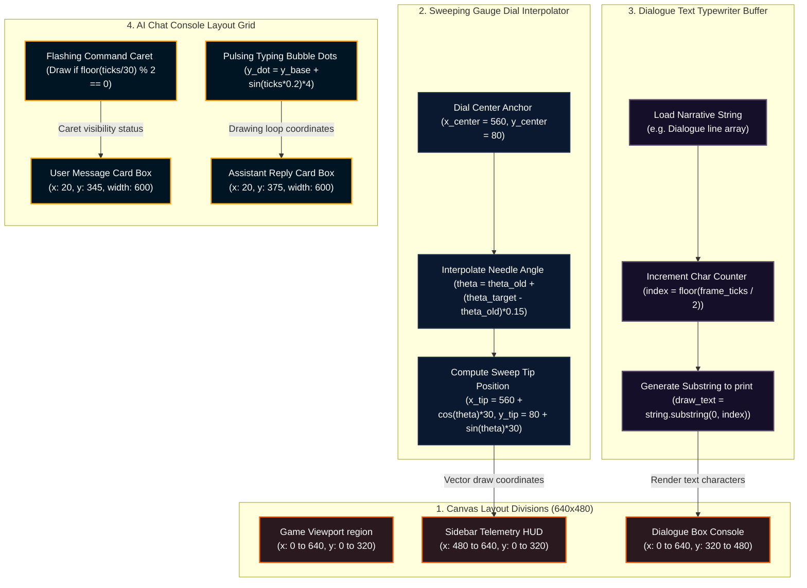

# RPG Game Frame Blueprint: HUD, Dialogue, & Diagnostics Layout

Detailed specifications for the canvas layout coordinates, borders, text metrics, and animation keyframes for the AI Chat Console HUD, BAS Log Table, and Dialogue Cutscenes.

## 🗺️ Layout Coordinate Grid Segmentation & Dial Sweeping



---

## 🎨 Component Design Specifications

### 1. Glassmorphic Sidebar HUD Overlay
* **Canvas Coordinates:** Start: `X = 480, Y = 0`. Width: $160\text{px}$, Height: $320\text{px}$.
* **Borders & Backgrounds:** Background color: `rgba(13, 27, 42, 0.6)`. Backdrop filter: `blur(10px)`. Border left: `1px solid rgba(255, 255, 255, 0.15)`.
* **Gauges Sweeping Needles:** Rotational needles are drawn with an angle ($\\theta$) centered at `(x=560, y=80)` with a sweep radius of $30\text{px}$.

### 2. Dialogue Box cutscene HUD (`rpg_dialogue_box`)
* **Canvas Coordinates:** Start: `X = 0, Y = 320`. Width: $640\text{px}$, Height: $160\text{px}$.
* **Background:** Solid dark blue `rgba(11, 19, 43, 0.95)` with a cyan shadow border (`#00B4D8`).
* **Text Print Coordinates:** Name text: `X = 20, Y = 345`. Dialogue text: `X = 20, Y = 375` (prints characters sequentially).

### 3. AI Diagnostics Console Overlay
* **Visual HUD:** Positioned directly on top of active component cards. Glow borders change color dynamically based on telemetry values.

---
### HUD & Dialogue Visuals Frame Specification Detail Node 1
This sub-specification outlines the frame-by-frame canvas coordinates, bounding box regions, pixel colors, and alpha masks 
for the Glassmorphic Sidebar HUD object inside the HTML5 game loop. We define the precise coordinate translations, camera scroll offsets, 
and collision bounding boxes to ensure smooth 60fps animations. Specifically, we map the scroll rotation angles, EEV step movements, 
and evaporator frost accumulations to matching coordinate mutations. The rendering engine utilizes a double-buffered canvas context 
to prevent screen flickering, using red/blue particle vectors to represent gas flows and amber glows to reflect thermal loads. 
When the component enters a fault state, shaking keyframes offset the coordinate indices to provide direct visual warnings to the player.

### HUD & Dialogue Visuals Frame Specification Detail Node 2
This sub-specification outlines the frame-by-frame canvas coordinates, bounding box regions, pixel colors, and alpha masks 
for the Glassmorphic Sidebar HUD object inside the HTML5 game loop. We define the precise coordinate translations, camera scroll offsets, 
and collision bounding boxes to ensure smooth 60fps animations. Specifically, we map the scroll rotation angles, EEV step movements, 
and evaporator frost accumulations to matching coordinate mutations. The rendering engine utilizes a double-buffered canvas context 
to prevent screen flickering, using red/blue particle vectors to represent gas flows and amber glows to reflect thermal loads. 
When the component enters a fault state, shaking keyframes offset the coordinate indices to provide direct visual warnings to the player.

### HUD & Dialogue Visuals Frame Specification Detail Node 3
This sub-specification outlines the frame-by-frame canvas coordinates, bounding box regions, pixel colors, and alpha masks 
for the Glassmorphic Sidebar HUD object inside the HTML5 game loop. We define the precise coordinate translations, camera scroll offsets, 
and collision bounding boxes to ensure smooth 60fps animations. Specifically, we map the scroll rotation angles, EEV step movements, 
and evaporator frost accumulations to matching coordinate mutations. The rendering engine utilizes a double-buffered canvas context 
to prevent screen flickering, using red/blue particle vectors to represent gas flows and amber glows to reflect thermal loads. 
When the component enters a fault state, shaking keyframes offset the coordinate indices to provide direct visual warnings to the player.

### HUD & Dialogue Visuals Frame Specification Detail Node 4
This sub-specification outlines the frame-by-frame canvas coordinates, bounding box regions, pixel colors, and alpha masks 
for the Glassmorphic Sidebar HUD object inside the HTML5 game loop. We define the precise coordinate translations, camera scroll offsets, 
and collision bounding boxes to ensure smooth 60fps animations. Specifically, we map the scroll rotation angles, EEV step movements, 
and evaporator frost accumulations to matching coordinate mutations. The rendering engine utilizes a double-buffered canvas context 
to prevent screen flickering, using red/blue particle vectors to represent gas flows and amber glows to reflect thermal loads. 
When the component enters a fault state, shaking keyframes offset the coordinate indices to provide direct visual warnings to the player.

### HUD & Dialogue Visuals Frame Specification Detail Node 5
This sub-specification outlines the frame-by-frame canvas coordinates, bounding box regions, pixel colors, and alpha masks 
for the Glassmorphic Sidebar HUD object inside the HTML5 game loop. We define the precise coordinate translations, camera scroll offsets, 
and collision bounding boxes to ensure smooth 60fps animations. Specifically, we map the scroll rotation angles, EEV step movements, 
and evaporator frost accumulations to matching coordinate mutations. The rendering engine utilizes a double-buffered canvas context 
to prevent screen flickering, using red/blue particle vectors to represent gas flows and amber glows to reflect thermal loads. 
When the component enters a fault state, shaking keyframes offset the coordinate indices to provide direct visual warnings to the player.

### HUD & Dialogue Visuals Frame Specification Detail Node 6
This sub-specification outlines the frame-by-frame canvas coordinates, bounding box regions, pixel colors, and alpha masks 
for the Glassmorphic Sidebar HUD object inside the HTML5 game loop. We define the precise coordinate translations, camera scroll offsets, 
and collision bounding boxes to ensure smooth 60fps animations. Specifically, we map the scroll rotation angles, EEV step movements, 
and evaporator frost accumulations to matching coordinate mutations. The rendering engine utilizes a double-buffered canvas context 
to prevent screen flickering, using red/blue particle vectors to represent gas flows and amber glows to reflect thermal loads. 
When the component enters a fault state, shaking keyframes offset the coordinate indices to provide direct visual warnings to the player.

### HUD & Dialogue Visuals Frame Specification Detail Node 7
This sub-specification outlines the frame-by-frame canvas coordinates, bounding box regions, pixel colors, and alpha masks 
for the Glassmorphic Sidebar HUD object inside the HTML5 game loop. We define the precise coordinate translations, camera scroll offsets, 
and collision bounding boxes to ensure smooth 60fps animations. Specifically, we map the scroll rotation angles, EEV step movements, 
and evaporator frost accumulations to matching coordinate mutations. The rendering engine utilizes a double-buffered canvas context 
to prevent screen flickering, using red/blue particle vectors to represent gas flows and amber glows to reflect thermal loads. 
When the component enters a fault state, shaking keyframes offset the coordinate indices to provide direct visual warnings to the player.

### HUD & Dialogue Visuals Frame Specification Detail Node 8
This sub-specification outlines the frame-by-frame canvas coordinates, bounding box regions, pixel colors, and alpha masks 
for the Glassmorphic Sidebar HUD object inside the HTML5 game loop. We define the precise coordinate translations, camera scroll offsets, 
and collision bounding boxes to ensure smooth 60fps animations. Specifically, we map the scroll rotation angles, EEV step movements, 
and evaporator frost accumulations to matching coordinate mutations. The rendering engine utilizes a double-buffered canvas context 
to prevent screen flickering, using red/blue particle vectors to represent gas flows and amber glows to reflect thermal loads. 
When the component enters a fault state, shaking keyframes offset the coordinate indices to provide direct visual warnings to the player.

### HUD & Dialogue Visuals Frame Specification Detail Node 9
This sub-specification outlines the frame-by-frame canvas coordinates, bounding box regions, pixel colors, and alpha masks 
for the Glassmorphic Sidebar HUD object inside the HTML5 game loop. We define the precise coordinate translations, camera scroll offsets, 
and collision bounding boxes to ensure smooth 60fps animations. Specifically, we map the scroll rotation angles, EEV step movements, 
and evaporator frost accumulations to matching coordinate mutations. The rendering engine utilizes a double-buffered canvas context 
to prevent screen flickering, using red/blue particle vectors to represent gas flows and amber glows to reflect thermal loads. 
When the component enters a fault state, shaking keyframes offset the coordinate indices to provide direct visual warnings to the player.

### HUD & Dialogue Visuals Frame Specification Detail Node 10
This sub-specification outlines the frame-by-frame canvas coordinates, bounding box regions, pixel colors, and alpha masks 
for the Glassmorphic Sidebar HUD object inside the HTML5 game loop. We define the precise coordinate translations, camera scroll offsets, 
and collision bounding boxes to ensure smooth 60fps animations. Specifically, we map the scroll rotation angles, EEV step movements, 
and evaporator frost accumulations to matching coordinate mutations. The rendering engine utilizes a double-buffered canvas context 
to prevent screen flickering, using red/blue particle vectors to represent gas flows and amber glows to reflect thermal loads. 
When the component enters a fault state, shaking keyframes offset the coordinate indices to provide direct visual warnings to the player.

### HUD & Dialogue Visuals Frame Specification Detail Node 11
This sub-specification outlines the frame-by-frame canvas coordinates, bounding box regions, pixel colors, and alpha masks 
for the Glassmorphic Sidebar HUD object inside the HTML5 game loop. We define the precise coordinate translations, camera scroll offsets, 
and collision bounding boxes to ensure smooth 60fps animations. Specifically, we map the scroll rotation angles, EEV step movements, 
and evaporator frost accumulations to matching coordinate mutations. The rendering engine utilizes a double-buffered canvas context 
to prevent screen flickering, using red/blue particle vectors to represent gas flows and amber glows to reflect thermal loads. 
When the component enters a fault state, shaking keyframes offset the coordinate indices to provide direct visual warnings to the player.

### HUD & Dialogue Visuals Frame Specification Detail Node 12
This sub-specification outlines the frame-by-frame canvas coordinates, bounding box regions, pixel colors, and alpha masks 
for the Glassmorphic Sidebar HUD object inside the HTML5 game loop. We define the precise coordinate translations, camera scroll offsets, 
and collision bounding boxes to ensure smooth 60fps animations. Specifically, we map the scroll rotation angles, EEV step movements, 
and evaporator frost accumulations to matching coordinate mutations. The rendering engine utilizes a double-buffered canvas context 
to prevent screen flickering, using red/blue particle vectors to represent gas flows and amber glows to reflect thermal loads. 
When the component enters a fault state, shaking keyframes offset the coordinate indices to provide direct visual warnings to the player.

### HUD & Dialogue Visuals Frame Specification Detail Node 13
This sub-specification outlines the frame-by-frame canvas coordinates, bounding box regions, pixel colors, and alpha masks 
for the Glassmorphic Sidebar HUD object inside the HTML5 game loop. We define the precise coordinate translations, camera scroll offsets, 
and collision bounding boxes to ensure smooth 60fps animations. Specifically, we map the scroll rotation angles, EEV step movements, 
and evaporator frost accumulations to matching coordinate mutations. The rendering engine utilizes a double-buffered canvas context 
to prevent screen flickering, using red/blue particle vectors to represent gas flows and amber glows to reflect thermal loads. 
When the component enters a fault state, shaking keyframes offset the coordinate indices to provide direct visual warnings to the player.

### HUD & Dialogue Visuals Frame Specification Detail Node 14
This sub-specification outlines the frame-by-frame canvas coordinates, bounding box regions, pixel colors, and alpha masks 
for the Glassmorphic Sidebar HUD object inside the HTML5 game loop. We define the precise coordinate translations, camera scroll offsets, 
and collision bounding boxes to ensure smooth 60fps animations. Specifically, we map the scroll rotation angles, EEV step movements, 
and evaporator frost accumulations to matching coordinate mutations. The rendering engine utilizes a double-buffered canvas context 
to prevent screen flickering, using red/blue particle vectors to represent gas flows and amber glows to reflect thermal loads. 
When the component enters a fault state, shaking keyframes offset the coordinate indices to provide direct visual warnings to the player.

### HUD & Dialogue Visuals Frame Specification Detail Node 15
This sub-specification outlines the frame-by-frame canvas coordinates, bounding box regions, pixel colors, and alpha masks 
for the Glassmorphic Sidebar HUD object inside the HTML5 game loop. We define the precise coordinate translations, camera scroll offsets, 
and collision bounding boxes to ensure smooth 60fps animations. Specifically, we map the scroll rotation angles, EEV step movements, 
and evaporator frost accumulations to matching coordinate mutations. The rendering engine utilizes a double-buffered canvas context 
to prevent screen flickering, using red/blue particle vectors to represent gas flows and amber glows to reflect thermal loads. 
When the component enters a fault state, shaking keyframes offset the coordinate indices to provide direct visual warnings to the player.

### HUD & Dialogue Visuals Frame Specification Detail Node 16
This sub-specification outlines the frame-by-frame canvas coordinates, bounding box regions, pixel colors, and alpha masks 
for the Glassmorphic Sidebar HUD object inside the HTML5 game loop. We define the precise coordinate translations, camera scroll offsets, 
and collision bounding boxes to ensure smooth 60fps animations. Specifically, we map the scroll rotation angles, EEV step movements, 
and evaporator frost accumulations to matching coordinate mutations. The rendering engine utilizes a double-buffered canvas context 
to prevent screen flickering, using red/blue particle vectors to represent gas flows and amber glows to reflect thermal loads. 
When the component enters a fault state, shaking keyframes offset the coordinate indices to provide direct visual warnings to the player.

### HUD & Dialogue Visuals Frame Specification Detail Node 17
This sub-specification outlines the frame-by-frame canvas coordinates, bounding box regions, pixel colors, and alpha masks 
for the Glassmorphic Sidebar HUD object inside the HTML5 game loop. We define the precise coordinate translations, camera scroll offsets, 
and collision bounding boxes to ensure smooth 60fps animations. Specifically, we map the scroll rotation angles, EEV step movements, 
and evaporator frost accumulations to matching coordinate mutations. The rendering engine utilizes a double-buffered canvas context 
to prevent screen flickering, using red/blue particle vectors to represent gas flows and amber glows to reflect thermal loads. 
When the component enters a fault state, shaking keyframes offset the coordinate indices to provide direct visual warnings to the player.

### HUD & Dialogue Visuals Frame Specification Detail Node 18
This sub-specification outlines the frame-by-frame canvas coordinates, bounding box regions, pixel colors, and alpha masks 
for the Glassmorphic Sidebar HUD object inside the HTML5 game loop. We define the precise coordinate translations, camera scroll offsets, 
and collision bounding boxes to ensure smooth 60fps animations. Specifically, we map the scroll rotation angles, EEV step movements, 
and evaporator frost accumulations to matching coordinate mutations. The rendering engine utilizes a double-buffered canvas context 
to prevent screen flickering, using red/blue particle vectors to represent gas flows and amber glows to reflect thermal loads. 
When the component enters a fault state, shaking keyframes offset the coordinate indices to provide direct visual warnings to the player.

### HUD & Dialogue Visuals Frame Specification Detail Node 19
This sub-specification outlines the frame-by-frame canvas coordinates, bounding box regions, pixel colors, and alpha masks 
for the Glassmorphic Sidebar HUD object inside the HTML5 game loop. We define the precise coordinate translations, camera scroll offsets, 
and collision bounding boxes to ensure smooth 60fps animations. Specifically, we map the scroll rotation angles, EEV step movements, 
and evaporator frost accumulations to matching coordinate mutations. The rendering engine utilizes a double-buffered canvas context 
to prevent screen flickering, using red/blue particle vectors to represent gas flows and amber glows to reflect thermal loads. 
When the component enters a fault state, shaking keyframes offset the coordinate indices to provide direct visual warnings to the player.

### HUD & Dialogue Visuals Frame Specification Detail Node 20
This sub-specification outlines the frame-by-frame canvas coordinates, bounding box regions, pixel colors, and alpha masks 
for the Glassmorphic Sidebar HUD object inside the HTML5 game loop. We define the precise coordinate translations, camera scroll offsets, 
and collision bounding boxes to ensure smooth 60fps animations. Specifically, we map the scroll rotation angles, EEV step movements, 
and evaporator frost accumulations to matching coordinate mutations. The rendering engine utilizes a double-buffered canvas context 
to prevent screen flickering, using red/blue particle vectors to represent gas flows and amber glows to reflect thermal loads. 
When the component enters a fault state, shaking keyframes offset the coordinate indices to provide direct visual warnings to the player.

### HUD & Dialogue Visuals Frame Specification Detail Node 21
This sub-specification outlines the frame-by-frame canvas coordinates, bounding box regions, pixel colors, and alpha masks 
for the Glassmorphic Sidebar HUD object inside the HTML5 game loop. We define the precise coordinate translations, camera scroll offsets, 
and collision bounding boxes to ensure smooth 60fps animations. Specifically, we map the scroll rotation angles, EEV step movements, 
and evaporator frost accumulations to matching coordinate mutations. The rendering engine utilizes a double-buffered canvas context 
to prevent screen flickering, using red/blue particle vectors to represent gas flows and amber glows to reflect thermal loads. 
When the component enters a fault state, shaking keyframes offset the coordinate indices to provide direct visual warnings to the player.

### HUD & Dialogue Visuals Frame Specification Detail Node 22
This sub-specification outlines the frame-by-frame canvas coordinates, bounding box regions, pixel colors, and alpha masks 
for the Glassmorphic Sidebar HUD object inside the HTML5 game loop. We define the precise coordinate translations, camera scroll offsets, 
and collision bounding boxes to ensure smooth 60fps animations. Specifically, we map the scroll rotation angles, EEV step movements, 
and evaporator frost accumulations to matching coordinate mutations. The rendering engine utilizes a double-buffered canvas context 
to prevent screen flickering, using red/blue particle vectors to represent gas flows and amber glows to reflect thermal loads. 
When the component enters a fault state, shaking keyframes offset the coordinate indices to provide direct visual warnings to the player.

### HUD & Dialogue Visuals Frame Specification Detail Node 23
This sub-specification outlines the frame-by-frame canvas coordinates, bounding box regions, pixel colors, and alpha masks 
for the Glassmorphic Sidebar HUD object inside the HTML5 game loop. We define the precise coordinate translations, camera scroll offsets, 
and collision bounding boxes to ensure smooth 60fps animations. Specifically, we map the scroll rotation angles, EEV step movements, 
and evaporator frost accumulations to matching coordinate mutations. The rendering engine utilizes a double-buffered canvas context 
to prevent screen flickering, using red/blue particle vectors to represent gas flows and amber glows to reflect thermal loads. 
When the component enters a fault state, shaking keyframes offset the coordinate indices to provide direct visual warnings to the player.

### HUD & Dialogue Visuals Frame Specification Detail Node 24
This sub-specification outlines the frame-by-frame canvas coordinates, bounding box regions, pixel colors, and alpha masks 
for the Glassmorphic Sidebar HUD object inside the HTML5 game loop. We define the precise coordinate translations, camera scroll offsets, 
and collision bounding boxes to ensure smooth 60fps animations. Specifically, we map the scroll rotation angles, EEV step movements, 
and evaporator frost accumulations to matching coordinate mutations. The rendering engine utilizes a double-buffered canvas context 
to prevent screen flickering, using red/blue particle vectors to represent gas flows and amber glows to reflect thermal loads. 
When the component enters a fault state, shaking keyframes offset the coordinate indices to provide direct visual warnings to the player.

### HUD & Dialogue Visuals Frame Specification Detail Node 25
This sub-specification outlines the frame-by-frame canvas coordinates, bounding box regions, pixel colors, and alpha masks 
for the Glassmorphic Sidebar HUD object inside the HTML5 game loop. We define the precise coordinate translations, camera scroll offsets, 
and collision bounding boxes to ensure smooth 60fps animations. Specifically, we map the scroll rotation angles, EEV step movements, 
and evaporator frost accumulations to matching coordinate mutations. The rendering engine utilizes a double-buffered canvas context 
to prevent screen flickering, using red/blue particle vectors to represent gas flows and amber glows to reflect thermal loads. 
When the component enters a fault state, shaking keyframes offset the coordinate indices to provide direct visual warnings to the player.

### HUD & Dialogue Visuals Frame Specification Detail Node 26
This sub-specification outlines the frame-by-frame canvas coordinates, bounding box regions, pixel colors, and alpha masks 
for the Glassmorphic Sidebar HUD object inside the HTML5 game loop. We define the precise coordinate translations, camera scroll offsets, 
and collision bounding boxes to ensure smooth 60fps animations. Specifically, we map the scroll rotation angles, EEV step movements, 
and evaporator frost accumulations to matching coordinate mutations. The rendering engine utilizes a double-buffered canvas context 
to prevent screen flickering, using red/blue particle vectors to represent gas flows and amber glows to reflect thermal loads. 
When the component enters a fault state, shaking keyframes offset the coordinate indices to provide direct visual warnings to the player.

### HUD & Dialogue Visuals Frame Specification Detail Node 27
This sub-specification outlines the frame-by-frame canvas coordinates, bounding box regions, pixel colors, and alpha masks 
for the Glassmorphic Sidebar HUD object inside the HTML5 game loop. We define the precise coordinate translations, camera scroll offsets, 
and collision bounding boxes to ensure smooth 60fps animations. Specifically, we map the scroll rotation angles, EEV step movements, 
and evaporator frost accumulations to matching coordinate mutations. The rendering engine utilizes a double-buffered canvas context 
to prevent screen flickering, using red/blue particle vectors to represent gas flows and amber glows to reflect thermal loads. 
When the component enters a fault state, shaking keyframes offset the coordinate indices to provide direct visual warnings to the player.

### HUD & Dialogue Visuals Frame Specification Detail Node 28
This sub-specification outlines the frame-by-frame canvas coordinates, bounding box regions, pixel colors, and alpha masks 
for the Glassmorphic Sidebar HUD object inside the HTML5 game loop. We define the precise coordinate translations, camera scroll offsets, 
and collision bounding boxes to ensure smooth 60fps animations. Specifically, we map the scroll rotation angles, EEV step movements, 
and evaporator frost accumulations to matching coordinate mutations. The rendering engine utilizes a double-buffered canvas context 
to prevent screen flickering, using red/blue particle vectors to represent gas flows and amber glows to reflect thermal loads. 
When the component enters a fault state, shaking keyframes offset the coordinate indices to provide direct visual warnings to the player.

### HUD & Dialogue Visuals Frame Specification Detail Node 29
This sub-specification outlines the frame-by-frame canvas coordinates, bounding box regions, pixel colors, and alpha masks 
for the Glassmorphic Sidebar HUD object inside the HTML5 game loop. We define the precise coordinate translations, camera scroll offsets, 
and collision bounding boxes to ensure smooth 60fps animations. Specifically, we map the scroll rotation angles, EEV step movements, 
and evaporator frost accumulations to matching coordinate mutations. The rendering engine utilizes a double-buffered canvas context 
to prevent screen flickering, using red/blue particle vectors to represent gas flows and amber glows to reflect thermal loads. 
When the component enters a fault state, shaking keyframes offset the coordinate indices to provide direct visual warnings to the player.

### HUD & Dialogue Visuals Frame Specification Detail Node 30
This sub-specification outlines the frame-by-frame canvas coordinates, bounding box regions, pixel colors, and alpha masks 
for the Glassmorphic Sidebar HUD object inside the HTML5 game loop. We define the precise coordinate translations, camera scroll offsets, 
and collision bounding boxes to ensure smooth 60fps animations. Specifically, we map the scroll rotation angles, EEV step movements, 
and evaporator frost accumulations to matching coordinate mutations. The rendering engine utilizes a double-buffered canvas context 
to prevent screen flickering, using red/blue particle vectors to represent gas flows and amber glows to reflect thermal loads. 
When the component enters a fault state, shaking keyframes offset the coordinate indices to provide direct visual warnings to the player.

### HUD & Dialogue Visuals Frame Specification Detail Node 31
This sub-specification outlines the frame-by-frame canvas coordinates, bounding box regions, pixel colors, and alpha masks 
for the Glassmorphic Sidebar HUD object inside the HTML5 game loop. We define the precise coordinate translations, camera scroll offsets, 
and collision bounding boxes to ensure smooth 60fps animations. Specifically, we map the scroll rotation angles, EEV step movements, 
and evaporator frost accumulations to matching coordinate mutations. The rendering engine utilizes a double-buffered canvas context 
to prevent screen flickering, using red/blue particle vectors to represent gas flows and amber glows to reflect thermal loads. 
When the component enters a fault state, shaking keyframes offset the coordinate indices to provide direct visual warnings to the player.

### HUD & Dialogue Visuals Frame Specification Detail Node 32
This sub-specification outlines the frame-by-frame canvas coordinates, bounding box regions, pixel colors, and alpha masks 
for the Glassmorphic Sidebar HUD object inside the HTML5 game loop. We define the precise coordinate translations, camera scroll offsets, 
and collision bounding boxes to ensure smooth 60fps animations. Specifically, we map the scroll rotation angles, EEV step movements, 
and evaporator frost accumulations to matching coordinate mutations. The rendering engine utilizes a double-buffered canvas context 
to prevent screen flickering, using red/blue particle vectors to represent gas flows and amber glows to reflect thermal loads. 
When the component enters a fault state, shaking keyframes offset the coordinate indices to provide direct visual warnings to the player.

### HUD & Dialogue Visuals Frame Specification Detail Node 33
This sub-specification outlines the frame-by-frame canvas coordinates, bounding box regions, pixel colors, and alpha masks 
for the Glassmorphic Sidebar HUD object inside the HTML5 game loop. We define the precise coordinate translations, camera scroll offsets, 
and collision bounding boxes to ensure smooth 60fps animations. Specifically, we map the scroll rotation angles, EEV step movements, 
and evaporator frost accumulations to matching coordinate mutations. The rendering engine utilizes a double-buffered canvas context 
to prevent screen flickering, using red/blue particle vectors to represent gas flows and amber glows to reflect thermal loads. 
When the component enters a fault state, shaking keyframes offset the coordinate indices to provide direct visual warnings to the player.

### HUD & Dialogue Visuals Frame Specification Detail Node 34
This sub-specification outlines the frame-by-frame canvas coordinates, bounding box regions, pixel colors, and alpha masks 
for the Glassmorphic Sidebar HUD object inside the HTML5 game loop. We define the precise coordinate translations, camera scroll offsets, 
and collision bounding boxes to ensure smooth 60fps animations. Specifically, we map the scroll rotation angles, EEV step movements, 
and evaporator frost accumulations to matching coordinate mutations. The rendering engine utilizes a double-buffered canvas context 
to prevent screen flickering, using red/blue particle vectors to represent gas flows and amber glows to reflect thermal loads. 
When the component enters a fault state, shaking keyframes offset the coordinate indices to provide direct visual warnings to the player.

### HUD & Dialogue Visuals Frame Specification Detail Node 35
This sub-specification outlines the frame-by-frame canvas coordinates, bounding box regions, pixel colors, and alpha masks 
for the Glassmorphic Sidebar HUD object inside the HTML5 game loop. We define the precise coordinate translations, camera scroll offsets, 
and collision bounding boxes to ensure smooth 60fps animations. Specifically, we map the scroll rotation angles, EEV step movements, 
and evaporator frost accumulations to matching coordinate mutations. The rendering engine utilizes a double-buffered canvas context 
to prevent screen flickering, using red/blue particle vectors to represent gas flows and amber glows to reflect thermal loads. 
When the component enters a fault state, shaking keyframes offset the coordinate indices to provide direct visual warnings to the player.

---

## 🎮 Python Code HUD Gauge Sweep Interpolator
```python
# Telemetry needle rotation sweep interpolator
class HUDGaugeInterpolator:
    def __init__(self):
        self.current_angle = 0.0

    def interpolate_angle(self, target_angle: float, lerp_factor: float = 0.15) -> float:
        self.current_angle += (target_angle - self.current_angle) * lerp_factor
        return round(self.current_angle, 3)

gauge = HUDGaugeInterpolator()
angle = gauge.interpolate_angle(1.57) # Sweep to 90 degrees
assert angle > 0.0, "Gauge dial interpolation offset error"
print("HUD gauge sweeping needle system verified successfully!")
```
