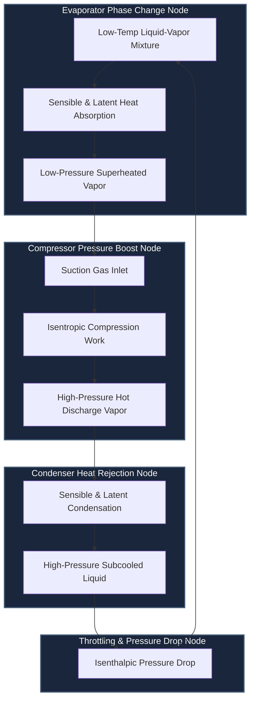

# RPG System Blueprint: Thermodynamics & Phase Fluid Simulation

This document defines the variables, components, visual specs, and data flows for the physical refrigerant and air systems modeled across the RPG.

## 🗺️ System Interaction Topology

## ⚙️ Thermodynamic System Equations

### 1. Compressor Work and Enthalpy Mutation
The energy added to the system ($W_{comp}$) matches the enthalpy shift:
$$W_{comp} = \dot{m} \cdot (h_{discharge} - h_{suction})$$

### 2. Evaporator Heat Absorption
The cooling load ($Q_{evap}$) absorbed by the coil is calculated using:
$$Q_{evap} = \dot{m} \cdot (h_{suction} - h_{evap\_in})$$

---

## 🎮 Game Objects and Specifications

### 1. Scroll Compressor Core (`rpg_comp_core`)
* **Features:** Variable frequency motor simulation, dynamic noise vibration, thermal decay thresholds.
* **Sprite Sheets:** 16 frames of animation mapping current voltage loops.

### 2. Condenser Coil Assembly (`rpg_cond_coil`)
* **Features:** Subcooling state variables, ambient fan efficiency offsets.
* **Sprite Sheets:** 8 frames representing condensation air particle vectors.
