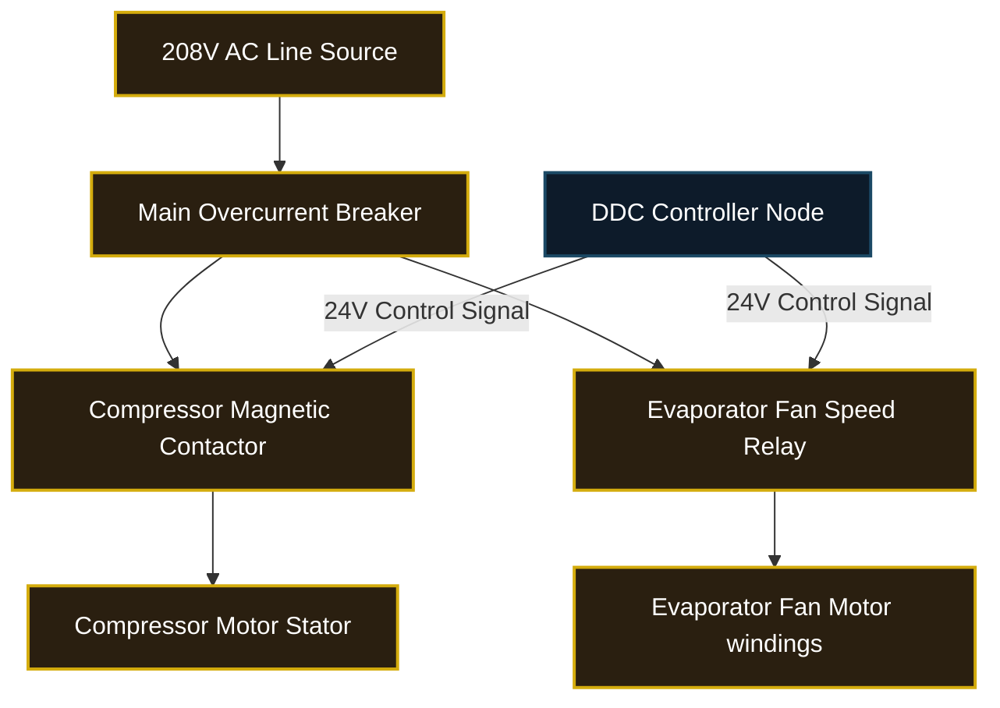

# RPG System Blueprint: Electrical Grid & DDC Control Loops

Defines the voltage nodes, wiring loops, current meters, and automated DDC logic rules.

## 🗺️ System Topology



## 💡 DDC Logic Specifications

### Thermostat Deadband Checks
```python
if current_temp > setpoint + deadband:
    stage_cooling_on()
elif current_temp < setpoint - deadband:
    stage_cooling_off()
```
