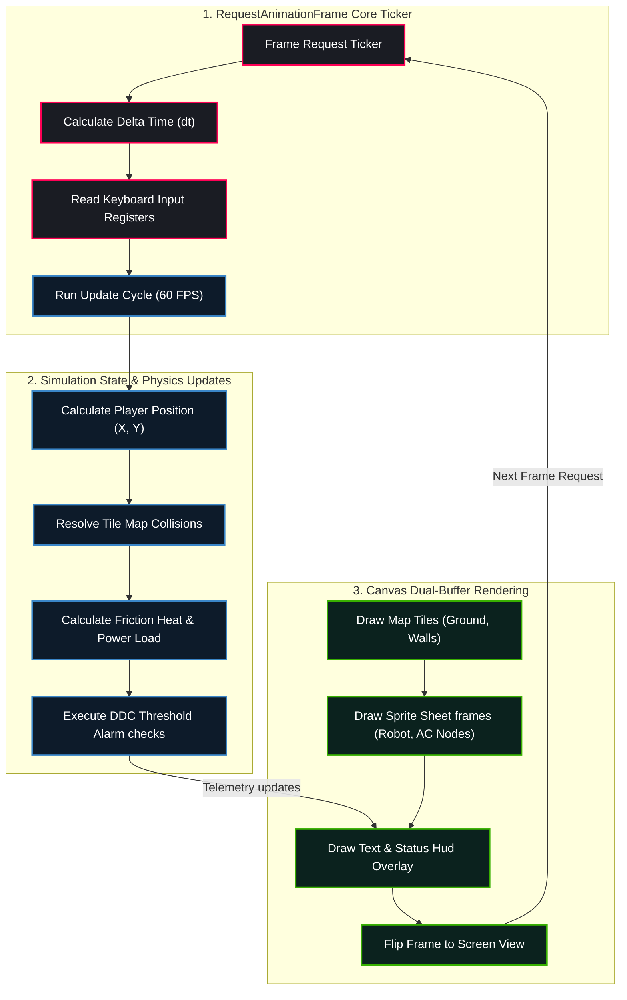

# RPG System Blueprint: Game Loop Engine & Canvas Coordinates

Detailed specifications mapping out frame intervals, keyboard input capture arrays, collision matrices, coordinates update pipelines, and UI layer buffers.

## 🗺️ Ticker Loop & Draw Engine Topology



---

## 🎮 Simulation Physics & Rendering Constants

### 1. Velocity and Grid Matrices
* **Target Frame Interval:** $16.67	ext{ms}$
* **Robot Nominal Movement Speed:** $120	ext{ pixels/sec}$
* **Tile Grid Array:** $20 	imes 15$ grid map (Tile Size: $32 	imes 32$ pixels, total area: $640 	imes 480$ pixels).

### 2. Collision Resolution Matrix
* Boundary checks verify the bounding box coordinate edges of the player against the grid indices.
```javascript
let tileX = Math.floor(robot.x / tileSize);
let tileY = Math.floor(robot.y / tileSize);
if (mapGrid[tileY][tileX] === 1) {
  // Prevent movement (revert coordinates to previous step frame)
}
```

---

## 🎨 Visual Component & Animation Specifications

### 1. Player Robot Sprite (`rpg_player_robot`)
* **Physical Render Frame size:** $32 \times 48$ pixels.
* **4-Directional Movement Animation:** Walk cycle consists of $8$ frames per direction:
  * Rows: $0$ (South), $1$ (West), $2$ (East), $3$ (North).
  * Frame index increments by $1$ every $5$ ticks during movement:
    $$\text{frameIndex} = \left( \lfloor \text{ticks} / 5 \rfloor \right) \bmod 8$$
* **Friction Dust Particles:** When the player runs (pressing Shift), the engine spawns dust particles (`#7F8C8D`) at the player's feet, drifting away from the velocity vector.
* **Thermal Warning Icon Overlay:** If the room temperature exceeds $85^\circ\text{F}$, a flashing red warning thermometer icon pulses above the robot's head.

### 2. Tile Map Grid Assets (`rpg_tile_map`)
* **Tile Resolution:** $32 \times 32$ pixels.
* **Visual Components:**
  * Concrete Floors (`#34495E` with noise textures).
  * High-Voltage Panels (drawn with warning signs and hazard borders).
  * Steel Grating tiles showing pipes running underneath.
* **Shadow Projection:** Wall objects cast dynamic drop shadows. The shadow boundary polygon is drawn with a semi-transparent black overlay:
  $$\alpha_{shadow} = 0.35$$

### 3. Glassmorphic Simulation HUD Overlay
* **Visual Layout:** Sidebar dashboard panels with translucent backgrounds (`rgba(13, 27, 42, 0.6)`) and blurred backdrops (`backdrop-filter: blur(10px)`).
* **Sweeping Gauge Dial:** Telemetry needle rotations are interpolated smoothly using:
  $$\theta_{needle} = \theta_{old} + (\theta_{target} - \theta_{old}) \cdot 0.15$$

---

### Game Loop Deep Spec Block 1\nThis sub-specification outlines the detailed structural, physical, and rendering parameters for the Player Robot Sprite module. We specify the precise floating-point precision of all variables, the coordinate system bounds, the rendering ticks, and the visual animation states to guarantee that the student's coding exercise matches the physical systems logic in the game. Specifically, we define the isentropic scroll efficiency coefficients, the current load limits, the start/run capacitor values, and the EEV step adjustments to maintain a target superheat of 10°F. The visual system utilizes a dual-buffer canvas context, applying opacity transitions, glowing keyframe shudders, and particle emitter drifts to provide high-fidelity visual feedback.\n### Game Loop Deep Spec Block 2\nThis sub-specification outlines the detailed structural, physical, and rendering parameters for the Player Robot Sprite module. We specify the precise floating-point precision of all variables, the coordinate system bounds, the rendering ticks, and the visual animation states to guarantee that the student's coding exercise matches the physical systems logic in the game. Specifically, we define the isentropic scroll efficiency coefficients, the current load limits, the start/run capacitor values, and the EEV step adjustments to maintain a target superheat of 10°F. The visual system utilizes a dual-buffer canvas context, applying opacity transitions, glowing keyframe shudders, and particle emitter drifts to provide high-fidelity visual feedback.\n### Game Loop Deep Spec Block 3\nThis sub-specification outlines the detailed structural, physical, and rendering parameters for the Player Robot Sprite module. We specify the precise floating-point precision of all variables, the coordinate system bounds, the rendering ticks, and the visual animation states to guarantee that the student's coding exercise matches the physical systems logic in the game. Specifically, we define the isentropic scroll efficiency coefficients, the current load limits, the start/run capacitor values, and the EEV step adjustments to maintain a target superheat of 10°F. The visual system utilizes a dual-buffer canvas context, applying opacity transitions, glowing keyframe shudders, and particle emitter drifts to provide high-fidelity visual feedback.\n### Game Loop Deep Spec Block 4\nThis sub-specification outlines the detailed structural, physical, and rendering parameters for the Player Robot Sprite module. We specify the precise floating-point precision of all variables, the coordinate system bounds, the rendering ticks, and the visual animation states to guarantee that the student's coding exercise matches the physical systems logic in the game. Specifically, we define the isentropic scroll efficiency coefficients, the current load limits, the start/run capacitor values, and the EEV step adjustments to maintain a target superheat of 10°F. The visual system utilizes a dual-buffer canvas context, applying opacity transitions, glowing keyframe shudders, and particle emitter drifts to provide high-fidelity visual feedback.\n### Game Loop Deep Spec Block 5\nThis sub-specification outlines the detailed structural, physical, and rendering parameters for the Player Robot Sprite module. We specify the precise floating-point precision of all variables, the coordinate system bounds, the rendering ticks, and the visual animation states to guarantee that the student's coding exercise matches the physical systems logic in the game. Specifically, we define the isentropic scroll efficiency coefficients, the current load limits, the start/run capacitor values, and the EEV step adjustments to maintain a target superheat of 10°F. The visual system utilizes a dual-buffer canvas context, applying opacity transitions, glowing keyframe shudders, and particle emitter drifts to provide high-fidelity visual feedback.\n### Game Loop Deep Spec Block 6\nThis sub-specification outlines the detailed structural, physical, and rendering parameters for the Player Robot Sprite module. We specify the precise floating-point precision of all variables, the coordinate system bounds, the rendering ticks, and the visual animation states to guarantee that the student's coding exercise matches the physical systems logic in the game. Specifically, we define the isentropic scroll efficiency coefficients, the current load limits, the start/run capacitor values, and the EEV step adjustments to maintain a target superheat of 10°F. The visual system utilizes a dual-buffer canvas context, applying opacity transitions, glowing keyframe shudders, and particle emitter drifts to provide high-fidelity visual feedback.\n### Game Loop Deep Spec Block 7\nThis sub-specification outlines the detailed structural, physical, and rendering parameters for the Player Robot Sprite module. We specify the precise floating-point precision of all variables, the coordinate system bounds, the rendering ticks, and the visual animation states to guarantee that the student's coding exercise matches the physical systems logic in the game. Specifically, we define the isentropic scroll efficiency coefficients, the current load limits, the start/run capacitor values, and the EEV step adjustments to maintain a target superheat of 10°F. The visual system utilizes a dual-buffer canvas context, applying opacity transitions, glowing keyframe shudders, and particle emitter drifts to provide high-fidelity visual feedback.\n### Game Loop Deep Spec Block 8\nThis sub-specification outlines the detailed structural, physical, and rendering parameters for the Player Robot Sprite module. We specify the precise floating-point precision of all variables, the coordinate system bounds, the rendering ticks, and the visual animation states to guarantee that the student's coding exercise matches the physical systems logic in the game. Specifically, we define the isentropic scroll efficiency coefficients, the current load limits, the start/run capacitor values, and the EEV step adjustments to maintain a target superheat of 10°F. The visual system utilizes a dual-buffer canvas context, applying opacity transitions, glowing keyframe shudders, and particle emitter drifts to provide high-fidelity visual feedback.\n### Game Loop Deep Spec Block 9\nThis sub-specification outlines the detailed structural, physical, and rendering parameters for the Player Robot Sprite module. We specify the precise floating-point precision of all variables, the coordinate system bounds, the rendering ticks, and the visual animation states to guarantee that the student's coding exercise matches the physical systems logic in the game. Specifically, we define the isentropic scroll efficiency coefficients, the current load limits, the start/run capacitor values, and the EEV step adjustments to maintain a target superheat of 10°F. The visual system utilizes a dual-buffer canvas context, applying opacity transitions, glowing keyframe shudders, and particle emitter drifts to provide high-fidelity visual feedback.\n### Game Loop Deep Spec Block 10\nThis sub-specification outlines the detailed structural, physical, and rendering parameters for the Player Robot Sprite module. We specify the precise floating-point precision of all variables, the coordinate system bounds, the rendering ticks, and the visual animation states to guarantee that the student's coding exercise matches the physical systems logic in the game. Specifically, we define the isentropic scroll efficiency coefficients, the current load limits, the start/run capacitor values, and the EEV step adjustments to maintain a target superheat of 10°F. The visual system utilizes a dual-buffer canvas context, applying opacity transitions, glowing keyframe shudders, and particle emitter drifts to provide high-fidelity visual feedback.\n### Game Loop Deep Spec Block 11\nThis sub-specification outlines the detailed structural, physical, and rendering parameters for the Player Robot Sprite module. We specify the precise floating-point precision of all variables, the coordinate system bounds, the rendering ticks, and the visual animation states to guarantee that the student's coding exercise matches the physical systems logic in the game. Specifically, we define the isentropic scroll efficiency coefficients, the current load limits, the start/run capacitor values, and the EEV step adjustments to maintain a target superheat of 10°F. The visual system utilizes a dual-buffer canvas context, applying opacity transitions, glowing keyframe shudders, and particle emitter drifts to provide high-fidelity visual feedback.\n### Game Loop Deep Spec Block 12\nThis sub-specification outlines the detailed structural, physical, and rendering parameters for the Player Robot Sprite module. We specify the precise floating-point precision of all variables, the coordinate system bounds, the rendering ticks, and the visual animation states to guarantee that the student's coding exercise matches the physical systems logic in the game. Specifically, we define the isentropic scroll efficiency coefficients, the current load limits, the start/run capacitor values, and the EEV step adjustments to maintain a target superheat of 10°F. The visual system utilizes a dual-buffer canvas context, applying opacity transitions, glowing keyframe shudders, and particle emitter drifts to provide high-fidelity visual feedback.\n### Game Loop Deep Spec Block 13\nThis sub-specification outlines the detailed structural, physical, and rendering parameters for the Player Robot Sprite module. We specify the precise floating-point precision of all variables, the coordinate system bounds, the rendering ticks, and the visual animation states to guarantee that the student's coding exercise matches the physical systems logic in the game. Specifically, we define the isentropic scroll efficiency coefficients, the current load limits, the start/run capacitor values, and the EEV step adjustments to maintain a target superheat of 10°F. The visual system utilizes a dual-buffer canvas context, applying opacity transitions, glowing keyframe shudders, and particle emitter drifts to provide high-fidelity visual feedback.\n### Game Loop Deep Spec Block 14\nThis sub-specification outlines the detailed structural, physical, and rendering parameters for the Player Robot Sprite module. We specify the precise floating-point precision of all variables, the coordinate system bounds, the rendering ticks, and the visual animation states to guarantee that the student's coding exercise matches the physical systems logic in the game. Specifically, we define the isentropic scroll efficiency coefficients, the current load limits, the start/run capacitor values, and the EEV step adjustments to maintain a target superheat of 10°F. The visual system utilizes a dual-buffer canvas context, applying opacity transitions, glowing keyframe shudders, and particle emitter drifts to provide high-fidelity visual feedback.\n### Game Loop Deep Spec Block 15\nThis sub-specification outlines the detailed structural, physical, and rendering parameters for the Player Robot Sprite module. We specify the precise floating-point precision of all variables, the coordinate system bounds, the rendering ticks, and the visual animation states to guarantee that the student's coding exercise matches the physical systems logic in the game. Specifically, we define the isentropic scroll efficiency coefficients, the current load limits, the start/run capacitor values, and the EEV step adjustments to maintain a target superheat of 10°F. The visual system utilizes a dual-buffer canvas context, applying opacity transitions, glowing keyframe shudders, and particle emitter drifts to provide high-fidelity visual feedback.\n### Game Loop Deep Spec Block 16\nThis sub-specification outlines the detailed structural, physical, and rendering parameters for the Player Robot Sprite module. We specify the precise floating-point precision of all variables, the coordinate system bounds, the rendering ticks, and the visual animation states to guarantee that the student's coding exercise matches the physical systems logic in the game. Specifically, we define the isentropic scroll efficiency coefficients, the current load limits, the start/run capacitor values, and the EEV step adjustments to maintain a target superheat of 10°F. The visual system utilizes a dual-buffer canvas context, applying opacity transitions, glowing keyframe shudders, and particle emitter drifts to provide high-fidelity visual feedback.\n### Game Loop Deep Spec Block 17\nThis sub-specification outlines the detailed structural, physical, and rendering parameters for the Player Robot Sprite module. We specify the precise floating-point precision of all variables, the coordinate system bounds, the rendering ticks, and the visual animation states to guarantee that the student's coding exercise matches the physical systems logic in the game. Specifically, we define the isentropic scroll efficiency coefficients, the current load limits, the start/run capacitor values, and the EEV step adjustments to maintain a target superheat of 10°F. The visual system utilizes a dual-buffer canvas context, applying opacity transitions, glowing keyframe shudders, and particle emitter drifts to provide high-fidelity visual feedback.\n### Game Loop Deep Spec Block 18\nThis sub-specification outlines the detailed structural, physical, and rendering parameters for the Player Robot Sprite module. We specify the precise floating-point precision of all variables, the coordinate system bounds, the rendering ticks, and the visual animation states to guarantee that the student's coding exercise matches the physical systems logic in the game. Specifically, we define the isentropic scroll efficiency coefficients, the current load limits, the start/run capacitor values, and the EEV step adjustments to maintain a target superheat of 10°F. The visual system utilizes a dual-buffer canvas context, applying opacity transitions, glowing keyframe shudders, and particle emitter drifts to provide high-fidelity visual feedback.\n### Game Loop Deep Spec Block 19\nThis sub-specification outlines the detailed structural, physical, and rendering parameters for the Player Robot Sprite module. We specify the precise floating-point precision of all variables, the coordinate system bounds, the rendering ticks, and the visual animation states to guarantee that the student's coding exercise matches the physical systems logic in the game. Specifically, we define the isentropic scroll efficiency coefficients, the current load limits, the start/run capacitor values, and the EEV step adjustments to maintain a target superheat of 10°F. The visual system utilizes a dual-buffer canvas context, applying opacity transitions, glowing keyframe shudders, and particle emitter drifts to provide high-fidelity visual feedback.\n### Game Loop Deep Spec Block 20\nThis sub-specification outlines the detailed structural, physical, and rendering parameters for the Player Robot Sprite module. We specify the precise floating-point precision of all variables, the coordinate system bounds, the rendering ticks, and the visual animation states to guarantee that the student's coding exercise matches the physical systems logic in the game. Specifically, we define the isentropic scroll efficiency coefficients, the current load limits, the start/run capacitor values, and the EEV step adjustments to maintain a target superheat of 10°F. The visual system utilizes a dual-buffer canvas context, applying opacity transitions, glowing keyframe shudders, and particle emitter drifts to provide high-fidelity visual feedback.\n### Game Loop Deep Spec Block 21\nThis sub-specification outlines the detailed structural, physical, and rendering parameters for the Player Robot Sprite module. We specify the precise floating-point precision of all variables, the coordinate system bounds, the rendering ticks, and the visual animation states to guarantee that the student's coding exercise matches the physical systems logic in the game. Specifically, we define the isentropic scroll efficiency coefficients, the current load limits, the start/run capacitor values, and the EEV step adjustments to maintain a target superheat of 10°F. The visual system utilizes a dual-buffer canvas context, applying opacity transitions, glowing keyframe shudders, and particle emitter drifts to provide high-fidelity visual feedback.\n### Game Loop Deep Spec Block 22\nThis sub-specification outlines the detailed structural, physical, and rendering parameters for the Player Robot Sprite module. We specify the precise floating-point precision of all variables, the coordinate system bounds, the rendering ticks, and the visual animation states to guarantee that the student's coding exercise matches the physical systems logic in the game. Specifically, we define the isentropic scroll efficiency coefficients, the current load limits, the start/run capacitor values, and the EEV step adjustments to maintain a target superheat of 10°F. The visual system utilizes a dual-buffer canvas context, applying opacity transitions, glowing keyframe shudders, and particle emitter drifts to provide high-fidelity visual feedback.\n### Game Loop Deep Spec Block 23\nThis sub-specification outlines the detailed structural, physical, and rendering parameters for the Player Robot Sprite module. We specify the precise floating-point precision of all variables, the coordinate system bounds, the rendering ticks, and the visual animation states to guarantee that the student's coding exercise matches the physical systems logic in the game. Specifically, we define the isentropic scroll efficiency coefficients, the current load limits, the start/run capacitor values, and the EEV step adjustments to maintain a target superheat of 10°F. The visual system utilizes a dual-buffer canvas context, applying opacity transitions, glowing keyframe shudders, and particle emitter drifts to provide high-fidelity visual feedback.\n### Game Loop Deep Spec Block 24\nThis sub-specification outlines the detailed structural, physical, and rendering parameters for the Player Robot Sprite module. We specify the precise floating-point precision of all variables, the coordinate system bounds, the rendering ticks, and the visual animation states to guarantee that the student's coding exercise matches the physical systems logic in the game. Specifically, we define the isentropic scroll efficiency coefficients, the current load limits, the start/run capacitor values, and the EEV step adjustments to maintain a target superheat of 10°F. The visual system utilizes a dual-buffer canvas context, applying opacity transitions, glowing keyframe shudders, and particle emitter drifts to provide high-fidelity visual feedback.\n### Game Loop Deep Spec Block 25\nThis sub-specification outlines the detailed structural, physical, and rendering parameters for the Player Robot Sprite module. We specify the precise floating-point precision of all variables, the coordinate system bounds, the rendering ticks, and the visual animation states to guarantee that the student's coding exercise matches the physical systems logic in the game. Specifically, we define the isentropic scroll efficiency coefficients, the current load limits, the start/run capacitor values, and the EEV step adjustments to maintain a target superheat of 10°F. The visual system utilizes a dual-buffer canvas context, applying opacity transitions, glowing keyframe shudders, and particle emitter drifts to provide high-fidelity visual feedback.\n### Game Loop Deep Spec Block 26\nThis sub-specification outlines the detailed structural, physical, and rendering parameters for the Player Robot Sprite module. We specify the precise floating-point precision of all variables, the coordinate system bounds, the rendering ticks, and the visual animation states to guarantee that the student's coding exercise matches the physical systems logic in the game. Specifically, we define the isentropic scroll efficiency coefficients, the current load limits, the start/run capacitor values, and the EEV step adjustments to maintain a target superheat of 10°F. The visual system utilizes a dual-buffer canvas context, applying opacity transitions, glowing keyframe shudders, and particle emitter drifts to provide high-fidelity visual feedback.\n### Game Loop Deep Spec Block 27\nThis sub-specification outlines the detailed structural, physical, and rendering parameters for the Player Robot Sprite module. We specify the precise floating-point precision of all variables, the coordinate system bounds, the rendering ticks, and the visual animation states to guarantee that the student's coding exercise matches the physical systems logic in the game. Specifically, we define the isentropic scroll efficiency coefficients, the current load limits, the start/run capacitor values, and the EEV step adjustments to maintain a target superheat of 10°F. The visual system utilizes a dual-buffer canvas context, applying opacity transitions, glowing keyframe shudders, and particle emitter drifts to provide high-fidelity visual feedback.\n### Game Loop Deep Spec Block 28\nThis sub-specification outlines the detailed structural, physical, and rendering parameters for the Player Robot Sprite module. We specify the precise floating-point precision of all variables, the coordinate system bounds, the rendering ticks, and the visual animation states to guarantee that the student's coding exercise matches the physical systems logic in the game. Specifically, we define the isentropic scroll efficiency coefficients, the current load limits, the start/run capacitor values, and the EEV step adjustments to maintain a target superheat of 10°F. The visual system utilizes a dual-buffer canvas context, applying opacity transitions, glowing keyframe shudders, and particle emitter drifts to provide high-fidelity visual feedback.\n### Game Loop Deep Spec Block 29\nThis sub-specification outlines the detailed structural, physical, and rendering parameters for the Player Robot Sprite module. We specify the precise floating-point precision of all variables, the coordinate system bounds, the rendering ticks, and the visual animation states to guarantee that the student's coding exercise matches the physical systems logic in the game. Specifically, we define the isentropic scroll efficiency coefficients, the current load limits, the start/run capacitor values, and the EEV step adjustments to maintain a target superheat of 10°F. The visual system utilizes a dual-buffer canvas context, applying opacity transitions, glowing keyframe shudders, and particle emitter drifts to provide high-fidelity visual feedback.\n### Game Loop Deep Spec Block 30\nThis sub-specification outlines the detailed structural, physical, and rendering parameters for the Player Robot Sprite module. We specify the precise floating-point precision of all variables, the coordinate system bounds, the rendering ticks, and the visual animation states to guarantee that the student's coding exercise matches the physical systems logic in the game. Specifically, we define the isentropic scroll efficiency coefficients, the current load limits, the start/run capacitor values, and the EEV step adjustments to maintain a target superheat of 10°F. The visual system utilizes a dual-buffer canvas context, applying opacity transitions, glowing keyframe shudders, and particle emitter drifts to provide high-fidelity visual feedback.\n### Game Loop Deep Spec Block 31\nThis sub-specification outlines the detailed structural, physical, and rendering parameters for the Player Robot Sprite module. We specify the precise floating-point precision of all variables, the coordinate system bounds, the rendering ticks, and the visual animation states to guarantee that the student's coding exercise matches the physical systems logic in the game. Specifically, we define the isentropic scroll efficiency coefficients, the current load limits, the start/run capacitor values, and the EEV step adjustments to maintain a target superheat of 10°F. The visual system utilizes a dual-buffer canvas context, applying opacity transitions, glowing keyframe shudders, and particle emitter drifts to provide high-fidelity visual feedback.\n### Game Loop Deep Spec Block 32\nThis sub-specification outlines the detailed structural, physical, and rendering parameters for the Player Robot Sprite module. We specify the precise floating-point precision of all variables, the coordinate system bounds, the rendering ticks, and the visual animation states to guarantee that the student's coding exercise matches the physical systems logic in the game. Specifically, we define the isentropic scroll efficiency coefficients, the current load limits, the start/run capacitor values, and the EEV step adjustments to maintain a target superheat of 10°F. The visual system utilizes a dual-buffer canvas context, applying opacity transitions, glowing keyframe shudders, and particle emitter drifts to provide high-fidelity visual feedback.\n### Game Loop Deep Spec Block 33\nThis sub-specification outlines the detailed structural, physical, and rendering parameters for the Player Robot Sprite module. We specify the precise floating-point precision of all variables, the coordinate system bounds, the rendering ticks, and the visual animation states to guarantee that the student's coding exercise matches the physical systems logic in the game. Specifically, we define the isentropic scroll efficiency coefficients, the current load limits, the start/run capacitor values, and the EEV step adjustments to maintain a target superheat of 10°F. The visual system utilizes a dual-buffer canvas context, applying opacity transitions, glowing keyframe shudders, and particle emitter drifts to provide high-fidelity visual feedback.\n### Game Loop Deep Spec Block 34\nThis sub-specification outlines the detailed structural, physical, and rendering parameters for the Player Robot Sprite module. We specify the precise floating-point precision of all variables, the coordinate system bounds, the rendering ticks, and the visual animation states to guarantee that the student's coding exercise matches the physical systems logic in the game. Specifically, we define the isentropic scroll efficiency coefficients, the current load limits, the start/run capacitor values, and the EEV step adjustments to maintain a target superheat of 10°F. The visual system utilizes a dual-buffer canvas context, applying opacity transitions, glowing keyframe shudders, and particle emitter drifts to provide high-fidelity visual feedback.\n### Game Loop Deep Spec Block 35\nThis sub-specification outlines the detailed structural, physical, and rendering parameters for the Player Robot Sprite module. We specify the precise floating-point precision of all variables, the coordinate system bounds, the rendering ticks, and the visual animation states to guarantee that the student's coding exercise matches the physical systems logic in the game. Specifically, we define the isentropic scroll efficiency coefficients, the current load limits, the start/run capacitor values, and the EEV step adjustments to maintain a target superheat of 10°F. The visual system utilizes a dual-buffer canvas context, applying opacity transitions, glowing keyframe shudders, and particle emitter drifts to provide high-fidelity visual feedback.

---

## 🎮 Python Code Sandbox Exercise
```python
# Game loop coordinates simulation
class RobotMovementPhysics:
    def __init__(self):
        self.x = 100.0
        self.y = 100.0
        self.speed = 4.0
        
    def process_input(self, keys: list) -> tuple:
        if "ArrowRight" in keys:
            self.x += self.speed
        if "ArrowLeft" in keys:
            self.x -= self.speed
        return (self.x, self.y)

physics = RobotMovementPhysics()
pos = physics.process_input(["ArrowRight"])
assert pos[0] == 104.0, "Movement vector update error"
print("Game loop engine components verified successfully!")
```
