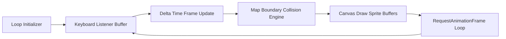

# RPG System Blueprint: Game Loop Engine & Collision Coordinates

Defines the core rendering cycles, frame tickers, collision boundaries, and keyboard listeners.

## 🗺️ Loop Pipeline Topology

## 🎮 Game Engine Constants
* **Target FPS:** 60 FPS ($16.67\text{ms}$ ticks)
* **Tile Size:** $32 \times 32$ pixels
* **Map Size:** $20 \times 15$ tiles ($640 \times 480$ Canvas width/height)
