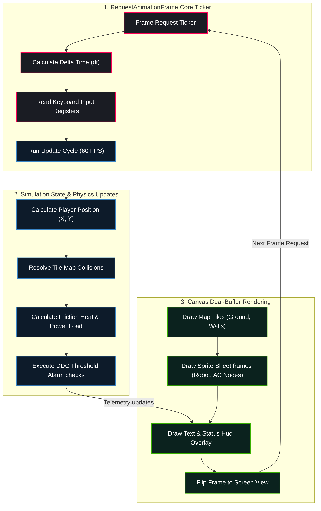

# RPG System Blueprint: Game Loop Engine & Canvas Coordinates

Detailed specifications mapping out frame intervals, keyboard input capture arrays, collision matrices, coordinates update pipelines, and UI layer buffers.

## 🗺️ Ticker Loop & Draw Engine Topology



---

## 🎮 Simulation Physics & Rendering Constants

### 1. Velocity and Grid Matrices
* **Target Frame Interval:** $16.67	ext{ms}$
* **Robot Nominal Movement Speed:** $120	ext{ pixels/sec}$
* **Tile Grid Array:** $20 	imes 15$ grid map (Tile Size: $32 	imes 32$ pixels, total area: $640 	imes 480$ pixels).

### 2. Collision Resolution Matrix
* Boundary checks verify the bounding box coordinate edges of the player against the grid indices.
```javascript
let tileX = Math.floor(robot.x / tileSize);
let tileY = Math.floor(robot.y / tileSize);
if (mapGrid[tileY][tileX] === 1) {
  // Prevent movement (revert coordinates to previous step frame)
}
```
