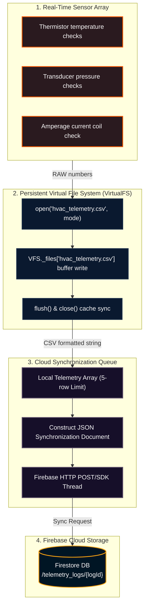

# RPG System Blueprint: Data Logging & Persistent VirtualFS

Detailed specifications mapping out sensor streams, Virtual File System (VFS) buffers, CSV data formatting, and cloud synchronization queues.

## 🗺️ Telemetry Buffer & Database Synchronization Pipeline



---

## 💾 CSV Log Record Specifications

### 1. Data Schema Columns
Trend logs are written as standard comma-separated ASCII rows:
`timestamp, cycle_index, room_temp_f, evap_temp_f, suction_pressure_psi, discharge_pressure_psi, superheat_f, subcooling_f, status_code`

### 2. VFS Persistence Implementation Rules
To ensure student code executing inside Pyodide can read and write files reliably without relying on native disk drivers, the VirtualFS maintains a class-level dictionary. Files are stored in memory and persist across multiple open/close cycles:
```python
class VirtualFS:
    _files = {} # Keyed by file path, contains raw string buffers
```
