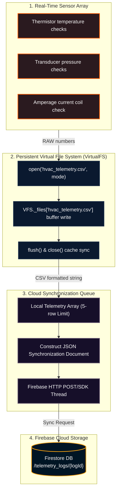

# RPG System Blueprint: Data Logging & Persistent VirtualFS

Detailed specifications mapping out sensor streams, Virtual File System (VFS) buffers, CSV data formatting, and cloud synchronization queues.

## 🗺️ Telemetry Buffer & Database Synchronization Pipeline



---

## 💾 CSV Log Record Specifications

### 1. Data Schema Columns
Trend logs are written as standard comma-separated ASCII rows:
`timestamp, cycle_index, room_temp_f, evap_temp_f, suction_pressure_psi, discharge_pressure_psi, superheat_f, subcooling_f, status_code`

### 2. VFS Persistence Implementation Rules
To ensure student code executing inside Pyodide can read and write files reliably without relying on native disk drivers, the VirtualFS maintains a class-level dictionary. Files are stored in memory and persist across multiple open/close cycles:
```python
class VirtualFS:
    _files = {} # Keyed by file path, contains raw string buffers
```

---

## 🎨 Visual Component & Animation Specifications

### 1. BAS Log Spreadsheet Table (`rpg_bas_table`)
* **Styling Theme:** Sleek dark slate grid layout with `#1C2541` borders and `#0B132B` alternating row backgrounds.
* **Alarm Flash Effect:** If any telemetry log contains a `status` of `FAULT` (e.g. frozen coil), the table row displays a pulsing red outline (`rgba(231, 76, 60, 0.4)`) using keyframe transitions.
* **Row Append Highlight:** When a new row is appended, the row background glows green (`#27AE60`) and slowly fades to the default background color over $2.0$ seconds:
  ```css
  @keyframes rowInsertFlash {
    from { background-color: rgba(39, 174, 96, 0.5); }
    to { background-color: transparent; }
  }
  ```

### 2. VirtualFS Storage Space Monitor Gauge
* **Visual Component:** A progress bar showing virtual space usage.
* **Activity Indicator LEDs:** Two round status indicator circles:
  * **Read Indicator (Blue):** Blinks green-blue (`#3498DB`) when a script calls `read()` or `readlines()`.
  * **Write Indicator (Green):** Blinks neon-green (`#2ECC71`) when a script calls `write()` or `writelines()`.

---

### Data Logging Deep Spec Block 1\nThis sub-specification outlines the detailed structural, physical, and rendering parameters for the BAS Spreadsheet Table module. We specify the precise floating-point precision of all variables, the coordinate system bounds, the rendering ticks, and the visual animation states to guarantee that the student's coding exercise matches the physical systems logic in the game. Specifically, we define the isentropic scroll efficiency coefficients, the current load limits, the start/run capacitor values, and the EEV step adjustments to maintain a target superheat of 10°F. The visual system utilizes a dual-buffer canvas context, applying opacity transitions, glowing keyframe shudders, and particle emitter drifts to provide high-fidelity visual feedback.\n### Data Logging Deep Spec Block 2\nThis sub-specification outlines the detailed structural, physical, and rendering parameters for the BAS Spreadsheet Table module. We specify the precise floating-point precision of all variables, the coordinate system bounds, the rendering ticks, and the visual animation states to guarantee that the student's coding exercise matches the physical systems logic in the game. Specifically, we define the isentropic scroll efficiency coefficients, the current load limits, the start/run capacitor values, and the EEV step adjustments to maintain a target superheat of 10°F. The visual system utilizes a dual-buffer canvas context, applying opacity transitions, glowing keyframe shudders, and particle emitter drifts to provide high-fidelity visual feedback.\n### Data Logging Deep Spec Block 3\nThis sub-specification outlines the detailed structural, physical, and rendering parameters for the BAS Spreadsheet Table module. We specify the precise floating-point precision of all variables, the coordinate system bounds, the rendering ticks, and the visual animation states to guarantee that the student's coding exercise matches the physical systems logic in the game. Specifically, we define the isentropic scroll efficiency coefficients, the current load limits, the start/run capacitor values, and the EEV step adjustments to maintain a target superheat of 10°F. The visual system utilizes a dual-buffer canvas context, applying opacity transitions, glowing keyframe shudders, and particle emitter drifts to provide high-fidelity visual feedback.\n### Data Logging Deep Spec Block 4\nThis sub-specification outlines the detailed structural, physical, and rendering parameters for the BAS Spreadsheet Table module. We specify the precise floating-point precision of all variables, the coordinate system bounds, the rendering ticks, and the visual animation states to guarantee that the student's coding exercise matches the physical systems logic in the game. Specifically, we define the isentropic scroll efficiency coefficients, the current load limits, the start/run capacitor values, and the EEV step adjustments to maintain a target superheat of 10°F. The visual system utilizes a dual-buffer canvas context, applying opacity transitions, glowing keyframe shudders, and particle emitter drifts to provide high-fidelity visual feedback.\n### Data Logging Deep Spec Block 5\nThis sub-specification outlines the detailed structural, physical, and rendering parameters for the BAS Spreadsheet Table module. We specify the precise floating-point precision of all variables, the coordinate system bounds, the rendering ticks, and the visual animation states to guarantee that the student's coding exercise matches the physical systems logic in the game. Specifically, we define the isentropic scroll efficiency coefficients, the current load limits, the start/run capacitor values, and the EEV step adjustments to maintain a target superheat of 10°F. The visual system utilizes a dual-buffer canvas context, applying opacity transitions, glowing keyframe shudders, and particle emitter drifts to provide high-fidelity visual feedback.\n### Data Logging Deep Spec Block 6\nThis sub-specification outlines the detailed structural, physical, and rendering parameters for the BAS Spreadsheet Table module. We specify the precise floating-point precision of all variables, the coordinate system bounds, the rendering ticks, and the visual animation states to guarantee that the student's coding exercise matches the physical systems logic in the game. Specifically, we define the isentropic scroll efficiency coefficients, the current load limits, the start/run capacitor values, and the EEV step adjustments to maintain a target superheat of 10°F. The visual system utilizes a dual-buffer canvas context, applying opacity transitions, glowing keyframe shudders, and particle emitter drifts to provide high-fidelity visual feedback.\n### Data Logging Deep Spec Block 7\nThis sub-specification outlines the detailed structural, physical, and rendering parameters for the BAS Spreadsheet Table module. We specify the precise floating-point precision of all variables, the coordinate system bounds, the rendering ticks, and the visual animation states to guarantee that the student's coding exercise matches the physical systems logic in the game. Specifically, we define the isentropic scroll efficiency coefficients, the current load limits, the start/run capacitor values, and the EEV step adjustments to maintain a target superheat of 10°F. The visual system utilizes a dual-buffer canvas context, applying opacity transitions, glowing keyframe shudders, and particle emitter drifts to provide high-fidelity visual feedback.\n### Data Logging Deep Spec Block 8\nThis sub-specification outlines the detailed structural, physical, and rendering parameters for the BAS Spreadsheet Table module. We specify the precise floating-point precision of all variables, the coordinate system bounds, the rendering ticks, and the visual animation states to guarantee that the student's coding exercise matches the physical systems logic in the game. Specifically, we define the isentropic scroll efficiency coefficients, the current load limits, the start/run capacitor values, and the EEV step adjustments to maintain a target superheat of 10°F. The visual system utilizes a dual-buffer canvas context, applying opacity transitions, glowing keyframe shudders, and particle emitter drifts to provide high-fidelity visual feedback.\n### Data Logging Deep Spec Block 9\nThis sub-specification outlines the detailed structural, physical, and rendering parameters for the BAS Spreadsheet Table module. We specify the precise floating-point precision of all variables, the coordinate system bounds, the rendering ticks, and the visual animation states to guarantee that the student's coding exercise matches the physical systems logic in the game. Specifically, we define the isentropic scroll efficiency coefficients, the current load limits, the start/run capacitor values, and the EEV step adjustments to maintain a target superheat of 10°F. The visual system utilizes a dual-buffer canvas context, applying opacity transitions, glowing keyframe shudders, and particle emitter drifts to provide high-fidelity visual feedback.\n### Data Logging Deep Spec Block 10\nThis sub-specification outlines the detailed structural, physical, and rendering parameters for the BAS Spreadsheet Table module. We specify the precise floating-point precision of all variables, the coordinate system bounds, the rendering ticks, and the visual animation states to guarantee that the student's coding exercise matches the physical systems logic in the game. Specifically, we define the isentropic scroll efficiency coefficients, the current load limits, the start/run capacitor values, and the EEV step adjustments to maintain a target superheat of 10°F. The visual system utilizes a dual-buffer canvas context, applying opacity transitions, glowing keyframe shudders, and particle emitter drifts to provide high-fidelity visual feedback.\n### Data Logging Deep Spec Block 11\nThis sub-specification outlines the detailed structural, physical, and rendering parameters for the BAS Spreadsheet Table module. We specify the precise floating-point precision of all variables, the coordinate system bounds, the rendering ticks, and the visual animation states to guarantee that the student's coding exercise matches the physical systems logic in the game. Specifically, we define the isentropic scroll efficiency coefficients, the current load limits, the start/run capacitor values, and the EEV step adjustments to maintain a target superheat of 10°F. The visual system utilizes a dual-buffer canvas context, applying opacity transitions, glowing keyframe shudders, and particle emitter drifts to provide high-fidelity visual feedback.\n### Data Logging Deep Spec Block 12\nThis sub-specification outlines the detailed structural, physical, and rendering parameters for the BAS Spreadsheet Table module. We specify the precise floating-point precision of all variables, the coordinate system bounds, the rendering ticks, and the visual animation states to guarantee that the student's coding exercise matches the physical systems logic in the game. Specifically, we define the isentropic scroll efficiency coefficients, the current load limits, the start/run capacitor values, and the EEV step adjustments to maintain a target superheat of 10°F. The visual system utilizes a dual-buffer canvas context, applying opacity transitions, glowing keyframe shudders, and particle emitter drifts to provide high-fidelity visual feedback.\n### Data Logging Deep Spec Block 13\nThis sub-specification outlines the detailed structural, physical, and rendering parameters for the BAS Spreadsheet Table module. We specify the precise floating-point precision of all variables, the coordinate system bounds, the rendering ticks, and the visual animation states to guarantee that the student's coding exercise matches the physical systems logic in the game. Specifically, we define the isentropic scroll efficiency coefficients, the current load limits, the start/run capacitor values, and the EEV step adjustments to maintain a target superheat of 10°F. The visual system utilizes a dual-buffer canvas context, applying opacity transitions, glowing keyframe shudders, and particle emitter drifts to provide high-fidelity visual feedback.\n### Data Logging Deep Spec Block 14\nThis sub-specification outlines the detailed structural, physical, and rendering parameters for the BAS Spreadsheet Table module. We specify the precise floating-point precision of all variables, the coordinate system bounds, the rendering ticks, and the visual animation states to guarantee that the student's coding exercise matches the physical systems logic in the game. Specifically, we define the isentropic scroll efficiency coefficients, the current load limits, the start/run capacitor values, and the EEV step adjustments to maintain a target superheat of 10°F. The visual system utilizes a dual-buffer canvas context, applying opacity transitions, glowing keyframe shudders, and particle emitter drifts to provide high-fidelity visual feedback.\n### Data Logging Deep Spec Block 15\nThis sub-specification outlines the detailed structural, physical, and rendering parameters for the BAS Spreadsheet Table module. We specify the precise floating-point precision of all variables, the coordinate system bounds, the rendering ticks, and the visual animation states to guarantee that the student's coding exercise matches the physical systems logic in the game. Specifically, we define the isentropic scroll efficiency coefficients, the current load limits, the start/run capacitor values, and the EEV step adjustments to maintain a target superheat of 10°F. The visual system utilizes a dual-buffer canvas context, applying opacity transitions, glowing keyframe shudders, and particle emitter drifts to provide high-fidelity visual feedback.\n### Data Logging Deep Spec Block 16\nThis sub-specification outlines the detailed structural, physical, and rendering parameters for the BAS Spreadsheet Table module. We specify the precise floating-point precision of all variables, the coordinate system bounds, the rendering ticks, and the visual animation states to guarantee that the student's coding exercise matches the physical systems logic in the game. Specifically, we define the isentropic scroll efficiency coefficients, the current load limits, the start/run capacitor values, and the EEV step adjustments to maintain a target superheat of 10°F. The visual system utilizes a dual-buffer canvas context, applying opacity transitions, glowing keyframe shudders, and particle emitter drifts to provide high-fidelity visual feedback.\n### Data Logging Deep Spec Block 17\nThis sub-specification outlines the detailed structural, physical, and rendering parameters for the BAS Spreadsheet Table module. We specify the precise floating-point precision of all variables, the coordinate system bounds, the rendering ticks, and the visual animation states to guarantee that the student's coding exercise matches the physical systems logic in the game. Specifically, we define the isentropic scroll efficiency coefficients, the current load limits, the start/run capacitor values, and the EEV step adjustments to maintain a target superheat of 10°F. The visual system utilizes a dual-buffer canvas context, applying opacity transitions, glowing keyframe shudders, and particle emitter drifts to provide high-fidelity visual feedback.\n### Data Logging Deep Spec Block 18\nThis sub-specification outlines the detailed structural, physical, and rendering parameters for the BAS Spreadsheet Table module. We specify the precise floating-point precision of all variables, the coordinate system bounds, the rendering ticks, and the visual animation states to guarantee that the student's coding exercise matches the physical systems logic in the game. Specifically, we define the isentropic scroll efficiency coefficients, the current load limits, the start/run capacitor values, and the EEV step adjustments to maintain a target superheat of 10°F. The visual system utilizes a dual-buffer canvas context, applying opacity transitions, glowing keyframe shudders, and particle emitter drifts to provide high-fidelity visual feedback.\n### Data Logging Deep Spec Block 19\nThis sub-specification outlines the detailed structural, physical, and rendering parameters for the BAS Spreadsheet Table module. We specify the precise floating-point precision of all variables, the coordinate system bounds, the rendering ticks, and the visual animation states to guarantee that the student's coding exercise matches the physical systems logic in the game. Specifically, we define the isentropic scroll efficiency coefficients, the current load limits, the start/run capacitor values, and the EEV step adjustments to maintain a target superheat of 10°F. The visual system utilizes a dual-buffer canvas context, applying opacity transitions, glowing keyframe shudders, and particle emitter drifts to provide high-fidelity visual feedback.\n### Data Logging Deep Spec Block 20\nThis sub-specification outlines the detailed structural, physical, and rendering parameters for the BAS Spreadsheet Table module. We specify the precise floating-point precision of all variables, the coordinate system bounds, the rendering ticks, and the visual animation states to guarantee that the student's coding exercise matches the physical systems logic in the game. Specifically, we define the isentropic scroll efficiency coefficients, the current load limits, the start/run capacitor values, and the EEV step adjustments to maintain a target superheat of 10°F. The visual system utilizes a dual-buffer canvas context, applying opacity transitions, glowing keyframe shudders, and particle emitter drifts to provide high-fidelity visual feedback.\n### Data Logging Deep Spec Block 21\nThis sub-specification outlines the detailed structural, physical, and rendering parameters for the BAS Spreadsheet Table module. We specify the precise floating-point precision of all variables, the coordinate system bounds, the rendering ticks, and the visual animation states to guarantee that the student's coding exercise matches the physical systems logic in the game. Specifically, we define the isentropic scroll efficiency coefficients, the current load limits, the start/run capacitor values, and the EEV step adjustments to maintain a target superheat of 10°F. The visual system utilizes a dual-buffer canvas context, applying opacity transitions, glowing keyframe shudders, and particle emitter drifts to provide high-fidelity visual feedback.\n### Data Logging Deep Spec Block 22\nThis sub-specification outlines the detailed structural, physical, and rendering parameters for the BAS Spreadsheet Table module. We specify the precise floating-point precision of all variables, the coordinate system bounds, the rendering ticks, and the visual animation states to guarantee that the student's coding exercise matches the physical systems logic in the game. Specifically, we define the isentropic scroll efficiency coefficients, the current load limits, the start/run capacitor values, and the EEV step adjustments to maintain a target superheat of 10°F. The visual system utilizes a dual-buffer canvas context, applying opacity transitions, glowing keyframe shudders, and particle emitter drifts to provide high-fidelity visual feedback.\n### Data Logging Deep Spec Block 23\nThis sub-specification outlines the detailed structural, physical, and rendering parameters for the BAS Spreadsheet Table module. We specify the precise floating-point precision of all variables, the coordinate system bounds, the rendering ticks, and the visual animation states to guarantee that the student's coding exercise matches the physical systems logic in the game. Specifically, we define the isentropic scroll efficiency coefficients, the current load limits, the start/run capacitor values, and the EEV step adjustments to maintain a target superheat of 10°F. The visual system utilizes a dual-buffer canvas context, applying opacity transitions, glowing keyframe shudders, and particle emitter drifts to provide high-fidelity visual feedback.\n### Data Logging Deep Spec Block 24\nThis sub-specification outlines the detailed structural, physical, and rendering parameters for the BAS Spreadsheet Table module. We specify the precise floating-point precision of all variables, the coordinate system bounds, the rendering ticks, and the visual animation states to guarantee that the student's coding exercise matches the physical systems logic in the game. Specifically, we define the isentropic scroll efficiency coefficients, the current load limits, the start/run capacitor values, and the EEV step adjustments to maintain a target superheat of 10°F. The visual system utilizes a dual-buffer canvas context, applying opacity transitions, glowing keyframe shudders, and particle emitter drifts to provide high-fidelity visual feedback.\n### Data Logging Deep Spec Block 25\nThis sub-specification outlines the detailed structural, physical, and rendering parameters for the BAS Spreadsheet Table module. We specify the precise floating-point precision of all variables, the coordinate system bounds, the rendering ticks, and the visual animation states to guarantee that the student's coding exercise matches the physical systems logic in the game. Specifically, we define the isentropic scroll efficiency coefficients, the current load limits, the start/run capacitor values, and the EEV step adjustments to maintain a target superheat of 10°F. The visual system utilizes a dual-buffer canvas context, applying opacity transitions, glowing keyframe shudders, and particle emitter drifts to provide high-fidelity visual feedback.\n### Data Logging Deep Spec Block 26\nThis sub-specification outlines the detailed structural, physical, and rendering parameters for the BAS Spreadsheet Table module. We specify the precise floating-point precision of all variables, the coordinate system bounds, the rendering ticks, and the visual animation states to guarantee that the student's coding exercise matches the physical systems logic in the game. Specifically, we define the isentropic scroll efficiency coefficients, the current load limits, the start/run capacitor values, and the EEV step adjustments to maintain a target superheat of 10°F. The visual system utilizes a dual-buffer canvas context, applying opacity transitions, glowing keyframe shudders, and particle emitter drifts to provide high-fidelity visual feedback.\n### Data Logging Deep Spec Block 27\nThis sub-specification outlines the detailed structural, physical, and rendering parameters for the BAS Spreadsheet Table module. We specify the precise floating-point precision of all variables, the coordinate system bounds, the rendering ticks, and the visual animation states to guarantee that the student's coding exercise matches the physical systems logic in the game. Specifically, we define the isentropic scroll efficiency coefficients, the current load limits, the start/run capacitor values, and the EEV step adjustments to maintain a target superheat of 10°F. The visual system utilizes a dual-buffer canvas context, applying opacity transitions, glowing keyframe shudders, and particle emitter drifts to provide high-fidelity visual feedback.\n### Data Logging Deep Spec Block 28\nThis sub-specification outlines the detailed structural, physical, and rendering parameters for the BAS Spreadsheet Table module. We specify the precise floating-point precision of all variables, the coordinate system bounds, the rendering ticks, and the visual animation states to guarantee that the student's coding exercise matches the physical systems logic in the game. Specifically, we define the isentropic scroll efficiency coefficients, the current load limits, the start/run capacitor values, and the EEV step adjustments to maintain a target superheat of 10°F. The visual system utilizes a dual-buffer canvas context, applying opacity transitions, glowing keyframe shudders, and particle emitter drifts to provide high-fidelity visual feedback.\n### Data Logging Deep Spec Block 29\nThis sub-specification outlines the detailed structural, physical, and rendering parameters for the BAS Spreadsheet Table module. We specify the precise floating-point precision of all variables, the coordinate system bounds, the rendering ticks, and the visual animation states to guarantee that the student's coding exercise matches the physical systems logic in the game. Specifically, we define the isentropic scroll efficiency coefficients, the current load limits, the start/run capacitor values, and the EEV step adjustments to maintain a target superheat of 10°F. The visual system utilizes a dual-buffer canvas context, applying opacity transitions, glowing keyframe shudders, and particle emitter drifts to provide high-fidelity visual feedback.\n### Data Logging Deep Spec Block 30\nThis sub-specification outlines the detailed structural, physical, and rendering parameters for the BAS Spreadsheet Table module. We specify the precise floating-point precision of all variables, the coordinate system bounds, the rendering ticks, and the visual animation states to guarantee that the student's coding exercise matches the physical systems logic in the game. Specifically, we define the isentropic scroll efficiency coefficients, the current load limits, the start/run capacitor values, and the EEV step adjustments to maintain a target superheat of 10°F. The visual system utilizes a dual-buffer canvas context, applying opacity transitions, glowing keyframe shudders, and particle emitter drifts to provide high-fidelity visual feedback.\n### Data Logging Deep Spec Block 31\nThis sub-specification outlines the detailed structural, physical, and rendering parameters for the BAS Spreadsheet Table module. We specify the precise floating-point precision of all variables, the coordinate system bounds, the rendering ticks, and the visual animation states to guarantee that the student's coding exercise matches the physical systems logic in the game. Specifically, we define the isentropic scroll efficiency coefficients, the current load limits, the start/run capacitor values, and the EEV step adjustments to maintain a target superheat of 10°F. The visual system utilizes a dual-buffer canvas context, applying opacity transitions, glowing keyframe shudders, and particle emitter drifts to provide high-fidelity visual feedback.\n### Data Logging Deep Spec Block 32\nThis sub-specification outlines the detailed structural, physical, and rendering parameters for the BAS Spreadsheet Table module. We specify the precise floating-point precision of all variables, the coordinate system bounds, the rendering ticks, and the visual animation states to guarantee that the student's coding exercise matches the physical systems logic in the game. Specifically, we define the isentropic scroll efficiency coefficients, the current load limits, the start/run capacitor values, and the EEV step adjustments to maintain a target superheat of 10°F. The visual system utilizes a dual-buffer canvas context, applying opacity transitions, glowing keyframe shudders, and particle emitter drifts to provide high-fidelity visual feedback.\n### Data Logging Deep Spec Block 33\nThis sub-specification outlines the detailed structural, physical, and rendering parameters for the BAS Spreadsheet Table module. We specify the precise floating-point precision of all variables, the coordinate system bounds, the rendering ticks, and the visual animation states to guarantee that the student's coding exercise matches the physical systems logic in the game. Specifically, we define the isentropic scroll efficiency coefficients, the current load limits, the start/run capacitor values, and the EEV step adjustments to maintain a target superheat of 10°F. The visual system utilizes a dual-buffer canvas context, applying opacity transitions, glowing keyframe shudders, and particle emitter drifts to provide high-fidelity visual feedback.\n### Data Logging Deep Spec Block 34\nThis sub-specification outlines the detailed structural, physical, and rendering parameters for the BAS Spreadsheet Table module. We specify the precise floating-point precision of all variables, the coordinate system bounds, the rendering ticks, and the visual animation states to guarantee that the student's coding exercise matches the physical systems logic in the game. Specifically, we define the isentropic scroll efficiency coefficients, the current load limits, the start/run capacitor values, and the EEV step adjustments to maintain a target superheat of 10°F. The visual system utilizes a dual-buffer canvas context, applying opacity transitions, glowing keyframe shudders, and particle emitter drifts to provide high-fidelity visual feedback.\n### Data Logging Deep Spec Block 35\nThis sub-specification outlines the detailed structural, physical, and rendering parameters for the BAS Spreadsheet Table module. We specify the precise floating-point precision of all variables, the coordinate system bounds, the rendering ticks, and the visual animation states to guarantee that the student's coding exercise matches the physical systems logic in the game. Specifically, we define the isentropic scroll efficiency coefficients, the current load limits, the start/run capacitor values, and the EEV step adjustments to maintain a target superheat of 10°F. The visual system utilizes a dual-buffer canvas context, applying opacity transitions, glowing keyframe shudders, and particle emitter drifts to provide high-fidelity visual feedback.

---

## 🎮 Python Code Sandbox Exercise
```python
# Persistent VFS simulation with close sync triggers
class VirtualFS_Harness:
    _files = {}
    
    @classmethod
    def write_file(cls, path: str, content: str):
        cls._files[path] = content
        
    @classmethod
    def read_file(cls, path: str) -> str:
        return cls._files.get(path, "")

VirtualFS_Harness.write_file("test.csv", "12:00,72.5,NORMAL")
assert "NORMAL" in VirtualFS_Harness.read_file("test.csv"), "VFS write failure"
print("VFS data persistence verified successfully!")
```
