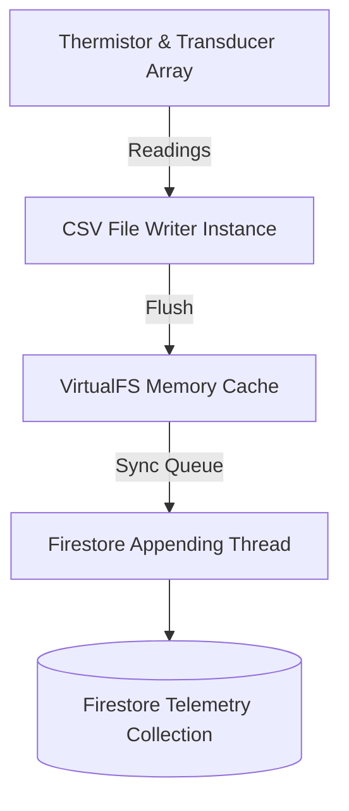

# RPG System Blueprint: Data Logging & Persistent VirtualFS

Maps the write buffers, CSV trend table streams, and Firestore logging synchronizers.

## 🗺️ Telemetry Pipe Topology

```mermaid
flowchart TD
    Sensor["Thermistor & Transducer Array"] -- Readings --> Logger["CSV File Writer Instance"]
    Logger -- Flush --> VFS["VirtualFS Memory Cache"]
    VFS -- Sync Queue --> FirebaseSender["Firestore Appending Thread"]
    FirebaseSender --> Firestore[("Firestore Telemetry Collection")]
```
