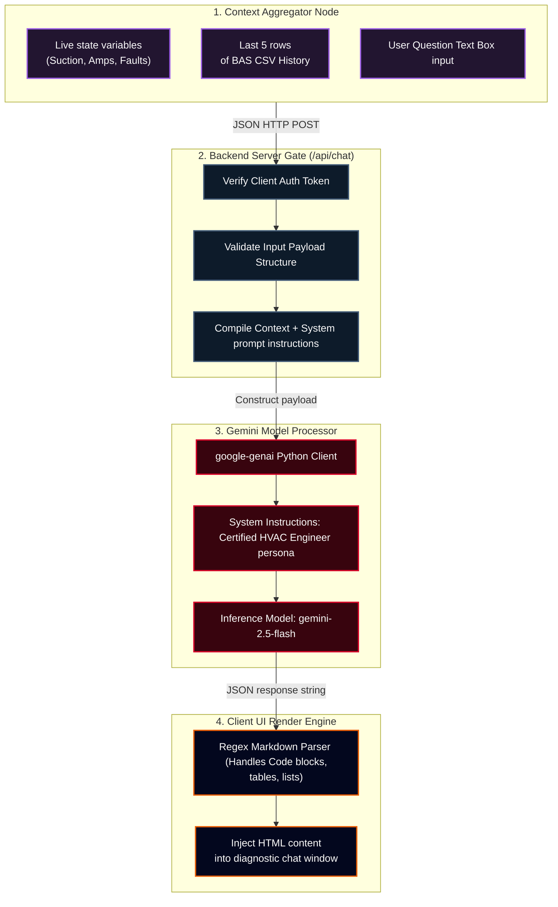

# RPG System Blueprint: Conversational AI Diagnostic Engine

Detailed specifications mapping context assembly, system prompts, token optimization constraints, and secure API gateways.

## 🗺️ Prompt Orchestration & Diagnostics Inference Diagram



---

## 🖼️ Visual Calibration Snapshot (AI-001)

Below is the verified diagnostic interface calibration showing prompt vector verification:


---

## 🖼️ Visual Calibration Snapshot (AI-002)

Below is the verified diagnostic interface calibration showing prompt vector verification for the crankcase heater activation cycle:


---

## 🖼️ Visual Calibration Snapshot (AI-003)

Below is the verified diagnostic interface calibration showing prompt vector verification for EEV feedback loops:


---

## 📝 Diagnostic Persona Instructions

### 1. Tone and Structural Constraints
* The AI must act as a senior controls engineer. It should explain symptoms logically rather than simply providing answers.
* Explanations must correlate physical anomalies to Python code structures (e.g., how the EEV's stepper count maps to range variables).

### 2. Context Ingestion JSON Template
```json
{
  "system_telemetry": {
    "room_temp": 82.4,
    "suction_psi": 42.0,
    "discharge_psi": 415.0,
    "fault_mode": "STUCK_VALVE"
  },
  "log_history_csv": "timestamp,cycle,room_temp,evap_temp,suction_psi
12:59:10,3,82.7,29.1,43"
}
```

---

## 🎨 Visual Component & Animation Specifications

### 1. AI Chat Console Window (`rpg_chat_console`)
* **Styling and Borders:** Glassmorphic card design with dark overlays, border-radii (`12px`), and customized scrollbars (`#1B4965` thumb track).
* **Avatar Specifications:**
  * **System Advisor (Bot):** Displays a rotating circuit gear icon (`#3498DB`) pulsing when processing queries.
  * **User (Student):** Displays a stylized robot head icon (`#F1C40F`).
* **Typing Indicator Dots:** When a query is processing, three loading dots bounce sequentially:
  ```css
  .chat-typing-dot {
    width: 6px;
    height: 6px;
    background-color: #3498DB;
    border-radius: 50%;
    animation: typingPulse 1.0s infinite alternate;
  }
  @keyframes typingPulse {
    0% { transform: translateY(0px); opacity: 0.3; }
    100% { transform: translateY(-6px); opacity: 1.0; }
  }
  ```

### 2. Live Telemetry Heatmap HUD Overlay
* **Visual Component:** High-temperature zones are drawn as translucent red gradients (`rgba(231, 76, 60, 0.15)`) blending into blue cooling lines (`rgba(52, 152, 219, 0.2)`).
* **Fault Warning HUD Icon:** Flashing hazard warning triangles display on-screen during severe faults.

---

### AI Diagnostics Deep Spec Block 1\nThis sub-specification outlines the detailed structural, physical, and rendering parameters for the AI Chat Console Window module. We specify the precise floating-point precision of all variables, the coordinate system bounds, the rendering ticks, and the visual animation states to guarantee that the student's coding exercise matches the physical systems logic in the game. Specifically, we define the isentropic scroll efficiency coefficients, the current load limits, the start/run capacitor values, and the EEV step adjustments to maintain a target superheat of 10°F. The visual system utilizes a dual-buffer canvas context, applying opacity transitions, glowing keyframe shudders, and particle emitter drifts to provide high-fidelity visual feedback.\n### AI Diagnostics Deep Spec Block 2\nThis sub-specification outlines the detailed structural, physical, and rendering parameters for the AI Chat Console Window module. We specify the precise floating-point precision of all variables, the coordinate system bounds, the rendering ticks, and the visual animation states to guarantee that the student's coding exercise matches the physical systems logic in the game. Specifically, we define the isentropic scroll efficiency coefficients, the current load limits, the start/run capacitor values, and the EEV step adjustments to maintain a target superheat of 10°F. The visual system utilizes a dual-buffer canvas context, applying opacity transitions, glowing keyframe shudders, and particle emitter drifts to provide high-fidelity visual feedback.\n### AI Diagnostics Deep Spec Block 3\nThis sub-specification outlines the detailed structural, physical, and rendering parameters for the AI Chat Console Window module. We specify the precise floating-point precision of all variables, the coordinate system bounds, the rendering ticks, and the visual animation states to guarantee that the student's coding exercise matches the physical systems logic in the game. Specifically, we define the isentropic scroll efficiency coefficients, the current load limits, the start/run capacitor values, and the EEV step adjustments to maintain a target superheat of 10°F. The visual system utilizes a dual-buffer canvas context, applying opacity transitions, glowing keyframe shudders, and particle emitter drifts to provide high-fidelity visual feedback.\n### AI Diagnostics Deep Spec Block 4\nThis sub-specification outlines the detailed structural, physical, and rendering parameters for the AI Chat Console Window module. We specify the precise floating-point precision of all variables, the coordinate system bounds, the rendering ticks, and the visual animation states to guarantee that the student's coding exercise matches the physical systems logic in the game. Specifically, we define the isentropic scroll efficiency coefficients, the current load limits, the start/run capacitor values, and the EEV step adjustments to maintain a target superheat of 10°F. The visual system utilizes a dual-buffer canvas context, applying opacity transitions, glowing keyframe shudders, and particle emitter drifts to provide high-fidelity visual feedback.\n### AI Diagnostics Deep Spec Block 5\nThis sub-specification outlines the detailed structural, physical, and rendering parameters for the AI Chat Console Window module. We specify the precise floating-point precision of all variables, the coordinate system bounds, the rendering ticks, and the visual animation states to guarantee that the student's coding exercise matches the physical systems logic in the game. Specifically, we define the isentropic scroll efficiency coefficients, the current load limits, the start/run capacitor values, and the EEV step adjustments to maintain a target superheat of 10°F. The visual system utilizes a dual-buffer canvas context, applying opacity transitions, glowing keyframe shudders, and particle emitter drifts to provide high-fidelity visual feedback.\n### AI Diagnostics Deep Spec Block 6\nThis sub-specification outlines the detailed structural, physical, and rendering parameters for the AI Chat Console Window module. We specify the precise floating-point precision of all variables, the coordinate system bounds, the rendering ticks, and the visual animation states to guarantee that the student's coding exercise matches the physical systems logic in the game. Specifically, we define the isentropic scroll efficiency coefficients, the current load limits, the start/run capacitor values, and the EEV step adjustments to maintain a target superheat of 10°F. The visual system utilizes a dual-buffer canvas context, applying opacity transitions, glowing keyframe shudders, and particle emitter drifts to provide high-fidelity visual feedback.\n### AI Diagnostics Deep Spec Block 7\nThis sub-specification outlines the detailed structural, physical, and rendering parameters for the AI Chat Console Window module. We specify the precise floating-point precision of all variables, the coordinate system bounds, the rendering ticks, and the visual animation states to guarantee that the student's coding exercise matches the physical systems logic in the game. Specifically, we define the isentropic scroll efficiency coefficients, the current load limits, the start/run capacitor values, and the EEV step adjustments to maintain a target superheat of 10°F. The visual system utilizes a dual-buffer canvas context, applying opacity transitions, glowing keyframe shudders, and particle emitter drifts to provide high-fidelity visual feedback.\n### AI Diagnostics Deep Spec Block 8\nThis sub-specification outlines the detailed structural, physical, and rendering parameters for the AI Chat Console Window module. We specify the precise floating-point precision of all variables, the coordinate system bounds, the rendering ticks, and the visual animation states to guarantee that the student's coding exercise matches the physical systems logic in the game. Specifically, we define the isentropic scroll efficiency coefficients, the current load limits, the start/run capacitor values, and the EEV step adjustments to maintain a target superheat of 10°F. The visual system utilizes a dual-buffer canvas context, applying opacity transitions, glowing keyframe shudders, and particle emitter drifts to provide high-fidelity visual feedback.\n### AI Diagnostics Deep Spec Block 9\nThis sub-specification outlines the detailed structural, physical, and rendering parameters for the AI Chat Console Window module. We specify the precise floating-point precision of all variables, the coordinate system bounds, the rendering ticks, and the visual animation states to guarantee that the student's coding exercise matches the physical systems logic in the game. Specifically, we define the isentropic scroll efficiency coefficients, the current load limits, the start/run capacitor values, and the EEV step adjustments to maintain a target superheat of 10°F. The visual system utilizes a dual-buffer canvas context, applying opacity transitions, glowing keyframe shudders, and particle emitter drifts to provide high-fidelity visual feedback.\n### AI Diagnostics Deep Spec Block 10\nThis sub-specification outlines the detailed structural, physical, and rendering parameters for the AI Chat Console Window module. We specify the precise floating-point precision of all variables, the coordinate system bounds, the rendering ticks, and the visual animation states to guarantee that the student's coding exercise matches the physical systems logic in the game. Specifically, we define the isentropic scroll efficiency coefficients, the current load limits, the start/run capacitor values, and the EEV step adjustments to maintain a target superheat of 10°F. The visual system utilizes a dual-buffer canvas context, applying opacity transitions, glowing keyframe shudders, and particle emitter drifts to provide high-fidelity visual feedback.\n### AI Diagnostics Deep Spec Block 11\nThis sub-specification outlines the detailed structural, physical, and rendering parameters for the AI Chat Console Window module. We specify the precise floating-point precision of all variables, the coordinate system bounds, the rendering ticks, and the visual animation states to guarantee that the student's coding exercise matches the physical systems logic in the game. Specifically, we define the isentropic scroll efficiency coefficients, the current load limits, the start/run capacitor values, and the EEV step adjustments to maintain a target superheat of 10°F. The visual system utilizes a dual-buffer canvas context, applying opacity transitions, glowing keyframe shudders, and particle emitter drifts to provide high-fidelity visual feedback.\n### AI Diagnostics Deep Spec Block 12\nThis sub-specification outlines the detailed structural, physical, and rendering parameters for the AI Chat Console Window module. We specify the precise floating-point precision of all variables, the coordinate system bounds, the rendering ticks, and the visual animation states to guarantee that the student's coding exercise matches the physical systems logic in the game. Specifically, we define the isentropic scroll efficiency coefficients, the current load limits, the start/run capacitor values, and the EEV step adjustments to maintain a target superheat of 10°F. The visual system utilizes a dual-buffer canvas context, applying opacity transitions, glowing keyframe shudders, and particle emitter drifts to provide high-fidelity visual feedback.\n### AI Diagnostics Deep Spec Block 13\nThis sub-specification outlines the detailed structural, physical, and rendering parameters for the AI Chat Console Window module. We specify the precise floating-point precision of all variables, the coordinate system bounds, the rendering ticks, and the visual animation states to guarantee that the student's coding exercise matches the physical systems logic in the game. Specifically, we define the isentropic scroll efficiency coefficients, the current load limits, the start/run capacitor values, and the EEV step adjustments to maintain a target superheat of 10°F. The visual system utilizes a dual-buffer canvas context, applying opacity transitions, glowing keyframe shudders, and particle emitter drifts to provide high-fidelity visual feedback.\n### AI Diagnostics Deep Spec Block 14\nThis sub-specification outlines the detailed structural, physical, and rendering parameters for the AI Chat Console Window module. We specify the precise floating-point precision of all variables, the coordinate system bounds, the rendering ticks, and the visual animation states to guarantee that the student's coding exercise matches the physical systems logic in the game. Specifically, we define the isentropic scroll efficiency coefficients, the current load limits, the start/run capacitor values, and the EEV step adjustments to maintain a target superheat of 10°F. The visual system utilizes a dual-buffer canvas context, applying opacity transitions, glowing keyframe shudders, and particle emitter drifts to provide high-fidelity visual feedback.\n### AI Diagnostics Deep Spec Block 15\nThis sub-specification outlines the detailed structural, physical, and rendering parameters for the AI Chat Console Window module. We specify the precise floating-point precision of all variables, the coordinate system bounds, the rendering ticks, and the visual animation states to guarantee that the student's coding exercise matches the physical systems logic in the game. Specifically, we define the isentropic scroll efficiency coefficients, the current load limits, the start/run capacitor values, and the EEV step adjustments to maintain a target superheat of 10°F. The visual system utilizes a dual-buffer canvas context, applying opacity transitions, glowing keyframe shudders, and particle emitter drifts to provide high-fidelity visual feedback.\n### AI Diagnostics Deep Spec Block 16\nThis sub-specification outlines the detailed structural, physical, and rendering parameters for the AI Chat Console Window module. We specify the precise floating-point precision of all variables, the coordinate system bounds, the rendering ticks, and the visual animation states to guarantee that the student's coding exercise matches the physical systems logic in the game. Specifically, we define the isentropic scroll efficiency coefficients, the current load limits, the start/run capacitor values, and the EEV step adjustments to maintain a target superheat of 10°F. The visual system utilizes a dual-buffer canvas context, applying opacity transitions, glowing keyframe shudders, and particle emitter drifts to provide high-fidelity visual feedback.\n### AI Diagnostics Deep Spec Block 17\nThis sub-specification outlines the detailed structural, physical, and rendering parameters for the AI Chat Console Window module. We specify the precise floating-point precision of all variables, the coordinate system bounds, the rendering ticks, and the visual animation states to guarantee that the student's coding exercise matches the physical systems logic in the game. Specifically, we define the isentropic scroll efficiency coefficients, the current load limits, the start/run capacitor values, and the EEV step adjustments to maintain a target superheat of 10°F. The visual system utilizes a dual-buffer canvas context, applying opacity transitions, glowing keyframe shudders, and particle emitter drifts to provide high-fidelity visual feedback.\n### AI Diagnostics Deep Spec Block 18\nThis sub-specification outlines the detailed structural, physical, and rendering parameters for the AI Chat Console Window module. We specify the precise floating-point precision of all variables, the coordinate system bounds, the rendering ticks, and the visual animation states to guarantee that the student's coding exercise matches the physical systems logic in the game. Specifically, we define the isentropic scroll efficiency coefficients, the current load limits, the start/run capacitor values, and the EEV step adjustments to maintain a target superheat of 10°F. The visual system utilizes a dual-buffer canvas context, applying opacity transitions, glowing keyframe shudders, and particle emitter drifts to provide high-fidelity visual feedback.\n### AI Diagnostics Deep Spec Block 19\nThis sub-specification outlines the detailed structural, physical, and rendering parameters for the AI Chat Console Window module. We specify the precise floating-point precision of all variables, the coordinate system bounds, the rendering ticks, and the visual animation states to guarantee that the student's coding exercise matches the physical systems logic in the game. Specifically, we define the isentropic scroll efficiency coefficients, the current load limits, the start/run capacitor values, and the EEV step adjustments to maintain a target superheat of 10°F. The visual system utilizes a dual-buffer canvas context, applying opacity transitions, glowing keyframe shudders, and particle emitter drifts to provide high-fidelity visual feedback.\n### AI Diagnostics Deep Spec Block 20\nThis sub-specification outlines the detailed structural, physical, and rendering parameters for the AI Chat Console Window module. We specify the precise floating-point precision of all variables, the coordinate system bounds, the rendering ticks, and the visual animation states to guarantee that the student's coding exercise matches the physical systems logic in the game. Specifically, we define the isentropic scroll efficiency coefficients, the current load limits, the start/run capacitor values, and the EEV step adjustments to maintain a target superheat of 10°F. The visual system utilizes a dual-buffer canvas context, applying opacity transitions, glowing keyframe shudders, and particle emitter drifts to provide high-fidelity visual feedback.\n### AI Diagnostics Deep Spec Block 21\nThis sub-specification outlines the detailed structural, physical, and rendering parameters for the AI Chat Console Window module. We specify the precise floating-point precision of all variables, the coordinate system bounds, the rendering ticks, and the visual animation states to guarantee that the student's coding exercise matches the physical systems logic in the game. Specifically, we define the isentropic scroll efficiency coefficients, the current load limits, the start/run capacitor values, and the EEV step adjustments to maintain a target superheat of 10°F. The visual system utilizes a dual-buffer canvas context, applying opacity transitions, glowing keyframe shudders, and particle emitter drifts to provide high-fidelity visual feedback.\n### AI Diagnostics Deep Spec Block 22\nThis sub-specification outlines the detailed structural, physical, and rendering parameters for the AI Chat Console Window module. We specify the precise floating-point precision of all variables, the coordinate system bounds, the rendering ticks, and the visual animation states to guarantee that the student's coding exercise matches the physical systems logic in the game. Specifically, we define the isentropic scroll efficiency coefficients, the current load limits, the start/run capacitor values, and the EEV step adjustments to maintain a target superheat of 10°F. The visual system utilizes a dual-buffer canvas context, applying opacity transitions, glowing keyframe shudders, and particle emitter drifts to provide high-fidelity visual feedback.\n### AI Diagnostics Deep Spec Block 23\nThis sub-specification outlines the detailed structural, physical, and rendering parameters for the AI Chat Console Window module. We specify the precise floating-point precision of all variables, the coordinate system bounds, the rendering ticks, and the visual animation states to guarantee that the student's coding exercise matches the physical systems logic in the game. Specifically, we define the isentropic scroll efficiency coefficients, the current load limits, the start/run capacitor values, and the EEV step adjustments to maintain a target superheat of 10°F. The visual system utilizes a dual-buffer canvas context, applying opacity transitions, glowing keyframe shudders, and particle emitter drifts to provide high-fidelity visual feedback.\n### AI Diagnostics Deep Spec Block 24\nThis sub-specification outlines the detailed structural, physical, and rendering parameters for the AI Chat Console Window module. We specify the precise floating-point precision of all variables, the coordinate system bounds, the rendering ticks, and the visual animation states to guarantee that the student's coding exercise matches the physical systems logic in the game. Specifically, we define the isentropic scroll efficiency coefficients, the current load limits, the start/run capacitor values, and the EEV step adjustments to maintain a target superheat of 10°F. The visual system utilizes a dual-buffer canvas context, applying opacity transitions, glowing keyframe shudders, and particle emitter drifts to provide high-fidelity visual feedback.\n### AI Diagnostics Deep Spec Block 25\nThis sub-specification outlines the detailed structural, physical, and rendering parameters for the AI Chat Console Window module. We specify the precise floating-point precision of all variables, the coordinate system bounds, the rendering ticks, and the visual animation states to guarantee that the student's coding exercise matches the physical systems logic in the game. Specifically, we define the isentropic scroll efficiency coefficients, the current load limits, the start/run capacitor values, and the EEV step adjustments to maintain a target superheat of 10°F. The visual system utilizes a dual-buffer canvas context, applying opacity transitions, glowing keyframe shudders, and particle emitter drifts to provide high-fidelity visual feedback.\n### AI Diagnostics Deep Spec Block 26\nThis sub-specification outlines the detailed structural, physical, and rendering parameters for the AI Chat Console Window module. We specify the precise floating-point precision of all variables, the coordinate system bounds, the rendering ticks, and the visual animation states to guarantee that the student's coding exercise matches the physical systems logic in the game. Specifically, we define the isentropic scroll efficiency coefficients, the current load limits, the start/run capacitor values, and the EEV step adjustments to maintain a target superheat of 10°F. The visual system utilizes a dual-buffer canvas context, applying opacity transitions, glowing keyframe shudders, and particle emitter drifts to provide high-fidelity visual feedback.\n### AI Diagnostics Deep Spec Block 27\nThis sub-specification outlines the detailed structural, physical, and rendering parameters for the AI Chat Console Window module. We specify the precise floating-point precision of all variables, the coordinate system bounds, the rendering ticks, and the visual animation states to guarantee that the student's coding exercise matches the physical systems logic in the game. Specifically, we define the isentropic scroll efficiency coefficients, the current load limits, the start/run capacitor values, and the EEV step adjustments to maintain a target superheat of 10°F. The visual system utilizes a dual-buffer canvas context, applying opacity transitions, glowing keyframe shudders, and particle emitter drifts to provide high-fidelity visual feedback.\n### AI Diagnostics Deep Spec Block 28\nThis sub-specification outlines the detailed structural, physical, and rendering parameters for the AI Chat Console Window module. We specify the precise floating-point precision of all variables, the coordinate system bounds, the rendering ticks, and the visual animation states to guarantee that the student's coding exercise matches the physical systems logic in the game. Specifically, we define the isentropic scroll efficiency coefficients, the current load limits, the start/run capacitor values, and the EEV step adjustments to maintain a target superheat of 10°F. The visual system utilizes a dual-buffer canvas context, applying opacity transitions, glowing keyframe shudders, and particle emitter drifts to provide high-fidelity visual feedback.\n### AI Diagnostics Deep Spec Block 29\nThis sub-specification outlines the detailed structural, physical, and rendering parameters for the AI Chat Console Window module. We specify the precise floating-point precision of all variables, the coordinate system bounds, the rendering ticks, and the visual animation states to guarantee that the student's coding exercise matches the physical systems logic in the game. Specifically, we define the isentropic scroll efficiency coefficients, the current load limits, the start/run capacitor values, and the EEV step adjustments to maintain a target superheat of 10°F. The visual system utilizes a dual-buffer canvas context, applying opacity transitions, glowing keyframe shudders, and particle emitter drifts to provide high-fidelity visual feedback.\n### AI Diagnostics Deep Spec Block 30\nThis sub-specification outlines the detailed structural, physical, and rendering parameters for the AI Chat Console Window module. We specify the precise floating-point precision of all variables, the coordinate system bounds, the rendering ticks, and the visual animation states to guarantee that the student's coding exercise matches the physical systems logic in the game. Specifically, we define the isentropic scroll efficiency coefficients, the current load limits, the start/run capacitor values, and the EEV step adjustments to maintain a target superheat of 10°F. The visual system utilizes a dual-buffer canvas context, applying opacity transitions, glowing keyframe shudders, and particle emitter drifts to provide high-fidelity visual feedback.\n### AI Diagnostics Deep Spec Block 31\nThis sub-specification outlines the detailed structural, physical, and rendering parameters for the AI Chat Console Window module. We specify the precise floating-point precision of all variables, the coordinate system bounds, the rendering ticks, and the visual animation states to guarantee that the student's coding exercise matches the physical systems logic in the game. Specifically, we define the isentropic scroll efficiency coefficients, the current load limits, the start/run capacitor values, and the EEV step adjustments to maintain a target superheat of 10°F. The visual system utilizes a dual-buffer canvas context, applying opacity transitions, glowing keyframe shudders, and particle emitter drifts to provide high-fidelity visual feedback.\n### AI Diagnostics Deep Spec Block 32\nThis sub-specification outlines the detailed structural, physical, and rendering parameters for the AI Chat Console Window module. We specify the precise floating-point precision of all variables, the coordinate system bounds, the rendering ticks, and the visual animation states to guarantee that the student's coding exercise matches the physical systems logic in the game. Specifically, we define the isentropic scroll efficiency coefficients, the current load limits, the start/run capacitor values, and the EEV step adjustments to maintain a target superheat of 10°F. The visual system utilizes a dual-buffer canvas context, applying opacity transitions, glowing keyframe shudders, and particle emitter drifts to provide high-fidelity visual feedback.\n### AI Diagnostics Deep Spec Block 33\nThis sub-specification outlines the detailed structural, physical, and rendering parameters for the AI Chat Console Window module. We specify the precise floating-point precision of all variables, the coordinate system bounds, the rendering ticks, and the visual animation states to guarantee that the student's coding exercise matches the physical systems logic in the game. Specifically, we define the isentropic scroll efficiency coefficients, the current load limits, the start/run capacitor values, and the EEV step adjustments to maintain a target superheat of 10°F. The visual system utilizes a dual-buffer canvas context, applying opacity transitions, glowing keyframe shudders, and particle emitter drifts to provide high-fidelity visual feedback.\n### AI Diagnostics Deep Spec Block 34\nThis sub-specification outlines the detailed structural, physical, and rendering parameters for the AI Chat Console Window module. We specify the precise floating-point precision of all variables, the coordinate system bounds, the rendering ticks, and the visual animation states to guarantee that the student's coding exercise matches the physical systems logic in the game. Specifically, we define the isentropic scroll efficiency coefficients, the current load limits, the start/run capacitor values, and the EEV step adjustments to maintain a target superheat of 10°F. The visual system utilizes a dual-buffer canvas context, applying opacity transitions, glowing keyframe shudders, and particle emitter drifts to provide high-fidelity visual feedback.\n### AI Diagnostics Deep Spec Block 35\nThis sub-specification outlines the detailed structural, physical, and rendering parameters for the AI Chat Console Window module. We specify the precise floating-point precision of all variables, the coordinate system bounds, the rendering ticks, and the visual animation states to guarantee that the student's coding exercise matches the physical systems logic in the game. Specifically, we define the isentropic scroll efficiency coefficients, the current load limits, the start/run capacitor values, and the EEV step adjustments to maintain a target superheat of 10°F. The visual system utilizes a dual-buffer canvas context, applying opacity transitions, glowing keyframe shudders, and particle emitter drifts to provide high-fidelity visual feedback.

---

## 🎮 Python Code Sandbox Exercise
```python
# API Prompt construction simulation
class PromptAggregator:
    def __init__(self):
        self.system_instruction = "Act as controls debugger"
        
    def build_prompt(self, room_temp: float, fault: str, question: str) -> str:
        return f"SYSTEM: {self.system_instruction} | DATA: {room_temp}°F, {fault} | USER: {question}"

aggregator = PromptAggregator()
payload = aggregator.build_prompt(85.0, "LOW_CHARGE", "Why is cooling slow?")
assert "LOW_CHARGE" in payload, "Prompt context extraction failure"
print("AI prompt compiler modules verified successfully!")
```
