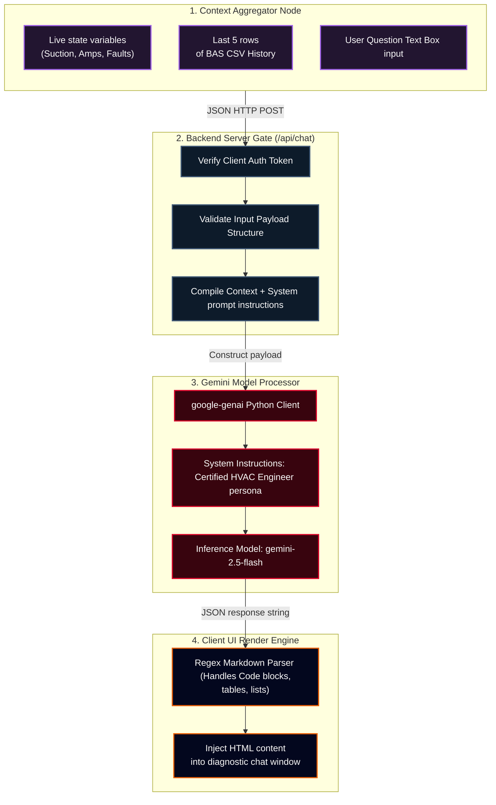

# RPG System Blueprint: Conversational AI Diagnostic Engine

Detailed specifications mapping context assembly, system prompts, token optimization constraints, and secure API gateways.

## 🗺️ Prompt Orchestration & Diagnostics Inference Diagram



---

## 📝 Diagnostic Persona Instructions

### 1. Tone and Structural Constraints
* The AI must act as a senior controls engineer. It should explain symptoms logically rather than simply providing answers.
* Explanations must correlate physical anomalies to Python code structures (e.g., how the EEV's stepper count maps to range variables).

### 2. Context Ingestion JSON Template
```json
{
  "system_telemetry": {
    "room_temp": 82.4,
    "suction_psi": 42.0,
    "discharge_psi": 415.0,
    "fault_mode": "STUCK_VALVE"
  },
  "log_history_csv": "timestamp,cycle,room_temp,evap_temp,suction_psi
12:59:10,3,82.7,29.1,43"
}
```
