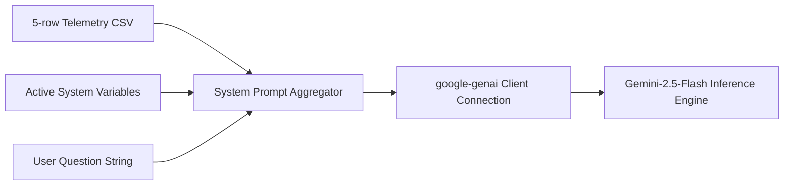

# RPG System Blueprint: Conversational AI Diagnostic Engine

Defines prompt generation pipelines, token buffers, and diagnostic response markdown parsing.

## 🗺️ Prompt Pipeline Topology

```mermaid
flowchart LR
    CSVHistory["5-row Telemetry CSV"] --> PromptCompiler["System Prompt Aggregator"]
    StateVars["Active System Variables"] --> PromptCompiler
    UserQuestion["User Question String"] --> PromptCompiler
    PromptCompiler --> GemSDK["google-genai Client Connection"]
    GemSDK --> Gemini["Gemini-2.5-Flash Inference Engine"]
```
