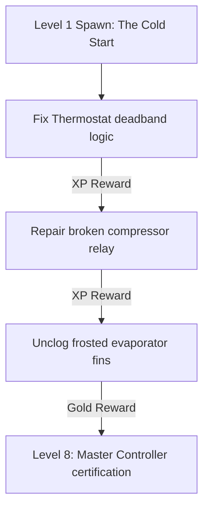

# RPG System Blueprint: Quest Progression & Dialogue Engine

Defines the story chapters, quest trigger items, dialog schemas, and experience point rewards.

## 🗺️ Quest Tree Flowchart

```mermaid
flowchart TD
    StartQuest["Level 1 Spawn: The Cold Start"] --> Q1["Fix Thermostat deadband logic"]
    Q1 -- XP Reward --> Q2["Repair broken compressor relay"]
    Q2 -- XP Reward --> Q3["Unclog frosted evaporator fins"]
    Q3 -- Gold Reward --> EndQuest["Level 8: Master Controller certification"]
```
