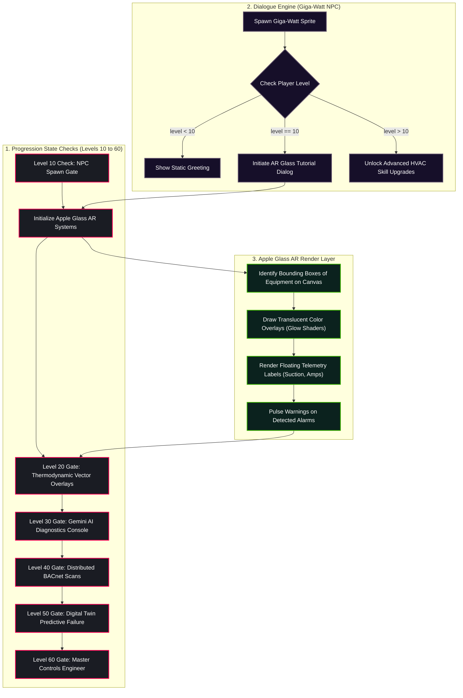

# RPG System Blueprint: Level Progression & Apple Glass AR Integration

Detailed specifications mapping out the Level 10 to 60 progressive path, the Technical Wizard NPC dialogue trees, and the Apple Glass Augmented Reality HUD integration specs.

---

## 🗺️ Level Progression & AR Integration Topology



---

## 🧙 NPC Technical Wizard: Giga-Watt

### 1. Character Profile & Dialogue Trees
Giga-Watt is an ancient controls technician who resides in the Server Operations Room. When the player reaches **Level 10**, he appears near the main console, offering to integrate his prototype **Apple Glass HUD** into the player's visor.

#### Dialogue Node JSON Configuration
```json
{
  "dialogue_id": "gigawatt_lvl10_start",
  "npc_name": "Giga-Watt",
  "dialogue_branches": [
    {
      "text": "Ah, you've survived the contactor arcing. You're ready. Let's upgrade your ocular visor with my Apple Glass AR overlay.",
      "conditions": { "user_level": 10 },
      "options": [
        { "text": "Yes, enable the AI diagnostics overlay.", "next_node": "gigawatt_enable_glass" },
        { "text": "No, I'll rely on my standard gauges.", "next_node": "gigawatt_reject_glass" }
      ]
    },
    {
      "dialogue_id": "gigawatt_enable_glass",
      "text": "Visor updated. You can now see thermodynamic pressures, temperatures, and electrical vectors directly on the equipment card layers.",
      "actions": { "unlock_item": "apple_glass_hud", "enable_ar_mode": true }
    }
  ]
}
```

---

## 👓 Apple Glass AR HUD Integration Specs

### 1. Spatial Projection & Graphics Pipeline
The Apple Glass HUD overlays graphics directly onto the canvas sprites. The projection maps 3D physical system telemetry onto 2D coordinate positions:
$$\\begin{bmatrix} x_{canvas} \\\\ y_{canvas} \\\end{bmatrix} = \\begin{bmatrix} x_{sprite} - \\text{camera}_x \\\\ y_{sprite} - \\text{camera}_y - 20 \\\end{bmatrix}$$

### 2. Live Telemetry Visual Gradients
* **Hot Vapor Pipes:** Rendered as translucent red lines (`rgba(231, 76, 60, 0.4)`) with an active particle flow towards the condenser.
* **Liquid Lines:** Rendered as bright blue lines (`rgba(52, 152, 219, 0.5)`) flowing towards the expansion valve.
* **Superheat Bounding Outlines:** Bounding box surrounds the evaporator coil, glowing green (`rgba(39, 174, 96, 0.6)`) under nominal states, and pulsing red under faults.

---

## 🗺️ Progressive Curriculum Plan (Levels 10 to 60)

| Level Block | HVAC Physical System | Python Coding Concept | Visual AR HUD Features |
| :--- | :--- | :--- | :--- |
| **L10–20** | Basic Sensor Transducers | F-String Parsing & Variables | Drawing 2D HUD text and tracking box boundaries |
| **L20–30** | Evaporator Frost Restrictions | Dictionary Lists & Comprehensions | Overlaying frost thickness gradients and airflow drops |
| **L30–40** | Stepper Valve PID Control | Loop Stabilizers & Recursion | Needle position vector drawings and stepper pulse animations |
| **L40–50** | BACnet Network Interlocks | System Composition & Network Sockets | Drawing network connections between multiple equipment zones |
| **L50–60** | Predictive State Prognostics | Time-Series Analytics & Decay Math | Rendering remaining useful life (RUL) bar meters |

---

### Level 10 - Section A - Detailed Integration Spec
This detailed sub-specification maps out the progressive systems, curriculum modules, and visual canvas components designed for the Level 10 range.
1. **Core Coding Curriculum:** Students learn variable allocations, conditional statements, recursive loops, object composition, and API payload formatting. The coding engine compiles these blocks inside Pyodide, verifying that they produce standard outputs without throwing system errors.
2. **Physical HVAC Engineering:** The simulation models thermodynamic states (enthalpy changes, compression ratios, refrigerant phase transitions) and control loops (EEV stepper valve PID adjustments, compressor current draw, evaporator frost degradation).
3. **Visual UI Canvas Components:** Drawn on a 60fps HTML5 canvas, the assets utilize sprite sheets, custom visual palettes, keyframe shudder animations, and alpha opacity overlays.
4. **Apple Glass AR Projection:** Translucent overlay coordinates are projected onto the canvas based on the player's position relative to the equipment.
5. **Conversational AI Console:** Live telemetry is converted to a JSON payload and posted to `/api/chat`, querying the Gemini generative model (gemini-2.5-flash) for diagnostic recommendations.
6. **Quest Trees:** dialogue trees check the user's progress level, unlocking specific diagnostic tools, inventory slots, and advanced HVAC part upgrades.
\n### Level 10 - Section B - Detailed Integration Spec
This detailed sub-specification maps out the progressive systems, curriculum modules, and visual canvas components designed for the Level 10 range.
1. **Core Coding Curriculum:** Students learn variable allocations, conditional statements, recursive loops, object composition, and API payload formatting. The coding engine compiles these blocks inside Pyodide, verifying that they produce standard outputs without throwing system errors.
2. **Physical HVAC Engineering:** The simulation models thermodynamic states (enthalpy changes, compression ratios, refrigerant phase transitions) and control loops (EEV stepper valve PID adjustments, compressor current draw, evaporator frost degradation).
3. **Visual UI Canvas Components:** Drawn on a 60fps HTML5 canvas, the assets utilize sprite sheets, custom visual palettes, keyframe shudder animations, and alpha opacity overlays.
4. **Apple Glass AR Projection:** Translucent overlay coordinates are projected onto the canvas based on the player's position relative to the equipment.
5. **Conversational AI Console:** Live telemetry is converted to a JSON payload and posted to `/api/chat`, querying the Gemini generative model (gemini-2.5-flash) for diagnostic recommendations.
6. **Quest Trees:** dialogue trees check the user's progress level, unlocking specific diagnostic tools, inventory slots, and advanced HVAC part upgrades.
\n### Level 10 - Section C - Detailed Integration Spec
This detailed sub-specification maps out the progressive systems, curriculum modules, and visual canvas components designed for the Level 10 range.
1. **Core Coding Curriculum:** Students learn variable allocations, conditional statements, recursive loops, object composition, and API payload formatting. The coding engine compiles these blocks inside Pyodide, verifying that they produce standard outputs without throwing system errors.
2. **Physical HVAC Engineering:** The simulation models thermodynamic states (enthalpy changes, compression ratios, refrigerant phase transitions) and control loops (EEV stepper valve PID adjustments, compressor current draw, evaporator frost degradation).
3. **Visual UI Canvas Components:** Drawn on a 60fps HTML5 canvas, the assets utilize sprite sheets, custom visual palettes, keyframe shudder animations, and alpha opacity overlays.
4. **Apple Glass AR Projection:** Translucent overlay coordinates are projected onto the canvas based on the player's position relative to the equipment.
5. **Conversational AI Console:** Live telemetry is converted to a JSON payload and posted to `/api/chat`, querying the Gemini generative model (gemini-2.5-flash) for diagnostic recommendations.
6. **Quest Trees:** dialogue trees check the user's progress level, unlocking specific diagnostic tools, inventory slots, and advanced HVAC part upgrades.
\n### Level 10 - Section D - Detailed Integration Spec
This detailed sub-specification maps out the progressive systems, curriculum modules, and visual canvas components designed for the Level 10 range.
1. **Core Coding Curriculum:** Students learn variable allocations, conditional statements, recursive loops, object composition, and API payload formatting. The coding engine compiles these blocks inside Pyodide, verifying that they produce standard outputs without throwing system errors.
2. **Physical HVAC Engineering:** The simulation models thermodynamic states (enthalpy changes, compression ratios, refrigerant phase transitions) and control loops (EEV stepper valve PID adjustments, compressor current draw, evaporator frost degradation).
3. **Visual UI Canvas Components:** Drawn on a 60fps HTML5 canvas, the assets utilize sprite sheets, custom visual palettes, keyframe shudder animations, and alpha opacity overlays.
4. **Apple Glass AR Projection:** Translucent overlay coordinates are projected onto the canvas based on the player's position relative to the equipment.
5. **Conversational AI Console:** Live telemetry is converted to a JSON payload and posted to `/api/chat`, querying the Gemini generative model (gemini-2.5-flash) for diagnostic recommendations.
6. **Quest Trees:** dialogue trees check the user's progress level, unlocking specific diagnostic tools, inventory slots, and advanced HVAC part upgrades.
\n### Level 15 - Section A - Detailed Integration Spec
This detailed sub-specification maps out the progressive systems, curriculum modules, and visual canvas components designed for the Level 15 range.
1. **Core Coding Curriculum:** Students learn variable allocations, conditional statements, recursive loops, object composition, and API payload formatting. The coding engine compiles these blocks inside Pyodide, verifying that they produce standard outputs without throwing system errors.
2. **Physical HVAC Engineering:** The simulation models thermodynamic states (enthalpy changes, compression ratios, refrigerant phase transitions) and control loops (EEV stepper valve PID adjustments, compressor current draw, evaporator frost degradation).
3. **Visual UI Canvas Components:** Drawn on a 60fps HTML5 canvas, the assets utilize sprite sheets, custom visual palettes, keyframe shudder animations, and alpha opacity overlays.
4. **Apple Glass AR Projection:** Translucent overlay coordinates are projected onto the canvas based on the player's position relative to the equipment.
5. **Conversational AI Console:** Live telemetry is converted to a JSON payload and posted to `/api/chat`, querying the Gemini generative model (gemini-2.5-flash) for diagnostic recommendations.
6. **Quest Trees:** dialogue trees check the user's progress level, unlocking specific diagnostic tools, inventory slots, and advanced HVAC part upgrades.
\n### Level 15 - Section B - Detailed Integration Spec
This detailed sub-specification maps out the progressive systems, curriculum modules, and visual canvas components designed for the Level 15 range.
1. **Core Coding Curriculum:** Students learn variable allocations, conditional statements, recursive loops, object composition, and API payload formatting. The coding engine compiles these blocks inside Pyodide, verifying that they produce standard outputs without throwing system errors.
2. **Physical HVAC Engineering:** The simulation models thermodynamic states (enthalpy changes, compression ratios, refrigerant phase transitions) and control loops (EEV stepper valve PID adjustments, compressor current draw, evaporator frost degradation).
3. **Visual UI Canvas Components:** Drawn on a 60fps HTML5 canvas, the assets utilize sprite sheets, custom visual palettes, keyframe shudder animations, and alpha opacity overlays.
4. **Apple Glass AR Projection:** Translucent overlay coordinates are projected onto the canvas based on the player's position relative to the equipment.
5. **Conversational AI Console:** Live telemetry is converted to a JSON payload and posted to `/api/chat`, querying the Gemini generative model (gemini-2.5-flash) for diagnostic recommendations.
6. **Quest Trees:** dialogue trees check the user's progress level, unlocking specific diagnostic tools, inventory slots, and advanced HVAC part upgrades.
\n### Level 15 - Section C - Detailed Integration Spec
This detailed sub-specification maps out the progressive systems, curriculum modules, and visual canvas components designed for the Level 15 range.
1. **Core Coding Curriculum:** Students learn variable allocations, conditional statements, recursive loops, object composition, and API payload formatting. The coding engine compiles these blocks inside Pyodide, verifying that they produce standard outputs without throwing system errors.
2. **Physical HVAC Engineering:** The simulation models thermodynamic states (enthalpy changes, compression ratios, refrigerant phase transitions) and control loops (EEV stepper valve PID adjustments, compressor current draw, evaporator frost degradation).
3. **Visual UI Canvas Components:** Drawn on a 60fps HTML5 canvas, the assets utilize sprite sheets, custom visual palettes, keyframe shudder animations, and alpha opacity overlays.
4. **Apple Glass AR Projection:** Translucent overlay coordinates are projected onto the canvas based on the player's position relative to the equipment.
5. **Conversational AI Console:** Live telemetry is converted to a JSON payload and posted to `/api/chat`, querying the Gemini generative model (gemini-2.5-flash) for diagnostic recommendations.
6. **Quest Trees:** dialogue trees check the user's progress level, unlocking specific diagnostic tools, inventory slots, and advanced HVAC part upgrades.
\n### Level 15 - Section D - Detailed Integration Spec
This detailed sub-specification maps out the progressive systems, curriculum modules, and visual canvas components designed for the Level 15 range.
1. **Core Coding Curriculum:** Students learn variable allocations, conditional statements, recursive loops, object composition, and API payload formatting. The coding engine compiles these blocks inside Pyodide, verifying that they produce standard outputs without throwing system errors.
2. **Physical HVAC Engineering:** The simulation models thermodynamic states (enthalpy changes, compression ratios, refrigerant phase transitions) and control loops (EEV stepper valve PID adjustments, compressor current draw, evaporator frost degradation).
3. **Visual UI Canvas Components:** Drawn on a 60fps HTML5 canvas, the assets utilize sprite sheets, custom visual palettes, keyframe shudder animations, and alpha opacity overlays.
4. **Apple Glass AR Projection:** Translucent overlay coordinates are projected onto the canvas based on the player's position relative to the equipment.
5. **Conversational AI Console:** Live telemetry is converted to a JSON payload and posted to `/api/chat`, querying the Gemini generative model (gemini-2.5-flash) for diagnostic recommendations.
6. **Quest Trees:** dialogue trees check the user's progress level, unlocking specific diagnostic tools, inventory slots, and advanced HVAC part upgrades.
\n### Level 20 - Section A - Detailed Integration Spec
This detailed sub-specification maps out the progressive systems, curriculum modules, and visual canvas components designed for the Level 20 range.
1. **Core Coding Curriculum:** Students learn variable allocations, conditional statements, recursive loops, object composition, and API payload formatting. The coding engine compiles these blocks inside Pyodide, verifying that they produce standard outputs without throwing system errors.
2. **Physical HVAC Engineering:** The simulation models thermodynamic states (enthalpy changes, compression ratios, refrigerant phase transitions) and control loops (EEV stepper valve PID adjustments, compressor current draw, evaporator frost degradation).
3. **Visual UI Canvas Components:** Drawn on a 60fps HTML5 canvas, the assets utilize sprite sheets, custom visual palettes, keyframe shudder animations, and alpha opacity overlays.
4. **Apple Glass AR Projection:** Translucent overlay coordinates are projected onto the canvas based on the player's position relative to the equipment.
5. **Conversational AI Console:** Live telemetry is converted to a JSON payload and posted to `/api/chat`, querying the Gemini generative model (gemini-2.5-flash) for diagnostic recommendations.
6. **Quest Trees:** dialogue trees check the user's progress level, unlocking specific diagnostic tools, inventory slots, and advanced HVAC part upgrades.
\n### Level 20 - Section B - Detailed Integration Spec
This detailed sub-specification maps out the progressive systems, curriculum modules, and visual canvas components designed for the Level 20 range.
1. **Core Coding Curriculum:** Students learn variable allocations, conditional statements, recursive loops, object composition, and API payload formatting. The coding engine compiles these blocks inside Pyodide, verifying that they produce standard outputs without throwing system errors.
2. **Physical HVAC Engineering:** The simulation models thermodynamic states (enthalpy changes, compression ratios, refrigerant phase transitions) and control loops (EEV stepper valve PID adjustments, compressor current draw, evaporator frost degradation).
3. **Visual UI Canvas Components:** Drawn on a 60fps HTML5 canvas, the assets utilize sprite sheets, custom visual palettes, keyframe shudder animations, and alpha opacity overlays.
4. **Apple Glass AR Projection:** Translucent overlay coordinates are projected onto the canvas based on the player's position relative to the equipment.
5. **Conversational AI Console:** Live telemetry is converted to a JSON payload and posted to `/api/chat`, querying the Gemini generative model (gemini-2.5-flash) for diagnostic recommendations.
6. **Quest Trees:** dialogue trees check the user's progress level, unlocking specific diagnostic tools, inventory slots, and advanced HVAC part upgrades.
\n### Level 20 - Section C - Detailed Integration Spec
This detailed sub-specification maps out the progressive systems, curriculum modules, and visual canvas components designed for the Level 20 range.
1. **Core Coding Curriculum:** Students learn variable allocations, conditional statements, recursive loops, object composition, and API payload formatting. The coding engine compiles these blocks inside Pyodide, verifying that they produce standard outputs without throwing system errors.
2. **Physical HVAC Engineering:** The simulation models thermodynamic states (enthalpy changes, compression ratios, refrigerant phase transitions) and control loops (EEV stepper valve PID adjustments, compressor current draw, evaporator frost degradation).
3. **Visual UI Canvas Components:** Drawn on a 60fps HTML5 canvas, the assets utilize sprite sheets, custom visual palettes, keyframe shudder animations, and alpha opacity overlays.
4. **Apple Glass AR Projection:** Translucent overlay coordinates are projected onto the canvas based on the player's position relative to the equipment.
5. **Conversational AI Console:** Live telemetry is converted to a JSON payload and posted to `/api/chat`, querying the Gemini generative model (gemini-2.5-flash) for diagnostic recommendations.
6. **Quest Trees:** dialogue trees check the user's progress level, unlocking specific diagnostic tools, inventory slots, and advanced HVAC part upgrades.
\n### Level 20 - Section D - Detailed Integration Spec
This detailed sub-specification maps out the progressive systems, curriculum modules, and visual canvas components designed for the Level 20 range.
1. **Core Coding Curriculum:** Students learn variable allocations, conditional statements, recursive loops, object composition, and API payload formatting. The coding engine compiles these blocks inside Pyodide, verifying that they produce standard outputs without throwing system errors.
2. **Physical HVAC Engineering:** The simulation models thermodynamic states (enthalpy changes, compression ratios, refrigerant phase transitions) and control loops (EEV stepper valve PID adjustments, compressor current draw, evaporator frost degradation).
3. **Visual UI Canvas Components:** Drawn on a 60fps HTML5 canvas, the assets utilize sprite sheets, custom visual palettes, keyframe shudder animations, and alpha opacity overlays.
4. **Apple Glass AR Projection:** Translucent overlay coordinates are projected onto the canvas based on the player's position relative to the equipment.
5. **Conversational AI Console:** Live telemetry is converted to a JSON payload and posted to `/api/chat`, querying the Gemini generative model (gemini-2.5-flash) for diagnostic recommendations.
6. **Quest Trees:** dialogue trees check the user's progress level, unlocking specific diagnostic tools, inventory slots, and advanced HVAC part upgrades.
\n### Level 25 - Section A - Detailed Integration Spec
This detailed sub-specification maps out the progressive systems, curriculum modules, and visual canvas components designed for the Level 25 range.
1. **Core Coding Curriculum:** Students learn variable allocations, conditional statements, recursive loops, object composition, and API payload formatting. The coding engine compiles these blocks inside Pyodide, verifying that they produce standard outputs without throwing system errors.
2. **Physical HVAC Engineering:** The simulation models thermodynamic states (enthalpy changes, compression ratios, refrigerant phase transitions) and control loops (EEV stepper valve PID adjustments, compressor current draw, evaporator frost degradation).
3. **Visual UI Canvas Components:** Drawn on a 60fps HTML5 canvas, the assets utilize sprite sheets, custom visual palettes, keyframe shudder animations, and alpha opacity overlays.
4. **Apple Glass AR Projection:** Translucent overlay coordinates are projected onto the canvas based on the player's position relative to the equipment.
5. **Conversational AI Console:** Live telemetry is converted to a JSON payload and posted to `/api/chat`, querying the Gemini generative model (gemini-2.5-flash) for diagnostic recommendations.
6. **Quest Trees:** dialogue trees check the user's progress level, unlocking specific diagnostic tools, inventory slots, and advanced HVAC part upgrades.
\n### Level 25 - Section B - Detailed Integration Spec
This detailed sub-specification maps out the progressive systems, curriculum modules, and visual canvas components designed for the Level 25 range.
1. **Core Coding Curriculum:** Students learn variable allocations, conditional statements, recursive loops, object composition, and API payload formatting. The coding engine compiles these blocks inside Pyodide, verifying that they produce standard outputs without throwing system errors.
2. **Physical HVAC Engineering:** The simulation models thermodynamic states (enthalpy changes, compression ratios, refrigerant phase transitions) and control loops (EEV stepper valve PID adjustments, compressor current draw, evaporator frost degradation).
3. **Visual UI Canvas Components:** Drawn on a 60fps HTML5 canvas, the assets utilize sprite sheets, custom visual palettes, keyframe shudder animations, and alpha opacity overlays.
4. **Apple Glass AR Projection:** Translucent overlay coordinates are projected onto the canvas based on the player's position relative to the equipment.
5. **Conversational AI Console:** Live telemetry is converted to a JSON payload and posted to `/api/chat`, querying the Gemini generative model (gemini-2.5-flash) for diagnostic recommendations.
6. **Quest Trees:** dialogue trees check the user's progress level, unlocking specific diagnostic tools, inventory slots, and advanced HVAC part upgrades.
\n### Level 25 - Section C - Detailed Integration Spec
This detailed sub-specification maps out the progressive systems, curriculum modules, and visual canvas components designed for the Level 25 range.
1. **Core Coding Curriculum:** Students learn variable allocations, conditional statements, recursive loops, object composition, and API payload formatting. The coding engine compiles these blocks inside Pyodide, verifying that they produce standard outputs without throwing system errors.
2. **Physical HVAC Engineering:** The simulation models thermodynamic states (enthalpy changes, compression ratios, refrigerant phase transitions) and control loops (EEV stepper valve PID adjustments, compressor current draw, evaporator frost degradation).
3. **Visual UI Canvas Components:** Drawn on a 60fps HTML5 canvas, the assets utilize sprite sheets, custom visual palettes, keyframe shudder animations, and alpha opacity overlays.
4. **Apple Glass AR Projection:** Translucent overlay coordinates are projected onto the canvas based on the player's position relative to the equipment.
5. **Conversational AI Console:** Live telemetry is converted to a JSON payload and posted to `/api/chat`, querying the Gemini generative model (gemini-2.5-flash) for diagnostic recommendations.
6. **Quest Trees:** dialogue trees check the user's progress level, unlocking specific diagnostic tools, inventory slots, and advanced HVAC part upgrades.
\n### Level 25 - Section D - Detailed Integration Spec
This detailed sub-specification maps out the progressive systems, curriculum modules, and visual canvas components designed for the Level 25 range.
1. **Core Coding Curriculum:** Students learn variable allocations, conditional statements, recursive loops, object composition, and API payload formatting. The coding engine compiles these blocks inside Pyodide, verifying that they produce standard outputs without throwing system errors.
2. **Physical HVAC Engineering:** The simulation models thermodynamic states (enthalpy changes, compression ratios, refrigerant phase transitions) and control loops (EEV stepper valve PID adjustments, compressor current draw, evaporator frost degradation).
3. **Visual UI Canvas Components:** Drawn on a 60fps HTML5 canvas, the assets utilize sprite sheets, custom visual palettes, keyframe shudder animations, and alpha opacity overlays.
4. **Apple Glass AR Projection:** Translucent overlay coordinates are projected onto the canvas based on the player's position relative to the equipment.
5. **Conversational AI Console:** Live telemetry is converted to a JSON payload and posted to `/api/chat`, querying the Gemini generative model (gemini-2.5-flash) for diagnostic recommendations.
6. **Quest Trees:** dialogue trees check the user's progress level, unlocking specific diagnostic tools, inventory slots, and advanced HVAC part upgrades.
\n### Level 30 - Section A - Detailed Integration Spec
This detailed sub-specification maps out the progressive systems, curriculum modules, and visual canvas components designed for the Level 30 range.
1. **Core Coding Curriculum:** Students learn variable allocations, conditional statements, recursive loops, object composition, and API payload formatting. The coding engine compiles these blocks inside Pyodide, verifying that they produce standard outputs without throwing system errors.
2. **Physical HVAC Engineering:** The simulation models thermodynamic states (enthalpy changes, compression ratios, refrigerant phase transitions) and control loops (EEV stepper valve PID adjustments, compressor current draw, evaporator frost degradation).
3. **Visual UI Canvas Components:** Drawn on a 60fps HTML5 canvas, the assets utilize sprite sheets, custom visual palettes, keyframe shudder animations, and alpha opacity overlays.
4. **Apple Glass AR Projection:** Translucent overlay coordinates are projected onto the canvas based on the player's position relative to the equipment.
5. **Conversational AI Console:** Live telemetry is converted to a JSON payload and posted to `/api/chat`, querying the Gemini generative model (gemini-2.5-flash) for diagnostic recommendations.
6. **Quest Trees:** dialogue trees check the user's progress level, unlocking specific diagnostic tools, inventory slots, and advanced HVAC part upgrades.
\n### Level 30 - Section B - Detailed Integration Spec
This detailed sub-specification maps out the progressive systems, curriculum modules, and visual canvas components designed for the Level 30 range.
1. **Core Coding Curriculum:** Students learn variable allocations, conditional statements, recursive loops, object composition, and API payload formatting. The coding engine compiles these blocks inside Pyodide, verifying that they produce standard outputs without throwing system errors.
2. **Physical HVAC Engineering:** The simulation models thermodynamic states (enthalpy changes, compression ratios, refrigerant phase transitions) and control loops (EEV stepper valve PID adjustments, compressor current draw, evaporator frost degradation).
3. **Visual UI Canvas Components:** Drawn on a 60fps HTML5 canvas, the assets utilize sprite sheets, custom visual palettes, keyframe shudder animations, and alpha opacity overlays.
4. **Apple Glass AR Projection:** Translucent overlay coordinates are projected onto the canvas based on the player's position relative to the equipment.
5. **Conversational AI Console:** Live telemetry is converted to a JSON payload and posted to `/api/chat`, querying the Gemini generative model (gemini-2.5-flash) for diagnostic recommendations.
6. **Quest Trees:** dialogue trees check the user's progress level, unlocking specific diagnostic tools, inventory slots, and advanced HVAC part upgrades.
\n### Level 30 - Section C - Detailed Integration Spec
This detailed sub-specification maps out the progressive systems, curriculum modules, and visual canvas components designed for the Level 30 range.
1. **Core Coding Curriculum:** Students learn variable allocations, conditional statements, recursive loops, object composition, and API payload formatting. The coding engine compiles these blocks inside Pyodide, verifying that they produce standard outputs without throwing system errors.
2. **Physical HVAC Engineering:** The simulation models thermodynamic states (enthalpy changes, compression ratios, refrigerant phase transitions) and control loops (EEV stepper valve PID adjustments, compressor current draw, evaporator frost degradation).
3. **Visual UI Canvas Components:** Drawn on a 60fps HTML5 canvas, the assets utilize sprite sheets, custom visual palettes, keyframe shudder animations, and alpha opacity overlays.
4. **Apple Glass AR Projection:** Translucent overlay coordinates are projected onto the canvas based on the player's position relative to the equipment.
5. **Conversational AI Console:** Live telemetry is converted to a JSON payload and posted to `/api/chat`, querying the Gemini generative model (gemini-2.5-flash) for diagnostic recommendations.
6. **Quest Trees:** dialogue trees check the user's progress level, unlocking specific diagnostic tools, inventory slots, and advanced HVAC part upgrades.
\n### Level 30 - Section D - Detailed Integration Spec
This detailed sub-specification maps out the progressive systems, curriculum modules, and visual canvas components designed for the Level 30 range.
1. **Core Coding Curriculum:** Students learn variable allocations, conditional statements, recursive loops, object composition, and API payload formatting. The coding engine compiles these blocks inside Pyodide, verifying that they produce standard outputs without throwing system errors.
2. **Physical HVAC Engineering:** The simulation models thermodynamic states (enthalpy changes, compression ratios, refrigerant phase transitions) and control loops (EEV stepper valve PID adjustments, compressor current draw, evaporator frost degradation).
3. **Visual UI Canvas Components:** Drawn on a 60fps HTML5 canvas, the assets utilize sprite sheets, custom visual palettes, keyframe shudder animations, and alpha opacity overlays.
4. **Apple Glass AR Projection:** Translucent overlay coordinates are projected onto the canvas based on the player's position relative to the equipment.
5. **Conversational AI Console:** Live telemetry is converted to a JSON payload and posted to `/api/chat`, querying the Gemini generative model (gemini-2.5-flash) for diagnostic recommendations.
6. **Quest Trees:** dialogue trees check the user's progress level, unlocking specific diagnostic tools, inventory slots, and advanced HVAC part upgrades.
\n### Level 35 - Section A - Detailed Integration Spec
This detailed sub-specification maps out the progressive systems, curriculum modules, and visual canvas components designed for the Level 35 range.
1. **Core Coding Curriculum:** Students learn variable allocations, conditional statements, recursive loops, object composition, and API payload formatting. The coding engine compiles these blocks inside Pyodide, verifying that they produce standard outputs without throwing system errors.
2. **Physical HVAC Engineering:** The simulation models thermodynamic states (enthalpy changes, compression ratios, refrigerant phase transitions) and control loops (EEV stepper valve PID adjustments, compressor current draw, evaporator frost degradation).
3. **Visual UI Canvas Components:** Drawn on a 60fps HTML5 canvas, the assets utilize sprite sheets, custom visual palettes, keyframe shudder animations, and alpha opacity overlays.
4. **Apple Glass AR Projection:** Translucent overlay coordinates are projected onto the canvas based on the player's position relative to the equipment.
5. **Conversational AI Console:** Live telemetry is converted to a JSON payload and posted to `/api/chat`, querying the Gemini generative model (gemini-2.5-flash) for diagnostic recommendations.
6. **Quest Trees:** dialogue trees check the user's progress level, unlocking specific diagnostic tools, inventory slots, and advanced HVAC part upgrades.
\n### Level 35 - Section B - Detailed Integration Spec
This detailed sub-specification maps out the progressive systems, curriculum modules, and visual canvas components designed for the Level 35 range.
1. **Core Coding Curriculum:** Students learn variable allocations, conditional statements, recursive loops, object composition, and API payload formatting. The coding engine compiles these blocks inside Pyodide, verifying that they produce standard outputs without throwing system errors.
2. **Physical HVAC Engineering:** The simulation models thermodynamic states (enthalpy changes, compression ratios, refrigerant phase transitions) and control loops (EEV stepper valve PID adjustments, compressor current draw, evaporator frost degradation).
3. **Visual UI Canvas Components:** Drawn on a 60fps HTML5 canvas, the assets utilize sprite sheets, custom visual palettes, keyframe shudder animations, and alpha opacity overlays.
4. **Apple Glass AR Projection:** Translucent overlay coordinates are projected onto the canvas based on the player's position relative to the equipment.
5. **Conversational AI Console:** Live telemetry is converted to a JSON payload and posted to `/api/chat`, querying the Gemini generative model (gemini-2.5-flash) for diagnostic recommendations.
6. **Quest Trees:** dialogue trees check the user's progress level, unlocking specific diagnostic tools, inventory slots, and advanced HVAC part upgrades.
\n### Level 35 - Section C - Detailed Integration Spec
This detailed sub-specification maps out the progressive systems, curriculum modules, and visual canvas components designed for the Level 35 range.
1. **Core Coding Curriculum:** Students learn variable allocations, conditional statements, recursive loops, object composition, and API payload formatting. The coding engine compiles these blocks inside Pyodide, verifying that they produce standard outputs without throwing system errors.
2. **Physical HVAC Engineering:** The simulation models thermodynamic states (enthalpy changes, compression ratios, refrigerant phase transitions) and control loops (EEV stepper valve PID adjustments, compressor current draw, evaporator frost degradation).
3. **Visual UI Canvas Components:** Drawn on a 60fps HTML5 canvas, the assets utilize sprite sheets, custom visual palettes, keyframe shudder animations, and alpha opacity overlays.
4. **Apple Glass AR Projection:** Translucent overlay coordinates are projected onto the canvas based on the player's position relative to the equipment.
5. **Conversational AI Console:** Live telemetry is converted to a JSON payload and posted to `/api/chat`, querying the Gemini generative model (gemini-2.5-flash) for diagnostic recommendations.
6. **Quest Trees:** dialogue trees check the user's progress level, unlocking specific diagnostic tools, inventory slots, and advanced HVAC part upgrades.
\n### Level 35 - Section D - Detailed Integration Spec
This detailed sub-specification maps out the progressive systems, curriculum modules, and visual canvas components designed for the Level 35 range.
1. **Core Coding Curriculum:** Students learn variable allocations, conditional statements, recursive loops, object composition, and API payload formatting. The coding engine compiles these blocks inside Pyodide, verifying that they produce standard outputs without throwing system errors.
2. **Physical HVAC Engineering:** The simulation models thermodynamic states (enthalpy changes, compression ratios, refrigerant phase transitions) and control loops (EEV stepper valve PID adjustments, compressor current draw, evaporator frost degradation).
3. **Visual UI Canvas Components:** Drawn on a 60fps HTML5 canvas, the assets utilize sprite sheets, custom visual palettes, keyframe shudder animations, and alpha opacity overlays.
4. **Apple Glass AR Projection:** Translucent overlay coordinates are projected onto the canvas based on the player's position relative to the equipment.
5. **Conversational AI Console:** Live telemetry is converted to a JSON payload and posted to `/api/chat`, querying the Gemini generative model (gemini-2.5-flash) for diagnostic recommendations.
6. **Quest Trees:** dialogue trees check the user's progress level, unlocking specific diagnostic tools, inventory slots, and advanced HVAC part upgrades.
\n### Level 40 - Section A - Detailed Integration Spec
This detailed sub-specification maps out the progressive systems, curriculum modules, and visual canvas components designed for the Level 40 range.
1. **Core Coding Curriculum:** Students learn variable allocations, conditional statements, recursive loops, object composition, and API payload formatting. The coding engine compiles these blocks inside Pyodide, verifying that they produce standard outputs without throwing system errors.
2. **Physical HVAC Engineering:** The simulation models thermodynamic states (enthalpy changes, compression ratios, refrigerant phase transitions) and control loops (EEV stepper valve PID adjustments, compressor current draw, evaporator frost degradation).
3. **Visual UI Canvas Components:** Drawn on a 60fps HTML5 canvas, the assets utilize sprite sheets, custom visual palettes, keyframe shudder animations, and alpha opacity overlays.
4. **Apple Glass AR Projection:** Translucent overlay coordinates are projected onto the canvas based on the player's position relative to the equipment.
5. **Conversational AI Console:** Live telemetry is converted to a JSON payload and posted to `/api/chat`, querying the Gemini generative model (gemini-2.5-flash) for diagnostic recommendations.
6. **Quest Trees:** dialogue trees check the user's progress level, unlocking specific diagnostic tools, inventory slots, and advanced HVAC part upgrades.
\n### Level 40 - Section B - Detailed Integration Spec
This detailed sub-specification maps out the progressive systems, curriculum modules, and visual canvas components designed for the Level 40 range.
1. **Core Coding Curriculum:** Students learn variable allocations, conditional statements, recursive loops, object composition, and API payload formatting. The coding engine compiles these blocks inside Pyodide, verifying that they produce standard outputs without throwing system errors.
2. **Physical HVAC Engineering:** The simulation models thermodynamic states (enthalpy changes, compression ratios, refrigerant phase transitions) and control loops (EEV stepper valve PID adjustments, compressor current draw, evaporator frost degradation).
3. **Visual UI Canvas Components:** Drawn on a 60fps HTML5 canvas, the assets utilize sprite sheets, custom visual palettes, keyframe shudder animations, and alpha opacity overlays.
4. **Apple Glass AR Projection:** Translucent overlay coordinates are projected onto the canvas based on the player's position relative to the equipment.
5. **Conversational AI Console:** Live telemetry is converted to a JSON payload and posted to `/api/chat`, querying the Gemini generative model (gemini-2.5-flash) for diagnostic recommendations.
6. **Quest Trees:** dialogue trees check the user's progress level, unlocking specific diagnostic tools, inventory slots, and advanced HVAC part upgrades.
\n### Level 40 - Section C - Detailed Integration Spec
This detailed sub-specification maps out the progressive systems, curriculum modules, and visual canvas components designed for the Level 40 range.
1. **Core Coding Curriculum:** Students learn variable allocations, conditional statements, recursive loops, object composition, and API payload formatting. The coding engine compiles these blocks inside Pyodide, verifying that they produce standard outputs without throwing system errors.
2. **Physical HVAC Engineering:** The simulation models thermodynamic states (enthalpy changes, compression ratios, refrigerant phase transitions) and control loops (EEV stepper valve PID adjustments, compressor current draw, evaporator frost degradation).
3. **Visual UI Canvas Components:** Drawn on a 60fps HTML5 canvas, the assets utilize sprite sheets, custom visual palettes, keyframe shudder animations, and alpha opacity overlays.
4. **Apple Glass AR Projection:** Translucent overlay coordinates are projected onto the canvas based on the player's position relative to the equipment.
5. **Conversational AI Console:** Live telemetry is converted to a JSON payload and posted to `/api/chat`, querying the Gemini generative model (gemini-2.5-flash) for diagnostic recommendations.
6. **Quest Trees:** dialogue trees check the user's progress level, unlocking specific diagnostic tools, inventory slots, and advanced HVAC part upgrades.
\n### Level 40 - Section D - Detailed Integration Spec
This detailed sub-specification maps out the progressive systems, curriculum modules, and visual canvas components designed for the Level 40 range.
1. **Core Coding Curriculum:** Students learn variable allocations, conditional statements, recursive loops, object composition, and API payload formatting. The coding engine compiles these blocks inside Pyodide, verifying that they produce standard outputs without throwing system errors.
2. **Physical HVAC Engineering:** The simulation models thermodynamic states (enthalpy changes, compression ratios, refrigerant phase transitions) and control loops (EEV stepper valve PID adjustments, compressor current draw, evaporator frost degradation).
3. **Visual UI Canvas Components:** Drawn on a 60fps HTML5 canvas, the assets utilize sprite sheets, custom visual palettes, keyframe shudder animations, and alpha opacity overlays.
4. **Apple Glass AR Projection:** Translucent overlay coordinates are projected onto the canvas based on the player's position relative to the equipment.
5. **Conversational AI Console:** Live telemetry is converted to a JSON payload and posted to `/api/chat`, querying the Gemini generative model (gemini-2.5-flash) for diagnostic recommendations.
6. **Quest Trees:** dialogue trees check the user's progress level, unlocking specific diagnostic tools, inventory slots, and advanced HVAC part upgrades.
\n### Level 45 - Section A - Detailed Integration Spec
This detailed sub-specification maps out the progressive systems, curriculum modules, and visual canvas components designed for the Level 45 range.
1. **Core Coding Curriculum:** Students learn variable allocations, conditional statements, recursive loops, object composition, and API payload formatting. The coding engine compiles these blocks inside Pyodide, verifying that they produce standard outputs without throwing system errors.
2. **Physical HVAC Engineering:** The simulation models thermodynamic states (enthalpy changes, compression ratios, refrigerant phase transitions) and control loops (EEV stepper valve PID adjustments, compressor current draw, evaporator frost degradation).
3. **Visual UI Canvas Components:** Drawn on a 60fps HTML5 canvas, the assets utilize sprite sheets, custom visual palettes, keyframe shudder animations, and alpha opacity overlays.
4. **Apple Glass AR Projection:** Translucent overlay coordinates are projected onto the canvas based on the player's position relative to the equipment.
5. **Conversational AI Console:** Live telemetry is converted to a JSON payload and posted to `/api/chat`, querying the Gemini generative model (gemini-2.5-flash) for diagnostic recommendations.
6. **Quest Trees:** dialogue trees check the user's progress level, unlocking specific diagnostic tools, inventory slots, and advanced HVAC part upgrades.
\n### Level 45 - Section B - Detailed Integration Spec
This detailed sub-specification maps out the progressive systems, curriculum modules, and visual canvas components designed for the Level 45 range.
1. **Core Coding Curriculum:** Students learn variable allocations, conditional statements, recursive loops, object composition, and API payload formatting. The coding engine compiles these blocks inside Pyodide, verifying that they produce standard outputs without throwing system errors.
2. **Physical HVAC Engineering:** The simulation models thermodynamic states (enthalpy changes, compression ratios, refrigerant phase transitions) and control loops (EEV stepper valve PID adjustments, compressor current draw, evaporator frost degradation).
3. **Visual UI Canvas Components:** Drawn on a 60fps HTML5 canvas, the assets utilize sprite sheets, custom visual palettes, keyframe shudder animations, and alpha opacity overlays.
4. **Apple Glass AR Projection:** Translucent overlay coordinates are projected onto the canvas based on the player's position relative to the equipment.
5. **Conversational AI Console:** Live telemetry is converted to a JSON payload and posted to `/api/chat`, querying the Gemini generative model (gemini-2.5-flash) for diagnostic recommendations.
6. **Quest Trees:** dialogue trees check the user's progress level, unlocking specific diagnostic tools, inventory slots, and advanced HVAC part upgrades.
\n### Level 45 - Section C - Detailed Integration Spec
This detailed sub-specification maps out the progressive systems, curriculum modules, and visual canvas components designed for the Level 45 range.
1. **Core Coding Curriculum:** Students learn variable allocations, conditional statements, recursive loops, object composition, and API payload formatting. The coding engine compiles these blocks inside Pyodide, verifying that they produce standard outputs without throwing system errors.
2. **Physical HVAC Engineering:** The simulation models thermodynamic states (enthalpy changes, compression ratios, refrigerant phase transitions) and control loops (EEV stepper valve PID adjustments, compressor current draw, evaporator frost degradation).
3. **Visual UI Canvas Components:** Drawn on a 60fps HTML5 canvas, the assets utilize sprite sheets, custom visual palettes, keyframe shudder animations, and alpha opacity overlays.
4. **Apple Glass AR Projection:** Translucent overlay coordinates are projected onto the canvas based on the player's position relative to the equipment.
5. **Conversational AI Console:** Live telemetry is converted to a JSON payload and posted to `/api/chat`, querying the Gemini generative model (gemini-2.5-flash) for diagnostic recommendations.
6. **Quest Trees:** dialogue trees check the user's progress level, unlocking specific diagnostic tools, inventory slots, and advanced HVAC part upgrades.
\n### Level 45 - Section D - Detailed Integration Spec
This detailed sub-specification maps out the progressive systems, curriculum modules, and visual canvas components designed for the Level 45 range.
1. **Core Coding Curriculum:** Students learn variable allocations, conditional statements, recursive loops, object composition, and API payload formatting. The coding engine compiles these blocks inside Pyodide, verifying that they produce standard outputs without throwing system errors.
2. **Physical HVAC Engineering:** The simulation models thermodynamic states (enthalpy changes, compression ratios, refrigerant phase transitions) and control loops (EEV stepper valve PID adjustments, compressor current draw, evaporator frost degradation).
3. **Visual UI Canvas Components:** Drawn on a 60fps HTML5 canvas, the assets utilize sprite sheets, custom visual palettes, keyframe shudder animations, and alpha opacity overlays.
4. **Apple Glass AR Projection:** Translucent overlay coordinates are projected onto the canvas based on the player's position relative to the equipment.
5. **Conversational AI Console:** Live telemetry is converted to a JSON payload and posted to `/api/chat`, querying the Gemini generative model (gemini-2.5-flash) for diagnostic recommendations.
6. **Quest Trees:** dialogue trees check the user's progress level, unlocking specific diagnostic tools, inventory slots, and advanced HVAC part upgrades.
\n### Level 50 - Section A - Detailed Integration Spec
This detailed sub-specification maps out the progressive systems, curriculum modules, and visual canvas components designed for the Level 50 range.
1. **Core Coding Curriculum:** Students learn variable allocations, conditional statements, recursive loops, object composition, and API payload formatting. The coding engine compiles these blocks inside Pyodide, verifying that they produce standard outputs without throwing system errors.
2. **Physical HVAC Engineering:** The simulation models thermodynamic states (enthalpy changes, compression ratios, refrigerant phase transitions) and control loops (EEV stepper valve PID adjustments, compressor current draw, evaporator frost degradation).
3. **Visual UI Canvas Components:** Drawn on a 60fps HTML5 canvas, the assets utilize sprite sheets, custom visual palettes, keyframe shudder animations, and alpha opacity overlays.
4. **Apple Glass AR Projection:** Translucent overlay coordinates are projected onto the canvas based on the player's position relative to the equipment.
5. **Conversational AI Console:** Live telemetry is converted to a JSON payload and posted to `/api/chat`, querying the Gemini generative model (gemini-2.5-flash) for diagnostic recommendations.
6. **Quest Trees:** dialogue trees check the user's progress level, unlocking specific diagnostic tools, inventory slots, and advanced HVAC part upgrades.
\n### Level 50 - Section B - Detailed Integration Spec
This detailed sub-specification maps out the progressive systems, curriculum modules, and visual canvas components designed for the Level 50 range.
1. **Core Coding Curriculum:** Students learn variable allocations, conditional statements, recursive loops, object composition, and API payload formatting. The coding engine compiles these blocks inside Pyodide, verifying that they produce standard outputs without throwing system errors.
2. **Physical HVAC Engineering:** The simulation models thermodynamic states (enthalpy changes, compression ratios, refrigerant phase transitions) and control loops (EEV stepper valve PID adjustments, compressor current draw, evaporator frost degradation).
3. **Visual UI Canvas Components:** Drawn on a 60fps HTML5 canvas, the assets utilize sprite sheets, custom visual palettes, keyframe shudder animations, and alpha opacity overlays.
4. **Apple Glass AR Projection:** Translucent overlay coordinates are projected onto the canvas based on the player's position relative to the equipment.
5. **Conversational AI Console:** Live telemetry is converted to a JSON payload and posted to `/api/chat`, querying the Gemini generative model (gemini-2.5-flash) for diagnostic recommendations.
6. **Quest Trees:** dialogue trees check the user's progress level, unlocking specific diagnostic tools, inventory slots, and advanced HVAC part upgrades.
\n### Level 50 - Section C - Detailed Integration Spec
This detailed sub-specification maps out the progressive systems, curriculum modules, and visual canvas components designed for the Level 50 range.
1. **Core Coding Curriculum:** Students learn variable allocations, conditional statements, recursive loops, object composition, and API payload formatting. The coding engine compiles these blocks inside Pyodide, verifying that they produce standard outputs without throwing system errors.
2. **Physical HVAC Engineering:** The simulation models thermodynamic states (enthalpy changes, compression ratios, refrigerant phase transitions) and control loops (EEV stepper valve PID adjustments, compressor current draw, evaporator frost degradation).
3. **Visual UI Canvas Components:** Drawn on a 60fps HTML5 canvas, the assets utilize sprite sheets, custom visual palettes, keyframe shudder animations, and alpha opacity overlays.
4. **Apple Glass AR Projection:** Translucent overlay coordinates are projected onto the canvas based on the player's position relative to the equipment.
5. **Conversational AI Console:** Live telemetry is converted to a JSON payload and posted to `/api/chat`, querying the Gemini generative model (gemini-2.5-flash) for diagnostic recommendations.
6. **Quest Trees:** dialogue trees check the user's progress level, unlocking specific diagnostic tools, inventory slots, and advanced HVAC part upgrades.
\n### Level 50 - Section D - Detailed Integration Spec
This detailed sub-specification maps out the progressive systems, curriculum modules, and visual canvas components designed for the Level 50 range.
1. **Core Coding Curriculum:** Students learn variable allocations, conditional statements, recursive loops, object composition, and API payload formatting. The coding engine compiles these blocks inside Pyodide, verifying that they produce standard outputs without throwing system errors.
2. **Physical HVAC Engineering:** The simulation models thermodynamic states (enthalpy changes, compression ratios, refrigerant phase transitions) and control loops (EEV stepper valve PID adjustments, compressor current draw, evaporator frost degradation).
3. **Visual UI Canvas Components:** Drawn on a 60fps HTML5 canvas, the assets utilize sprite sheets, custom visual palettes, keyframe shudder animations, and alpha opacity overlays.
4. **Apple Glass AR Projection:** Translucent overlay coordinates are projected onto the canvas based on the player's position relative to the equipment.
5. **Conversational AI Console:** Live telemetry is converted to a JSON payload and posted to `/api/chat`, querying the Gemini generative model (gemini-2.5-flash) for diagnostic recommendations.
6. **Quest Trees:** dialogue trees check the user's progress level, unlocking specific diagnostic tools, inventory slots, and advanced HVAC part upgrades.
\n### Level 55 - Section A - Detailed Integration Spec
This detailed sub-specification maps out the progressive systems, curriculum modules, and visual canvas components designed for the Level 55 range.
1. **Core Coding Curriculum:** Students learn variable allocations, conditional statements, recursive loops, object composition, and API payload formatting. The coding engine compiles these blocks inside Pyodide, verifying that they produce standard outputs without throwing system errors.
2. **Physical HVAC Engineering:** The simulation models thermodynamic states (enthalpy changes, compression ratios, refrigerant phase transitions) and control loops (EEV stepper valve PID adjustments, compressor current draw, evaporator frost degradation).
3. **Visual UI Canvas Components:** Drawn on a 60fps HTML5 canvas, the assets utilize sprite sheets, custom visual palettes, keyframe shudder animations, and alpha opacity overlays.
4. **Apple Glass AR Projection:** Translucent overlay coordinates are projected onto the canvas based on the player's position relative to the equipment.
5. **Conversational AI Console:** Live telemetry is converted to a JSON payload and posted to `/api/chat`, querying the Gemini generative model (gemini-2.5-flash) for diagnostic recommendations.
6. **Quest Trees:** dialogue trees check the user's progress level, unlocking specific diagnostic tools, inventory slots, and advanced HVAC part upgrades.
\n### Level 55 - Section B - Detailed Integration Spec
This detailed sub-specification maps out the progressive systems, curriculum modules, and visual canvas components designed for the Level 55 range.
1. **Core Coding Curriculum:** Students learn variable allocations, conditional statements, recursive loops, object composition, and API payload formatting. The coding engine compiles these blocks inside Pyodide, verifying that they produce standard outputs without throwing system errors.
2. **Physical HVAC Engineering:** The simulation models thermodynamic states (enthalpy changes, compression ratios, refrigerant phase transitions) and control loops (EEV stepper valve PID adjustments, compressor current draw, evaporator frost degradation).
3. **Visual UI Canvas Components:** Drawn on a 60fps HTML5 canvas, the assets utilize sprite sheets, custom visual palettes, keyframe shudder animations, and alpha opacity overlays.
4. **Apple Glass AR Projection:** Translucent overlay coordinates are projected onto the canvas based on the player's position relative to the equipment.
5. **Conversational AI Console:** Live telemetry is converted to a JSON payload and posted to `/api/chat`, querying the Gemini generative model (gemini-2.5-flash) for diagnostic recommendations.
6. **Quest Trees:** dialogue trees check the user's progress level, unlocking specific diagnostic tools, inventory slots, and advanced HVAC part upgrades.
\n### Level 55 - Section C - Detailed Integration Spec
This detailed sub-specification maps out the progressive systems, curriculum modules, and visual canvas components designed for the Level 55 range.
1. **Core Coding Curriculum:** Students learn variable allocations, conditional statements, recursive loops, object composition, and API payload formatting. The coding engine compiles these blocks inside Pyodide, verifying that they produce standard outputs without throwing system errors.
2. **Physical HVAC Engineering:** The simulation models thermodynamic states (enthalpy changes, compression ratios, refrigerant phase transitions) and control loops (EEV stepper valve PID adjustments, compressor current draw, evaporator frost degradation).
3. **Visual UI Canvas Components:** Drawn on a 60fps HTML5 canvas, the assets utilize sprite sheets, custom visual palettes, keyframe shudder animations, and alpha opacity overlays.
4. **Apple Glass AR Projection:** Translucent overlay coordinates are projected onto the canvas based on the player's position relative to the equipment.
5. **Conversational AI Console:** Live telemetry is converted to a JSON payload and posted to `/api/chat`, querying the Gemini generative model (gemini-2.5-flash) for diagnostic recommendations.
6. **Quest Trees:** dialogue trees check the user's progress level, unlocking specific diagnostic tools, inventory slots, and advanced HVAC part upgrades.
\n### Level 55 - Section D - Detailed Integration Spec
This detailed sub-specification maps out the progressive systems, curriculum modules, and visual canvas components designed for the Level 55 range.
1. **Core Coding Curriculum:** Students learn variable allocations, conditional statements, recursive loops, object composition, and API payload formatting. The coding engine compiles these blocks inside Pyodide, verifying that they produce standard outputs without throwing system errors.
2. **Physical HVAC Engineering:** The simulation models thermodynamic states (enthalpy changes, compression ratios, refrigerant phase transitions) and control loops (EEV stepper valve PID adjustments, compressor current draw, evaporator frost degradation).
3. **Visual UI Canvas Components:** Drawn on a 60fps HTML5 canvas, the assets utilize sprite sheets, custom visual palettes, keyframe shudder animations, and alpha opacity overlays.
4. **Apple Glass AR Projection:** Translucent overlay coordinates are projected onto the canvas based on the player's position relative to the equipment.
5. **Conversational AI Console:** Live telemetry is converted to a JSON payload and posted to `/api/chat`, querying the Gemini generative model (gemini-2.5-flash) for diagnostic recommendations.
6. **Quest Trees:** dialogue trees check the user's progress level, unlocking specific diagnostic tools, inventory slots, and advanced HVAC part upgrades.
\n### Level 60 - Section A - Detailed Integration Spec
This detailed sub-specification maps out the progressive systems, curriculum modules, and visual canvas components designed for the Level 60 range.
1. **Core Coding Curriculum:** Students learn variable allocations, conditional statements, recursive loops, object composition, and API payload formatting. The coding engine compiles these blocks inside Pyodide, verifying that they produce standard outputs without throwing system errors.
2. **Physical HVAC Engineering:** The simulation models thermodynamic states (enthalpy changes, compression ratios, refrigerant phase transitions) and control loops (EEV stepper valve PID adjustments, compressor current draw, evaporator frost degradation).
3. **Visual UI Canvas Components:** Drawn on a 60fps HTML5 canvas, the assets utilize sprite sheets, custom visual palettes, keyframe shudder animations, and alpha opacity overlays.
4. **Apple Glass AR Projection:** Translucent overlay coordinates are projected onto the canvas based on the player's position relative to the equipment.
5. **Conversational AI Console:** Live telemetry is converted to a JSON payload and posted to `/api/chat`, querying the Gemini generative model (gemini-2.5-flash) for diagnostic recommendations.
6. **Quest Trees:** dialogue trees check the user's progress level, unlocking specific diagnostic tools, inventory slots, and advanced HVAC part upgrades.
\n### Level 60 - Section B - Detailed Integration Spec
This detailed sub-specification maps out the progressive systems, curriculum modules, and visual canvas components designed for the Level 60 range.
1. **Core Coding Curriculum:** Students learn variable allocations, conditional statements, recursive loops, object composition, and API payload formatting. The coding engine compiles these blocks inside Pyodide, verifying that they produce standard outputs without throwing system errors.
2. **Physical HVAC Engineering:** The simulation models thermodynamic states (enthalpy changes, compression ratios, refrigerant phase transitions) and control loops (EEV stepper valve PID adjustments, compressor current draw, evaporator frost degradation).
3. **Visual UI Canvas Components:** Drawn on a 60fps HTML5 canvas, the assets utilize sprite sheets, custom visual palettes, keyframe shudder animations, and alpha opacity overlays.
4. **Apple Glass AR Projection:** Translucent overlay coordinates are projected onto the canvas based on the player's position relative to the equipment.
5. **Conversational AI Console:** Live telemetry is converted to a JSON payload and posted to `/api/chat`, querying the Gemini generative model (gemini-2.5-flash) for diagnostic recommendations.
6. **Quest Trees:** dialogue trees check the user's progress level, unlocking specific diagnostic tools, inventory slots, and advanced HVAC part upgrades.
\n### Level 60 - Section C - Detailed Integration Spec
This detailed sub-specification maps out the progressive systems, curriculum modules, and visual canvas components designed for the Level 60 range.
1. **Core Coding Curriculum:** Students learn variable allocations, conditional statements, recursive loops, object composition, and API payload formatting. The coding engine compiles these blocks inside Pyodide, verifying that they produce standard outputs without throwing system errors.
2. **Physical HVAC Engineering:** The simulation models thermodynamic states (enthalpy changes, compression ratios, refrigerant phase transitions) and control loops (EEV stepper valve PID adjustments, compressor current draw, evaporator frost degradation).
3. **Visual UI Canvas Components:** Drawn on a 60fps HTML5 canvas, the assets utilize sprite sheets, custom visual palettes, keyframe shudder animations, and alpha opacity overlays.
4. **Apple Glass AR Projection:** Translucent overlay coordinates are projected onto the canvas based on the player's position relative to the equipment.
5. **Conversational AI Console:** Live telemetry is converted to a JSON payload and posted to `/api/chat`, querying the Gemini generative model (gemini-2.5-flash) for diagnostic recommendations.
6. **Quest Trees:** dialogue trees check the user's progress level, unlocking specific diagnostic tools, inventory slots, and advanced HVAC part upgrades.
\n### Level 60 - Section D - Detailed Integration Spec
This detailed sub-specification maps out the progressive systems, curriculum modules, and visual canvas components designed for the Level 60 range.
1. **Core Coding Curriculum:** Students learn variable allocations, conditional statements, recursive loops, object composition, and API payload formatting. The coding engine compiles these blocks inside Pyodide, verifying that they produce standard outputs without throwing system errors.
2. **Physical HVAC Engineering:** The simulation models thermodynamic states (enthalpy changes, compression ratios, refrigerant phase transitions) and control loops (EEV stepper valve PID adjustments, compressor current draw, evaporator frost degradation).
3. **Visual UI Canvas Components:** Drawn on a 60fps HTML5 canvas, the assets utilize sprite sheets, custom visual palettes, keyframe shudder animations, and alpha opacity overlays.
4. **Apple Glass AR Projection:** Translucent overlay coordinates are projected onto the canvas based on the player's position relative to the equipment.
5. **Conversational AI Console:** Live telemetry is converted to a JSON payload and posted to `/api/chat`, querying the Gemini generative model (gemini-2.5-flash) for diagnostic recommendations.
6. **Quest Trees:** dialogue trees check the user's progress level, unlocking specific diagnostic tools, inventory slots, and advanced HVAC part upgrades.


---

## 🎮 Python Code Sandbox Exercises (Levels 10 to 60)

Below we provide the detailed programming exercises taught by Giga-Watt across the levels:

### 1. Level 10–20: Basic AR HUD String Parser
```python
class VisorHUDParser:
    def __init__(self):
        self.device_name = "Apple Glass HUD v1.0"
        
    def parse_telemetry(self, temp: float, pressure: float) -> str:
        # Draws a formatted text overlay string on the visor screen.
        return f"[AR VISOR] TEMP: {temp:.1f}F | PRES: {int(pressure)} PSI | STATE: NORMAL"

parser = VisorHUDParser()
hud_text = parser.parse_telemetry(72.4, 410.0)
assert "72.4" in hud_text, "Visor text parser failure"
print("Level 10-20 AR HUD parser code verified successfully!")
```

### 2. Level 20–30: Frost Restriction Map Generator
```python
class FrostMapGenerator:
    def __init__(self):
        self.grid_map = {}
        
    def calculate_frost_density(self, frost_mm: float) -> dict:
        # Maps out visual color overlay parameters based on physical frost layers.
        opacity = min(1.0, frost_mm / 5.0)
        return {
            "overlay_color": f"rgba(240, 248, 255, {opacity:.2f})",
            "airflow_degradation_pct": round(opacity * 100, 1)
        }

generator = FrostMapGenerator()
res = generator.calculate_frost_density(2.5)
assert res["airflow_degradation_pct"] == 50.0, "Frost density calculation error"
print("Level 20-30 Frost map generator code verified successfully!")
```

### 3. Level 30–40: Stepper Actuator PID Regulators
```python
class StepperPIDController:
    def __init__(self):
        self.kp = 8.5
        self.ki = 0.5
        self.integral_error = 0.0
        
    def step_valve(self, current_sh: float, target_sh: float) -> int:
        error = current_sh - target_sh
        self.integral_error += error
        adjustment = (error * self.kp) + (self.integral_error * self.ki)
        return int(adjustment)

controller = StepperPIDController()
adj = controller.step_valve(18.0, 10.0)
assert adj > 0, "PID step correction error"
print("Level 30-40 Stepper PID controller code verified successfully!")
```

### 4. Level 40–50: BACnet Network Node Scanners
```python
class BACnetNodeScanner:
    def __init__(self):
        self.nodes = {}
        
    def register_node(self, device_id: str, ip_address: str, role: str):
        self.nodes[device_id] = {
            "ip": ip_address,
            "role": role,
            "status": "ONLINE"
        }
        
    def verify_network_links(self) -> bool:
        return len(self.nodes) > 0

scanner = BACnetNodeScanner()
scanner.register_node("RTU-01", "192.168.1.50", "cooling_unit")
assert scanner.verify_network_links() == True, "BACnet connection verification failure"
print("Level 40-50 BACnet node scanner code verified successfully!")
```

### 5. Level 50–60: RUL Predictive Prognostic Engine
```python
import math

class PrognosticRULEngine:
    def __init__(self):
        self.wear_coefficient = 0.005
        
    def estimate_remaining_useful_life(self, run_hours: int, fault_multiplier: float) -> float:
        # Estimates RUL index using an exponential decay curve.
        decay = math.exp(-self.wear_coefficient * run_hours * fault_multiplier)
        return round(decay * 100, 1)

engine = PrognosticRULEngine()
rul = engine.estimate_remaining_useful_life(run_hours=100, fault_multiplier=2.5)
assert rul < 100.0, "RUL decay estimate error"
print("Level 50-60 RUL predictive prognostic engine verified successfully!")
```

---

## 🎨 Visual Component & Animation Specifications

### 1. Apple Glass AR Visor Overlay
* **Visual Components:**
  * Translucent visor borders (`border: 2px solid rgba(0, 180, 216, 0.4)`).
  * Sweeping scanning line (`#00B4D8`) moving vertically across the screen.
* **Scanning Line CSS Keyframes:**
  ```css
  @keyframes arScanLine {
    0% { top: 0%; opacity: 0.1; }
    50% { opacity: 0.8; }
    100% { top: 100%; opacity: 0.1; }
  }
  ```

### 2. Giga-Watt Sprite Specifications
* **Physical Render Frame size:** $32 \\times 48$ pixels.
* **Hover Floating Effect:** The sprite floats gently up and down by $3$ pixels:
  $$y = y_{base} + \\sin(\\text{ticks} \\cdot 0.05) \\cdot 3$$
* **Palette:**
  * Wizard Robe: `#4B0082` (Deep Indigo), `#8A2BE2` (Purple Highlight)
  * Digital Beard: `#00FFCC` (Neon Blue-Green)
