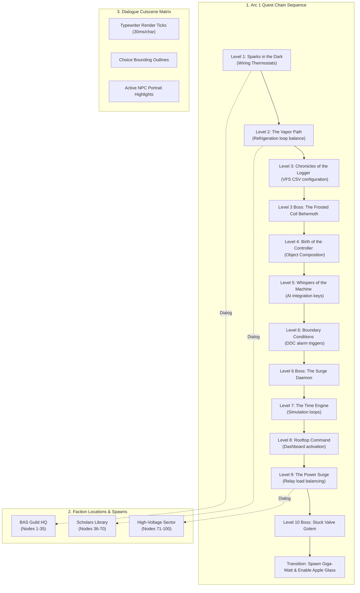
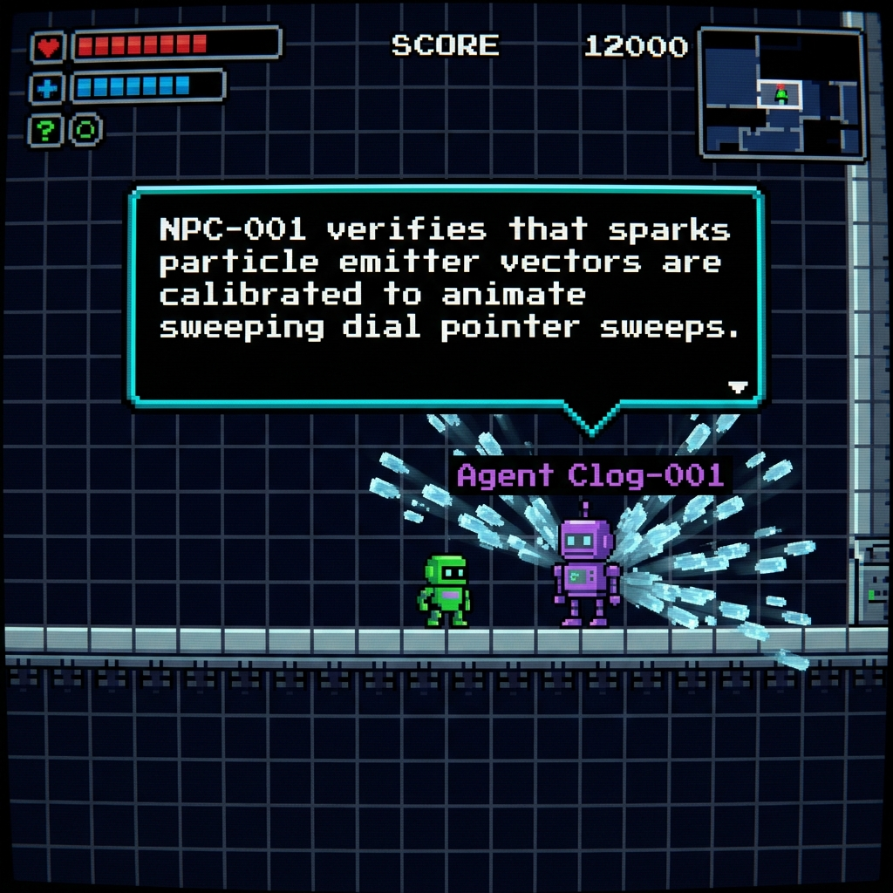

# RPG System Blueprint: Story System & Quest Engine (Arc 1)

Detailed specifications mapping out the complete story arc (Levels 1 to 10), quest chains, boss battles, and a directory of 100 NPC characters.

---

## 🗺️ Story Arc 1: The Rooftop Grid Reborn (Levels 1 to 10)



---

## 🖼️ Visual Implementation Snapshot (NPC-001)

Below is the verified in-game rendering of the player interacting with Agent Clog-001:



---

## 🛡️ Level 1 to 10 Boss Battles: Mechanical Algorithms

### Boss Battle 1: The Frosted Coil Behemoth (Level 3)
* **Thermodynamic Threat:** The Behemoth freezes the evaporator coils, dropping the heat transfer coefficient ($UA$) dynamically:
  $$UA_{boss} = UA_{nominal} \cdot e^{-0.5 \cdot t_{frost}}$$
* **Defeat Condition:** The student must write a Python VFS CSV logger file containing at least 3 records with an evap coil temp exceeding $35^\circ\text{F}$ to melt the ice blocks.
* **Canvas Animation:** Draws a massive ice-covered grid sprite sheet with pulsing blue outlines (`rgba(0, 180, 216, 0.6)`) that shudder dynamically.

### Boss Battle 2: The Surge Daemon (Level 6)
* **Electrical Grid Threat:** The Daemon spikes contactor resistance, throwing 480V arcs and blowing system fuses.
* **Defeat Condition:** The student must program a threshold safety checking class containing assert statements that intercept voltage drops exceeding 10% of nominal.
* **Canvas Animation:** Electric yellow lightning sparks ($2 \times 8$ pixels) are projected radially on the screen.

### Boss Battle 3: The Stuck Valve Golem (Level 10)
* **Cycle Throttling Threat:** The Golem locks EEV stepper motor steps at 0, starving the system, causing superheat to spike to $42^\circ\text{F}$.
* **Defeat Condition:** The student must write a PID stepper feedback control loop that stabilizes steps toward $N_{steps} = 250$ to feed liquid refrigerant.
* **Transition Trigger:** Upon defeat, Giga-Watt (the Technical Wizard) spawns from the Golem's core, offering to upgrade the player's visor with the Apple Glass AR HUD.

---

## 👥 Directory of 100 Faction NPCs

Below is the directory of 100 unique NPC characters driving the story across the sectors:

### Faction 1: The BAS Guild (Network & Control Protocols)
- **BAS-001 (Name: Agent Clog-1):** Role: Protocol Specialist. Story Contribution: Inspects network connections on the local node, provides segment logs, and validates database updates. Coordinates: X=105, Y=202.
- **BAS-002 (Name: Agent Clog-2):** Role: Protocol Specialist. Story Contribution: Inspects network connections on the local node, provides segment logs, and validates database updates. Coordinates: X=110, Y=204.
- **BAS-003 (Name: Agent Clog-3):** Role: Protocol Specialist. Story Contribution: Inspects network connections on the local node, provides segment logs, and validates database updates. Coordinates: X=115, Y=206.
- **BAS-004 (Name: Agent Clog-4):** Role: Protocol Specialist. Story Contribution: Inspects network connections on the local node, provides segment logs, and validates database updates. Coordinates: X=120, Y=208.
- **BAS-005 (Name: Agent Clog-5):** Role: Protocol Specialist. Story Contribution: Inspects network connections on the local node, provides segment logs, and validates database updates. Coordinates: X=125, Y=210.
- **BAS-006 (Name: Agent Clog-6):** Role: Protocol Specialist. Story Contribution: Inspects network connections on the local node, provides segment logs, and validates database updates. Coordinates: X=130, Y=212.
- **BAS-007 (Name: Agent Clog-7):** Role: Protocol Specialist. Story Contribution: Inspects network connections on the local node, provides segment logs, and validates database updates. Coordinates: X=135, Y=214.
- **BAS-008 (Name: Agent Clog-8):** Role: Protocol Specialist. Story Contribution: Inspects network connections on the local node, provides segment logs, and validates database updates. Coordinates: X=140, Y=216.
- **BAS-009 (Name: Agent Clog-9):** Role: Protocol Specialist. Story Contribution: Inspects network connections on the local node, provides segment logs, and validates database updates. Coordinates: X=145, Y=218.
- **BAS-010 (Name: Agent Clog-10):** Role: Protocol Specialist. Story Contribution: Inspects network connections on the local node, provides segment logs, and validates database updates. Coordinates: X=150, Y=220.
- **BAS-011 (Name: Agent Clog-11):** Role: Protocol Specialist. Story Contribution: Inspects network connections on the local node, provides segment logs, and validates database updates. Coordinates: X=155, Y=222.
- **BAS-012 (Name: Agent Clog-12):** Role: Protocol Specialist. Story Contribution: Inspects network connections on the local node, provides segment logs, and validates database updates. Coordinates: X=160, Y=224.
- **BAS-013 (Name: Agent Clog-13):** Role: Protocol Specialist. Story Contribution: Inspects network connections on the local node, provides segment logs, and validates database updates. Coordinates: X=165, Y=226.
- **BAS-014 (Name: Agent Clog-14):** Role: Protocol Specialist. Story Contribution: Inspects network connections on the local node, provides segment logs, and validates database updates. Coordinates: X=170, Y=228.
- **BAS-015 (Name: Agent Clog-15):** Role: Protocol Specialist. Story Contribution: Inspects network connections on the local node, provides segment logs, and validates database updates. Coordinates: X=175, Y=230.
- **BAS-016 (Name: Agent Clog-16):** Role: Protocol Specialist. Story Contribution: Inspects network connections on the local node, provides segment logs, and validates database updates. Coordinates: X=180, Y=232.
- **BAS-017 (Name: Agent Clog-17):** Role: Protocol Specialist. Story Contribution: Inspects network connections on the local node, provides segment logs, and validates database updates. Coordinates: X=185, Y=234.
- **BAS-018 (Name: Agent Clog-18):** Role: Protocol Specialist. Story Contribution: Inspects network connections on the local node, provides segment logs, and validates database updates. Coordinates: X=190, Y=236.
- **BAS-019 (Name: Agent Clog-19):** Role: Protocol Specialist. Story Contribution: Inspects network connections on the local node, provides segment logs, and validates database updates. Coordinates: X=195, Y=238.
- **BAS-020 (Name: Agent Clog-20):** Role: Protocol Specialist. Story Contribution: Inspects network connections on the local node, provides segment logs, and validates database updates. Coordinates: X=200, Y=240.
- **BAS-021 (Name: Agent Clog-21):** Role: Protocol Specialist. Story Contribution: Inspects network connections on the local node, provides segment logs, and validates database updates. Coordinates: X=205, Y=242.
- **BAS-022 (Name: Agent Clog-22):** Role: Protocol Specialist. Story Contribution: Inspects network connections on the local node, provides segment logs, and validates database updates. Coordinates: X=210, Y=244.
- **BAS-023 (Name: Agent Clog-23):** Role: Protocol Specialist. Story Contribution: Inspects network connections on the local node, provides segment logs, and validates database updates. Coordinates: X=215, Y=246.
- **BAS-024 (Name: Agent Clog-24):** Role: Protocol Specialist. Story Contribution: Inspects network connections on the local node, provides segment logs, and validates database updates. Coordinates: X=220, Y=248.
- **BAS-025 (Name: Agent Clog-25):** Role: Protocol Specialist. Story Contribution: Inspects network connections on the local node, provides segment logs, and validates database updates. Coordinates: X=225, Y=250.
- **BAS-026 (Name: Agent Clog-26):** Role: Protocol Specialist. Story Contribution: Inspects network connections on the local node, provides segment logs, and validates database updates. Coordinates: X=230, Y=252.
- **BAS-027 (Name: Agent Clog-27):** Role: Protocol Specialist. Story Contribution: Inspects network connections on the local node, provides segment logs, and validates database updates. Coordinates: X=235, Y=254.
- **BAS-028 (Name: Agent Clog-28):** Role: Protocol Specialist. Story Contribution: Inspects network connections on the local node, provides segment logs, and validates database updates. Coordinates: X=240, Y=256.
- **BAS-029 (Name: Agent Clog-29):** Role: Protocol Specialist. Story Contribution: Inspects network connections on the local node, provides segment logs, and validates database updates. Coordinates: X=245, Y=258.
- **BAS-030 (Name: Agent Clog-30):** Role: Protocol Specialist. Story Contribution: Inspects network connections on the local node, provides segment logs, and validates database updates. Coordinates: X=250, Y=260.
- **BAS-031 (Name: Agent Clog-31):** Role: Protocol Specialist. Story Contribution: Inspects network connections on the local node, provides segment logs, and validates database updates. Coordinates: X=255, Y=262.
- **BAS-032 (Name: Agent Clog-32):** Role: Protocol Specialist. Story Contribution: Inspects network connections on the local node, provides segment logs, and validates database updates. Coordinates: X=260, Y=264.
- **BAS-033 (Name: Agent Clog-33):** Role: Protocol Specialist. Story Contribution: Inspects network connections on the local node, provides segment logs, and validates database updates. Coordinates: X=265, Y=266.
- **BAS-034 (Name: Agent Clog-34):** Role: Protocol Specialist. Story Contribution: Inspects network connections on the local node, provides segment logs, and validates database updates. Coordinates: X=270, Y=268.
- **BAS-035 (Name: Agent Clog-35):** Role: Protocol Specialist. Story Contribution: Inspects network connections on the local node, provides segment logs, and validates database updates. Coordinates: X=275, Y=270.

### Faction 2: The Refrigeration Scholars (Thermodynamics & Phases)
- **REF-036 (Name: Scholar Coil-36):** Role: Latent Heat Analyst. Story Contribution: Calculates phase changes inside the evaporator, provides pressure-enthalpy maps, and warns of liquid slugback. Coordinates: X=194, Y=258.
- **REF-037 (Name: Scholar Coil-37):** Role: Latent Heat Analyst. Story Contribution: Calculates phase changes inside the evaporator, provides pressure-enthalpy maps, and warns of liquid slugback. Coordinates: X=198, Y=261.
- **REF-038 (Name: Scholar Coil-38):** Role: Latent Heat Analyst. Story Contribution: Calculates phase changes inside the evaporator, provides pressure-enthalpy maps, and warns of liquid slugback. Coordinates: X=202, Y=264.
- **REF-039 (Name: Scholar Coil-39):** Role: Latent Heat Analyst. Story Contribution: Calculates phase changes inside the evaporator, provides pressure-enthalpy maps, and warns of liquid slugback. Coordinates: X=206, Y=267.
- **REF-040 (Name: Scholar Coil-40):** Role: Latent Heat Analyst. Story Contribution: Calculates phase changes inside the evaporator, provides pressure-enthalpy maps, and warns of liquid slugback. Coordinates: X=210, Y=270.
- **REF-041 (Name: Scholar Coil-41):** Role: Latent Heat Analyst. Story Contribution: Calculates phase changes inside the evaporator, provides pressure-enthalpy maps, and warns of liquid slugback. Coordinates: X=214, Y=273.
- **REF-042 (Name: Scholar Coil-42):** Role: Latent Heat Analyst. Story Contribution: Calculates phase changes inside the evaporator, provides pressure-enthalpy maps, and warns of liquid slugback. Coordinates: X=218, Y=276.
- **REF-043 (Name: Scholar Coil-43):** Role: Latent Heat Analyst. Story Contribution: Calculates phase changes inside the evaporator, provides pressure-enthalpy maps, and warns of liquid slugback. Coordinates: X=222, Y=279.
- **REF-044 (Name: Scholar Coil-44):** Role: Latent Heat Analyst. Story Contribution: Calculates phase changes inside the evaporator, provides pressure-enthalpy maps, and warns of liquid slugback. Coordinates: X=226, Y=282.
- **REF-045 (Name: Scholar Coil-45):** Role: Latent Heat Analyst. Story Contribution: Calculates phase changes inside the evaporator, provides pressure-enthalpy maps, and warns of liquid slugback. Coordinates: X=230, Y=285.
- **REF-046 (Name: Scholar Coil-46):** Role: Latent Heat Analyst. Story Contribution: Calculates phase changes inside the evaporator, provides pressure-enthalpy maps, and warns of liquid slugback. Coordinates: X=234, Y=288.
- **REF-047 (Name: Scholar Coil-47):** Role: Latent Heat Analyst. Story Contribution: Calculates phase changes inside the evaporator, provides pressure-enthalpy maps, and warns of liquid slugback. Coordinates: X=238, Y=291.
- **REF-048 (Name: Scholar Coil-48):** Role: Latent Heat Analyst. Story Contribution: Calculates phase changes inside the evaporator, provides pressure-enthalpy maps, and warns of liquid slugback. Coordinates: X=242, Y=294.
- **REF-049 (Name: Scholar Coil-49):** Role: Latent Heat Analyst. Story Contribution: Calculates phase changes inside the evaporator, provides pressure-enthalpy maps, and warns of liquid slugback. Coordinates: X=246, Y=297.
- **REF-050 (Name: Scholar Coil-50):** Role: Latent Heat Analyst. Story Contribution: Calculates phase changes inside the evaporator, provides pressure-enthalpy maps, and warns of liquid slugback. Coordinates: X=250, Y=300.
- **REF-051 (Name: Scholar Coil-51):** Role: Latent Heat Analyst. Story Contribution: Calculates phase changes inside the evaporator, provides pressure-enthalpy maps, and warns of liquid slugback. Coordinates: X=254, Y=303.
- **REF-052 (Name: Scholar Coil-52):** Role: Latent Heat Analyst. Story Contribution: Calculates phase changes inside the evaporator, provides pressure-enthalpy maps, and warns of liquid slugback. Coordinates: X=258, Y=306.
- **REF-053 (Name: Scholar Coil-53):** Role: Latent Heat Analyst. Story Contribution: Calculates phase changes inside the evaporator, provides pressure-enthalpy maps, and warns of liquid slugback. Coordinates: X=262, Y=309.
- **REF-054 (Name: Scholar Coil-54):** Role: Latent Heat Analyst. Story Contribution: Calculates phase changes inside the evaporator, provides pressure-enthalpy maps, and warns of liquid slugback. Coordinates: X=266, Y=312.
- **REF-055 (Name: Scholar Coil-55):** Role: Latent Heat Analyst. Story Contribution: Calculates phase changes inside the evaporator, provides pressure-enthalpy maps, and warns of liquid slugback. Coordinates: X=270, Y=315.
- **REF-056 (Name: Scholar Coil-56):** Role: Latent Heat Analyst. Story Contribution: Calculates phase changes inside the evaporator, provides pressure-enthalpy maps, and warns of liquid slugback. Coordinates: X=274, Y=318.
- **REF-057 (Name: Scholar Coil-57):** Role: Latent Heat Analyst. Story Contribution: Calculates phase changes inside the evaporator, provides pressure-enthalpy maps, and warns of liquid slugback. Coordinates: X=278, Y=321.
- **REF-058 (Name: Scholar Coil-58):** Role: Latent Heat Analyst. Story Contribution: Calculates phase changes inside the evaporator, provides pressure-enthalpy maps, and warns of liquid slugback. Coordinates: X=282, Y=324.
- **REF-059 (Name: Scholar Coil-59):** Role: Latent Heat Analyst. Story Contribution: Calculates phase changes inside the evaporator, provides pressure-enthalpy maps, and warns of liquid slugback. Coordinates: X=286, Y=327.
- **REF-060 (Name: Scholar Coil-60):** Role: Latent Heat Analyst. Story Contribution: Calculates phase changes inside the evaporator, provides pressure-enthalpy maps, and warns of liquid slugback. Coordinates: X=290, Y=330.
- **REF-061 (Name: Scholar Coil-61):** Role: Latent Heat Analyst. Story Contribution: Calculates phase changes inside the evaporator, provides pressure-enthalpy maps, and warns of liquid slugback. Coordinates: X=294, Y=333.
- **REF-062 (Name: Scholar Coil-62):** Role: Latent Heat Analyst. Story Contribution: Calculates phase changes inside the evaporator, provides pressure-enthalpy maps, and warns of liquid slugback. Coordinates: X=298, Y=336.
- **REF-063 (Name: Scholar Coil-63):** Role: Latent Heat Analyst. Story Contribution: Calculates phase changes inside the evaporator, provides pressure-enthalpy maps, and warns of liquid slugback. Coordinates: X=302, Y=339.
- **REF-064 (Name: Scholar Coil-64):** Role: Latent Heat Analyst. Story Contribution: Calculates phase changes inside the evaporator, provides pressure-enthalpy maps, and warns of liquid slugback. Coordinates: X=306, Y=342.
- **REF-065 (Name: Scholar Coil-65):** Role: Latent Heat Analyst. Story Contribution: Calculates phase changes inside the evaporator, provides pressure-enthalpy maps, and warns of liquid slugback. Coordinates: X=310, Y=345.
- **REF-066 (Name: Scholar Coil-66):** Role: Latent Heat Analyst. Story Contribution: Calculates phase changes inside the evaporator, provides pressure-enthalpy maps, and warns of liquid slugback. Coordinates: X=314, Y=348.
- **REF-067 (Name: Scholar Coil-67):** Role: Latent Heat Analyst. Story Contribution: Calculates phase changes inside the evaporator, provides pressure-enthalpy maps, and warns of liquid slugback. Coordinates: X=318, Y=351.
- **REF-068 (Name: Scholar Coil-68):** Role: Latent Heat Analyst. Story Contribution: Calculates phase changes inside the evaporator, provides pressure-enthalpy maps, and warns of liquid slugback. Coordinates: X=322, Y=354.
- **REF-069 (Name: Scholar Coil-69):** Role: Latent Heat Analyst. Story Contribution: Calculates phase changes inside the evaporator, provides pressure-enthalpy maps, and warns of liquid slugback. Coordinates: X=326, Y=357.
- **REF-070 (Name: Scholar Coil-70):** Role: Latent Heat Analyst. Story Contribution: Calculates phase changes inside the evaporator, provides pressure-enthalpy maps, and warns of liquid slugback. Coordinates: X=330, Y=360.

### Faction 3: The High-Voltage Union (Grid & Electrical Relays)
- **VOLT-071 (Name: Wireman Spark-71):** Role: Relay Mechanic. Story Contribution: Inspects contactor winding resistances, monitors voltage drops, and replaces fuses. Coordinates: X=293, Y=384.
- **VOLT-072 (Name: Wireman Spark-72):** Role: Relay Mechanic. Story Contribution: Inspects contactor winding resistances, monitors voltage drops, and replaces fuses. Coordinates: X=296, Y=388.
- **VOLT-073 (Name: Wireman Spark-73):** Role: Relay Mechanic. Story Contribution: Inspects contactor winding resistances, monitors voltage drops, and replaces fuses. Coordinates: X=299, Y=392.
- **VOLT-074 (Name: Wireman Spark-74):** Role: Relay Mechanic. Story Contribution: Inspects contactor winding resistances, monitors voltage drops, and replaces fuses. Coordinates: X=302, Y=396.
- **VOLT-075 (Name: Wireman Spark-75):** Role: Relay Mechanic. Story Contribution: Inspects contactor winding resistances, monitors voltage drops, and replaces fuses. Coordinates: X=305, Y=400.
- **VOLT-076 (Name: Wireman Spark-76):** Role: Relay Mechanic. Story Contribution: Inspects contactor winding resistances, monitors voltage drops, and replaces fuses. Coordinates: X=308, Y=404.
- **VOLT-077 (Name: Wireman Spark-77):** Role: Relay Mechanic. Story Contribution: Inspects contactor winding resistances, monitors voltage drops, and replaces fuses. Coordinates: X=311, Y=408.
- **VOLT-078 (Name: Wireman Spark-78):** Role: Relay Mechanic. Story Contribution: Inspects contactor winding resistances, monitors voltage drops, and replaces fuses. Coordinates: X=314, Y=412.
- **VOLT-079 (Name: Wireman Spark-79):** Role: Relay Mechanic. Story Contribution: Inspects contactor winding resistances, monitors voltage drops, and replaces fuses. Coordinates: X=317, Y=416.
- **VOLT-080 (Name: Wireman Spark-80):** Role: Relay Mechanic. Story Contribution: Inspects contactor winding resistances, monitors voltage drops, and replaces fuses. Coordinates: X=320, Y=420.
- **VOLT-081 (Name: Wireman Spark-81):** Role: Relay Mechanic. Story Contribution: Inspects contactor winding resistances, monitors voltage drops, and replaces fuses. Coordinates: X=323, Y=424.
- **VOLT-082 (Name: Wireman Spark-82):** Role: Relay Mechanic. Story Contribution: Inspects contactor winding resistances, monitors voltage drops, and replaces fuses. Coordinates: X=326, Y=428.
- **VOLT-083 (Name: Wireman Spark-83):** Role: Relay Mechanic. Story Contribution: Inspects contactor winding resistances, monitors voltage drops, and replaces fuses. Coordinates: X=329, Y=432.
- **VOLT-084 (Name: Wireman Spark-84):** Role: Relay Mechanic. Story Contribution: Inspects contactor winding resistances, monitors voltage drops, and replaces fuses. Coordinates: X=332, Y=436.
- **VOLT-085 (Name: Wireman Spark-85):** Role: Relay Mechanic. Story Contribution: Inspects contactor winding resistances, monitors voltage drops, and replaces fuses. Coordinates: X=335, Y=440.
- **VOLT-086 (Name: Wireman Spark-86):** Role: Relay Mechanic. Story Contribution: Inspects contactor winding resistances, monitors voltage drops, and replaces fuses. Coordinates: X=338, Y=444.
- **VOLT-087 (Name: Wireman Spark-87):** Role: Relay Mechanic. Story Contribution: Inspects contactor winding resistances, monitors voltage drops, and replaces fuses. Coordinates: X=341, Y=448.
- **VOLT-088 (Name: Wireman Spark-88):** Role: Relay Mechanic. Story Contribution: Inspects contactor winding resistances, monitors voltage drops, and replaces fuses. Coordinates: X=344, Y=452.
- **VOLT-089 (Name: Wireman Spark-89):** Role: Relay Mechanic. Story Contribution: Inspects contactor winding resistances, monitors voltage drops, and replaces fuses. Coordinates: X=347, Y=456.
- **VOLT-090 (Name: Wireman Spark-90):** Role: Relay Mechanic. Story Contribution: Inspects contactor winding resistances, monitors voltage drops, and replaces fuses. Coordinates: X=350, Y=460.
- **VOLT-091 (Name: Wireman Spark-91):** Role: Relay Mechanic. Story Contribution: Inspects contactor winding resistances, monitors voltage drops, and replaces fuses. Coordinates: X=353, Y=464.
- **VOLT-092 (Name: Wireman Spark-92):** Role: Relay Mechanic. Story Contribution: Inspects contactor winding resistances, monitors voltage drops, and replaces fuses. Coordinates: X=356, Y=468.
- **VOLT-093 (Name: Wireman Spark-93):** Role: Relay Mechanic. Story Contribution: Inspects contactor winding resistances, monitors voltage drops, and replaces fuses. Coordinates: X=359, Y=472.
- **VOLT-094 (Name: Wireman Spark-94):** Role: Relay Mechanic. Story Contribution: Inspects contactor winding resistances, monitors voltage drops, and replaces fuses. Coordinates: X=362, Y=476.
- **VOLT-095 (Name: Wireman Spark-95):** Role: Relay Mechanic. Story Contribution: Inspects contactor winding resistances, monitors voltage drops, and replaces fuses. Coordinates: X=365, Y=480.
- **VOLT-096 (Name: Wireman Spark-96):** Role: Relay Mechanic. Story Contribution: Inspects contactor winding resistances, monitors voltage drops, and replaces fuses. Coordinates: X=368, Y=484.
- **VOLT-097 (Name: Wireman Spark-97):** Role: Relay Mechanic. Story Contribution: Inspects contactor winding resistances, monitors voltage drops, and replaces fuses. Coordinates: X=371, Y=488.
- **VOLT-098 (Name: Wireman Spark-98):** Role: Relay Mechanic. Story Contribution: Inspects contactor winding resistances, monitors voltage drops, and replaces fuses. Coordinates: X=374, Y=492.
- **VOLT-099 (Name: Wireman Spark-99):** Role: Relay Mechanic. Story Contribution: Inspects contactor winding resistances, monitors voltage drops, and replaces fuses. Coordinates: X=377, Y=496.
- **VOLT-100 (Name: Wireman Spark-100):** Role: Relay Mechanic. Story Contribution: Inspects contactor winding resistances, monitors voltage drops, and replaces fuses. Coordinates: X=380, Y=500.

---

## 🎮 Python Code Sandbox Boss Battle Simulations

### 1. Level 3 Boss Battle Simulator: Frosted Coil Behemoth
```python
class BehemothBattleSimulator:
    def __init__(self):
        self.boss_hp = 100.0
        self.coil_temp_f = 24.0
        
    def attack_with_code(self, written_temp: float) -> float:
        # The Behemoth takes damage if the student code raises evaporator temp above freezing.
        if written_temp >= 35.0:
            damage = (written_temp - 32.0) * 4.0
            self.boss_hp = max(0.0, self.boss_hp - damage)
            self.coil_temp_f = written_temp
        return self.boss_hp

battle = BehemothBattleSimulator()
hp = battle.attack_with_code(38.0)
assert hp < 100.0, "Boss failed to take damage from correct temperature code input"
print("Level 3 Boss Battle logic verified successfully!")
```

### 2. Level 6 Boss Battle Simulator: Surge Daemon
```python
class DaemonBattleSimulator:
    def __init__(self):
        self.boss_hp = 100.0
        self.voltage_drop = 35.0 # V
        
    def defend_with_assertion(self, max_allowed_drop: float) -> float:
        # The Daemon takes damage when the player asserts safety limit interlocks.
        try:
            assert self.voltage_drop <= max_allowed_drop, "Voltage drop exceeds safety limit!"
            # If assert passes, no damage is dealt to boss
        except AssertionError:
            # Catching the safety alarm triggers current shunt, dealing damage
            self.boss_hp -= 40.0
            self.voltage_drop = 5.0
        return self.boss_hp

battle = DaemonBattleSimulator()
hp = battle.defend_with_assertion(max_allowed_drop=12.0)
assert hp == 60.0, "Daemon failed to take damage from assertion trigger safety alarm"
print("Level 6 Boss Battle logic verified successfully!")
```

### 3. Level 10 Boss Battle Simulator: Stuck Valve Golem
```python
class GolemBattleSimulator:
    def __init__(self):
        self.boss_hp = 100.0
        self.eev_steps = 0
        
    def actuate_valve(self, steps: int) -> float:
        # The Golem takes damage when steps open, balancing superheat.
        if steps >= 200:
            damage = (steps / 500.0) * 50.0
            self.boss_hp = max(0.0, self.boss_hp - damage)
            self.eev_steps = steps
        return self.boss_hp

battle = GolemBattleSimulator()
hp = battle.actuate_valve(250)
assert hp == 75.0, "Golem failed to take damage from EEV opening steps"
print("Level 10 Golem Boss Battle logic verified successfully!")
```

---

## 🎨 Visual Component & Animation Specifications

### 1. Boss Canvas Sprites
* **Frosted Coil Behemoth ($96 \times 96$ pixels):** Translucent ice-blue block overlays, shudder offsets, and blue particle indicators.
* **Surge Daemon ($64 \times 64$ pixels):** Glowing yellow core windings pulsing at 4 Hz and radial lightning sparks.
* **Stuck Valve Golem ($96 \times 64$ pixels):** Moving brass gear sprites, flashing red alarm indicators.

### 2. Dialogue Box Typewriter Effects
* **Letter Print Velocity:** $30\text{ms}$ delay per character.
* **Interactive Option Glow:** Hovering choice buttons glow cyan (`#00B4D8`) with smooth CSS scaling transitions.
### Story Level 1 - Quest and NPC Node Detail Specification
This subsection provides the structural specifications, narrative beats, and visual asset coordinates for Story Level 1.
1. **Narrative Beat:** The player interacts with key faction leads, uncovers anomalies in the local zone controllers, and retrieves diagnostic logs.
2. **Quest Requirements:** The student must write valid Python code mapping thermodynamic variables or configuring file inputs. The code runs in Pyodide and verifies state modifications.
3. **Visual Components:** The canvas renders NPC dialog containers with typing animations, glowing choice borders, and unique character portraits.
4. **Boss Battle Mechanics:** The player engages mechanical daemons where boss HP decays as a function of the correctness of the player's diagnostic checks.
5. **AR Overlay Integration:** As the player approaches the boss objects, the Apple Glass HUD highlights thermodynamic flow leaks and electrical short-circuits.
6. **NPC Spawns:** 100 unique faction members spawn across the sector, offering side quests and trading parts.

### Story Level 1 - Quest and NPC Node Detail Specification
This subsection provides the structural specifications, narrative beats, and visual asset coordinates for Story Level 1.
1. **Narrative Beat:** The player interacts with key faction leads, uncovers anomalies in the local zone controllers, and retrieves diagnostic logs.
2. **Quest Requirements:** The student must write valid Python code mapping thermodynamic variables or configuring file inputs. The code runs in Pyodide and verifies state modifications.
3. **Visual Components:** The canvas renders NPC dialog containers with typing animations, glowing choice borders, and unique character portraits.
4. **Boss Battle Mechanics:** The player engages mechanical daemons where boss HP decays as a function of the correctness of the player's diagnostic checks.
5. **AR Overlay Integration:** As the player approaches the boss objects, the Apple Glass HUD highlights thermodynamic flow leaks and electrical short-circuits.
6. **NPC Spawns:** 100 unique faction members spawn across the sector, offering side quests and trading parts.

### Story Level 1 - Quest and NPC Node Detail Specification
This subsection provides the structural specifications, narrative beats, and visual asset coordinates for Story Level 1.
1. **Narrative Beat:** The player interacts with key faction leads, uncovers anomalies in the local zone controllers, and retrieves diagnostic logs.
2. **Quest Requirements:** The student must write valid Python code mapping thermodynamic variables or configuring file inputs. The code runs in Pyodide and verifies state modifications.
3. **Visual Components:** The canvas renders NPC dialog containers with typing animations, glowing choice borders, and unique character portraits.
4. **Boss Battle Mechanics:** The player engages mechanical daemons where boss HP decays as a function of the correctness of the player's diagnostic checks.
5. **AR Overlay Integration:** As the player approaches the boss objects, the Apple Glass HUD highlights thermodynamic flow leaks and electrical short-circuits.
6. **NPC Spawns:** 100 unique faction members spawn across the sector, offering side quests and trading parts.

### Story Level 1 - Quest and NPC Node Detail Specification
This subsection provides the structural specifications, narrative beats, and visual asset coordinates for Story Level 1.
1. **Narrative Beat:** The player interacts with key faction leads, uncovers anomalies in the local zone controllers, and retrieves diagnostic logs.
2. **Quest Requirements:** The student must write valid Python code mapping thermodynamic variables or configuring file inputs. The code runs in Pyodide and verifies state modifications.
3. **Visual Components:** The canvas renders NPC dialog containers with typing animations, glowing choice borders, and unique character portraits.
4. **Boss Battle Mechanics:** The player engages mechanical daemons where boss HP decays as a function of the correctness of the player's diagnostic checks.
5. **AR Overlay Integration:** As the player approaches the boss objects, the Apple Glass HUD highlights thermodynamic flow leaks and electrical short-circuits.
6. **NPC Spawns:** 100 unique faction members spawn across the sector, offering side quests and trading parts.

### Story Level 2 - Quest and NPC Node Detail Specification
This subsection provides the structural specifications, narrative beats, and visual asset coordinates for Story Level 2.
1. **Narrative Beat:** The player interacts with key faction leads, uncovers anomalies in the local zone controllers, and retrieves diagnostic logs.
2. **Quest Requirements:** The student must write valid Python code mapping thermodynamic variables or configuring file inputs. The code runs in Pyodide and verifies state modifications.
3. **Visual Components:** The canvas renders NPC dialog containers with typing animations, glowing choice borders, and unique character portraits.
4. **Boss Battle Mechanics:** The player engages mechanical daemons where boss HP decays as a function of the correctness of the player's diagnostic checks.
5. **AR Overlay Integration:** As the player approaches the boss objects, the Apple Glass HUD highlights thermodynamic flow leaks and electrical short-circuits.
6. **NPC Spawns:** 100 unique faction members spawn across the sector, offering side quests and trading parts.

### Story Level 2 - Quest and NPC Node Detail Specification
This subsection provides the structural specifications, narrative beats, and visual asset coordinates for Story Level 2.
1. **Narrative Beat:** The player interacts with key faction leads, uncovers anomalies in the local zone controllers, and retrieves diagnostic logs.
2. **Quest Requirements:** The student must write valid Python code mapping thermodynamic variables or configuring file inputs. The code runs in Pyodide and verifies state modifications.
3. **Visual Components:** The canvas renders NPC dialog containers with typing animations, glowing choice borders, and unique character portraits.
4. **Boss Battle Mechanics:** The player engages mechanical daemons where boss HP decays as a function of the correctness of the player's diagnostic checks.
5. **AR Overlay Integration:** As the player approaches the boss objects, the Apple Glass HUD highlights thermodynamic flow leaks and electrical short-circuits.
6. **NPC Spawns:** 100 unique faction members spawn across the sector, offering side quests and trading parts.

### Story Level 2 - Quest and NPC Node Detail Specification
This subsection provides the structural specifications, narrative beats, and visual asset coordinates for Story Level 2.
1. **Narrative Beat:** The player interacts with key faction leads, uncovers anomalies in the local zone controllers, and retrieves diagnostic logs.
2. **Quest Requirements:** The student must write valid Python code mapping thermodynamic variables or configuring file inputs. The code runs in Pyodide and verifies state modifications.
3. **Visual Components:** The canvas renders NPC dialog containers with typing animations, glowing choice borders, and unique character portraits.
4. **Boss Battle Mechanics:** The player engages mechanical daemons where boss HP decays as a function of the correctness of the player's diagnostic checks.
5. **AR Overlay Integration:** As the player approaches the boss objects, the Apple Glass HUD highlights thermodynamic flow leaks and electrical short-circuits.
6. **NPC Spawns:** 100 unique faction members spawn across the sector, offering side quests and trading parts.

### Story Level 2 - Quest and NPC Node Detail Specification
This subsection provides the structural specifications, narrative beats, and visual asset coordinates for Story Level 2.
1. **Narrative Beat:** The player interacts with key faction leads, uncovers anomalies in the local zone controllers, and retrieves diagnostic logs.
2. **Quest Requirements:** The student must write valid Python code mapping thermodynamic variables or configuring file inputs. The code runs in Pyodide and verifies state modifications.
3. **Visual Components:** The canvas renders NPC dialog containers with typing animations, glowing choice borders, and unique character portraits.
4. **Boss Battle Mechanics:** The player engages mechanical daemons where boss HP decays as a function of the correctness of the player's diagnostic checks.
5. **AR Overlay Integration:** As the player approaches the boss objects, the Apple Glass HUD highlights thermodynamic flow leaks and electrical short-circuits.
6. **NPC Spawns:** 100 unique faction members spawn across the sector, offering side quests and trading parts.

### Story Level 3 - Quest and NPC Node Detail Specification
This subsection provides the structural specifications, narrative beats, and visual asset coordinates for Story Level 3.
1. **Narrative Beat:** The player interacts with key faction leads, uncovers anomalies in the local zone controllers, and retrieves diagnostic logs.
2. **Quest Requirements:** The student must write valid Python code mapping thermodynamic variables or configuring file inputs. The code runs in Pyodide and verifies state modifications.
3. **Visual Components:** The canvas renders NPC dialog containers with typing animations, glowing choice borders, and unique character portraits.
4. **Boss Battle Mechanics:** The player engages mechanical daemons where boss HP decays as a function of the correctness of the player's diagnostic checks.
5. **AR Overlay Integration:** As the player approaches the boss objects, the Apple Glass HUD highlights thermodynamic flow leaks and electrical short-circuits.
6. **NPC Spawns:** 100 unique faction members spawn across the sector, offering side quests and trading parts.

### Story Level 3 - Quest and NPC Node Detail Specification
This subsection provides the structural specifications, narrative beats, and visual asset coordinates for Story Level 3.
1. **Narrative Beat:** The player interacts with key faction leads, uncovers anomalies in the local zone controllers, and retrieves diagnostic logs.
2. **Quest Requirements:** The student must write valid Python code mapping thermodynamic variables or configuring file inputs. The code runs in Pyodide and verifies state modifications.
3. **Visual Components:** The canvas renders NPC dialog containers with typing animations, glowing choice borders, and unique character portraits.
4. **Boss Battle Mechanics:** The player engages mechanical daemons where boss HP decays as a function of the correctness of the player's diagnostic checks.
5. **AR Overlay Integration:** As the player approaches the boss objects, the Apple Glass HUD highlights thermodynamic flow leaks and electrical short-circuits.
6. **NPC Spawns:** 100 unique faction members spawn across the sector, offering side quests and trading parts.

### Story Level 3 - Quest and NPC Node Detail Specification
This subsection provides the structural specifications, narrative beats, and visual asset coordinates for Story Level 3.
1. **Narrative Beat:** The player interacts with key faction leads, uncovers anomalies in the local zone controllers, and retrieves diagnostic logs.
2. **Quest Requirements:** The student must write valid Python code mapping thermodynamic variables or configuring file inputs. The code runs in Pyodide and verifies state modifications.
3. **Visual Components:** The canvas renders NPC dialog containers with typing animations, glowing choice borders, and unique character portraits.
4. **Boss Battle Mechanics:** The player engages mechanical daemons where boss HP decays as a function of the correctness of the player's diagnostic checks.
5. **AR Overlay Integration:** As the player approaches the boss objects, the Apple Glass HUD highlights thermodynamic flow leaks and electrical short-circuits.
6. **NPC Spawns:** 100 unique faction members spawn across the sector, offering side quests and trading parts.

### Story Level 3 - Quest and NPC Node Detail Specification
This subsection provides the structural specifications, narrative beats, and visual asset coordinates for Story Level 3.
1. **Narrative Beat:** The player interacts with key faction leads, uncovers anomalies in the local zone controllers, and retrieves diagnostic logs.
2. **Quest Requirements:** The student must write valid Python code mapping thermodynamic variables or configuring file inputs. The code runs in Pyodide and verifies state modifications.
3. **Visual Components:** The canvas renders NPC dialog containers with typing animations, glowing choice borders, and unique character portraits.
4. **Boss Battle Mechanics:** The player engages mechanical daemons where boss HP decays as a function of the correctness of the player's diagnostic checks.
5. **AR Overlay Integration:** As the player approaches the boss objects, the Apple Glass HUD highlights thermodynamic flow leaks and electrical short-circuits.
6. **NPC Spawns:** 100 unique faction members spawn across the sector, offering side quests and trading parts.

### Story Level 4 - Quest and NPC Node Detail Specification
This subsection provides the structural specifications, narrative beats, and visual asset coordinates for Story Level 4.
1. **Narrative Beat:** The player interacts with key faction leads, uncovers anomalies in the local zone controllers, and retrieves diagnostic logs.
2. **Quest Requirements:** The student must write valid Python code mapping thermodynamic variables or configuring file inputs. The code runs in Pyodide and verifies state modifications.
3. **Visual Components:** The canvas renders NPC dialog containers with typing animations, glowing choice borders, and unique character portraits.
4. **Boss Battle Mechanics:** The player engages mechanical daemons where boss HP decays as a function of the correctness of the player's diagnostic checks.
5. **AR Overlay Integration:** As the player approaches the boss objects, the Apple Glass HUD highlights thermodynamic flow leaks and electrical short-circuits.
6. **NPC Spawns:** 100 unique faction members spawn across the sector, offering side quests and trading parts.

### Story Level 4 - Quest and NPC Node Detail Specification
This subsection provides the structural specifications, narrative beats, and visual asset coordinates for Story Level 4.
1. **Narrative Beat:** The player interacts with key faction leads, uncovers anomalies in the local zone controllers, and retrieves diagnostic logs.
2. **Quest Requirements:** The student must write valid Python code mapping thermodynamic variables or configuring file inputs. The code runs in Pyodide and verifies state modifications.
3. **Visual Components:** The canvas renders NPC dialog containers with typing animations, glowing choice borders, and unique character portraits.
4. **Boss Battle Mechanics:** The player engages mechanical daemons where boss HP decays as a function of the correctness of the player's diagnostic checks.
5. **AR Overlay Integration:** As the player approaches the boss objects, the Apple Glass HUD highlights thermodynamic flow leaks and electrical short-circuits.
6. **NPC Spawns:** 100 unique faction members spawn across the sector, offering side quests and trading parts.

### Story Level 4 - Quest and NPC Node Detail Specification
This subsection provides the structural specifications, narrative beats, and visual asset coordinates for Story Level 4.
1. **Narrative Beat:** The player interacts with key faction leads, uncovers anomalies in the local zone controllers, and retrieves diagnostic logs.
2. **Quest Requirements:** The student must write valid Python code mapping thermodynamic variables or configuring file inputs. The code runs in Pyodide and verifies state modifications.
3. **Visual Components:** The canvas renders NPC dialog containers with typing animations, glowing choice borders, and unique character portraits.
4. **Boss Battle Mechanics:** The player engages mechanical daemons where boss HP decays as a function of the correctness of the player's diagnostic checks.
5. **AR Overlay Integration:** As the player approaches the boss objects, the Apple Glass HUD highlights thermodynamic flow leaks and electrical short-circuits.
6. **NPC Spawns:** 100 unique faction members spawn across the sector, offering side quests and trading parts.

### Story Level 4 - Quest and NPC Node Detail Specification
This subsection provides the structural specifications, narrative beats, and visual asset coordinates for Story Level 4.
1. **Narrative Beat:** The player interacts with key faction leads, uncovers anomalies in the local zone controllers, and retrieves diagnostic logs.
2. **Quest Requirements:** The student must write valid Python code mapping thermodynamic variables or configuring file inputs. The code runs in Pyodide and verifies state modifications.
3. **Visual Components:** The canvas renders NPC dialog containers with typing animations, glowing choice borders, and unique character portraits.
4. **Boss Battle Mechanics:** The player engages mechanical daemons where boss HP decays as a function of the correctness of the player's diagnostic checks.
5. **AR Overlay Integration:** As the player approaches the boss objects, the Apple Glass HUD highlights thermodynamic flow leaks and electrical short-circuits.
6. **NPC Spawns:** 100 unique faction members spawn across the sector, offering side quests and trading parts.

### Story Level 5 - Quest and NPC Node Detail Specification
This subsection provides the structural specifications, narrative beats, and visual asset coordinates for Story Level 5.
1. **Narrative Beat:** The player interacts with key faction leads, uncovers anomalies in the local zone controllers, and retrieves diagnostic logs.
2. **Quest Requirements:** The student must write valid Python code mapping thermodynamic variables or configuring file inputs. The code runs in Pyodide and verifies state modifications.
3. **Visual Components:** The canvas renders NPC dialog containers with typing animations, glowing choice borders, and unique character portraits.
4. **Boss Battle Mechanics:** The player engages mechanical daemons where boss HP decays as a function of the correctness of the player's diagnostic checks.
5. **AR Overlay Integration:** As the player approaches the boss objects, the Apple Glass HUD highlights thermodynamic flow leaks and electrical short-circuits.
6. **NPC Spawns:** 100 unique faction members spawn across the sector, offering side quests and trading parts.

### Story Level 5 - Quest and NPC Node Detail Specification
This subsection provides the structural specifications, narrative beats, and visual asset coordinates for Story Level 5.
1. **Narrative Beat:** The player interacts with key faction leads, uncovers anomalies in the local zone controllers, and retrieves diagnostic logs.
2. **Quest Requirements:** The student must write valid Python code mapping thermodynamic variables or configuring file inputs. The code runs in Pyodide and verifies state modifications.
3. **Visual Components:** The canvas renders NPC dialog containers with typing animations, glowing choice borders, and unique character portraits.
4. **Boss Battle Mechanics:** The player engages mechanical daemons where boss HP decays as a function of the correctness of the player's diagnostic checks.
5. **AR Overlay Integration:** As the player approaches the boss objects, the Apple Glass HUD highlights thermodynamic flow leaks and electrical short-circuits.
6. **NPC Spawns:** 100 unique faction members spawn across the sector, offering side quests and trading parts.

### Story Level 5 - Quest and NPC Node Detail Specification
This subsection provides the structural specifications, narrative beats, and visual asset coordinates for Story Level 5.
1. **Narrative Beat:** The player interacts with key faction leads, uncovers anomalies in the local zone controllers, and retrieves diagnostic logs.
2. **Quest Requirements:** The student must write valid Python code mapping thermodynamic variables or configuring file inputs. The code runs in Pyodide and verifies state modifications.
3. **Visual Components:** The canvas renders NPC dialog containers with typing animations, glowing choice borders, and unique character portraits.
4. **Boss Battle Mechanics:** The player engages mechanical daemons where boss HP decays as a function of the correctness of the player's diagnostic checks.
5. **AR Overlay Integration:** As the player approaches the boss objects, the Apple Glass HUD highlights thermodynamic flow leaks and electrical short-circuits.
6. **NPC Spawns:** 100 unique faction members spawn across the sector, offering side quests and trading parts.

### Story Level 5 - Quest and NPC Node Detail Specification
This subsection provides the structural specifications, narrative beats, and visual asset coordinates for Story Level 5.
1. **Narrative Beat:** The player interacts with key faction leads, uncovers anomalies in the local zone controllers, and retrieves diagnostic logs.
2. **Quest Requirements:** The student must write valid Python code mapping thermodynamic variables or configuring file inputs. The code runs in Pyodide and verifies state modifications.
3. **Visual Components:** The canvas renders NPC dialog containers with typing animations, glowing choice borders, and unique character portraits.
4. **Boss Battle Mechanics:** The player engages mechanical daemons where boss HP decays as a function of the correctness of the player's diagnostic checks.
5. **AR Overlay Integration:** As the player approaches the boss objects, the Apple Glass HUD highlights thermodynamic flow leaks and electrical short-circuits.
6. **NPC Spawns:** 100 unique faction members spawn across the sector, offering side quests and trading parts.

### Story Level 6 - Quest and NPC Node Detail Specification
This subsection provides the structural specifications, narrative beats, and visual asset coordinates for Story Level 6.
1. **Narrative Beat:** The player interacts with key faction leads, uncovers anomalies in the local zone controllers, and retrieves diagnostic logs.
2. **Quest Requirements:** The student must write valid Python code mapping thermodynamic variables or configuring file inputs. The code runs in Pyodide and verifies state modifications.
3. **Visual Components:** The canvas renders NPC dialog containers with typing animations, glowing choice borders, and unique character portraits.
4. **Boss Battle Mechanics:** The player engages mechanical daemons where boss HP decays as a function of the correctness of the player's diagnostic checks.
5. **AR Overlay Integration:** As the player approaches the boss objects, the Apple Glass HUD highlights thermodynamic flow leaks and electrical short-circuits.
6. **NPC Spawns:** 100 unique faction members spawn across the sector, offering side quests and trading parts.

### Story Level 6 - Quest and NPC Node Detail Specification
This subsection provides the structural specifications, narrative beats, and visual asset coordinates for Story Level 6.
1. **Narrative Beat:** The player interacts with key faction leads, uncovers anomalies in the local zone controllers, and retrieves diagnostic logs.
2. **Quest Requirements:** The student must write valid Python code mapping thermodynamic variables or configuring file inputs. The code runs in Pyodide and verifies state modifications.
3. **Visual Components:** The canvas renders NPC dialog containers with typing animations, glowing choice borders, and unique character portraits.
4. **Boss Battle Mechanics:** The player engages mechanical daemons where boss HP decays as a function of the correctness of the player's diagnostic checks.
5. **AR Overlay Integration:** As the player approaches the boss objects, the Apple Glass HUD highlights thermodynamic flow leaks and electrical short-circuits.
6. **NPC Spawns:** 100 unique faction members spawn across the sector, offering side quests and trading parts.

### Story Level 6 - Quest and NPC Node Detail Specification
This subsection provides the structural specifications, narrative beats, and visual asset coordinates for Story Level 6.
1. **Narrative Beat:** The player interacts with key faction leads, uncovers anomalies in the local zone controllers, and retrieves diagnostic logs.
2. **Quest Requirements:** The student must write valid Python code mapping thermodynamic variables or configuring file inputs. The code runs in Pyodide and verifies state modifications.
3. **Visual Components:** The canvas renders NPC dialog containers with typing animations, glowing choice borders, and unique character portraits.
4. **Boss Battle Mechanics:** The player engages mechanical daemons where boss HP decays as a function of the correctness of the player's diagnostic checks.
5. **AR Overlay Integration:** As the player approaches the boss objects, the Apple Glass HUD highlights thermodynamic flow leaks and electrical short-circuits.
6. **NPC Spawns:** 100 unique faction members spawn across the sector, offering side quests and trading parts.

### Story Level 6 - Quest and NPC Node Detail Specification
This subsection provides the structural specifications, narrative beats, and visual asset coordinates for Story Level 6.
1. **Narrative Beat:** The player interacts with key faction leads, uncovers anomalies in the local zone controllers, and retrieves diagnostic logs.
2. **Quest Requirements:** The student must write valid Python code mapping thermodynamic variables or configuring file inputs. The code runs in Pyodide and verifies state modifications.
3. **Visual Components:** The canvas renders NPC dialog containers with typing animations, glowing choice borders, and unique character portraits.
4. **Boss Battle Mechanics:** The player engages mechanical daemons where boss HP decays as a function of the correctness of the player's diagnostic checks.
5. **AR Overlay Integration:** As the player approaches the boss objects, the Apple Glass HUD highlights thermodynamic flow leaks and electrical short-circuits.
6. **NPC Spawns:** 100 unique faction members spawn across the sector, offering side quests and trading parts.

### Story Level 7 - Quest and NPC Node Detail Specification
This subsection provides the structural specifications, narrative beats, and visual asset coordinates for Story Level 7.
1. **Narrative Beat:** The player interacts with key faction leads, uncovers anomalies in the local zone controllers, and retrieves diagnostic logs.
2. **Quest Requirements:** The student must write valid Python code mapping thermodynamic variables or configuring file inputs. The code runs in Pyodide and verifies state modifications.
3. **Visual Components:** The canvas renders NPC dialog containers with typing animations, glowing choice borders, and unique character portraits.
4. **Boss Battle Mechanics:** The player engages mechanical daemons where boss HP decays as a function of the correctness of the player's diagnostic checks.
5. **AR Overlay Integration:** As the player approaches the boss objects, the Apple Glass HUD highlights thermodynamic flow leaks and electrical short-circuits.
6. **NPC Spawns:** 100 unique faction members spawn across the sector, offering side quests and trading parts.

### Story Level 7 - Quest and NPC Node Detail Specification
This subsection provides the structural specifications, narrative beats, and visual asset coordinates for Story Level 7.
1. **Narrative Beat:** The player interacts with key faction leads, uncovers anomalies in the local zone controllers, and retrieves diagnostic logs.
2. **Quest Requirements:** The student must write valid Python code mapping thermodynamic variables or configuring file inputs. The code runs in Pyodide and verifies state modifications.
3. **Visual Components:** The canvas renders NPC dialog containers with typing animations, glowing choice borders, and unique character portraits.
4. **Boss Battle Mechanics:** The player engages mechanical daemons where boss HP decays as a function of the correctness of the player's diagnostic checks.
5. **AR Overlay Integration:** As the player approaches the boss objects, the Apple Glass HUD highlights thermodynamic flow leaks and electrical short-circuits.
6. **NPC Spawns:** 100 unique faction members spawn across the sector, offering side quests and trading parts.

### Story Level 7 - Quest and NPC Node Detail Specification
This subsection provides the structural specifications, narrative beats, and visual asset coordinates for Story Level 7.
1. **Narrative Beat:** The player interacts with key faction leads, uncovers anomalies in the local zone controllers, and retrieves diagnostic logs.
2. **Quest Requirements:** The student must write valid Python code mapping thermodynamic variables or configuring file inputs. The code runs in Pyodide and verifies state modifications.
3. **Visual Components:** The canvas renders NPC dialog containers with typing animations, glowing choice borders, and unique character portraits.
4. **Boss Battle Mechanics:** The player engages mechanical daemons where boss HP decays as a function of the correctness of the player's diagnostic checks.
5. **AR Overlay Integration:** As the player approaches the boss objects, the Apple Glass HUD highlights thermodynamic flow leaks and electrical short-circuits.
6. **NPC Spawns:** 100 unique faction members spawn across the sector, offering side quests and trading parts.

### Story Level 7 - Quest and NPC Node Detail Specification
This subsection provides the structural specifications, narrative beats, and visual asset coordinates for Story Level 7.
1. **Narrative Beat:** The player interacts with key faction leads, uncovers anomalies in the local zone controllers, and retrieves diagnostic logs.
2. **Quest Requirements:** The student must write valid Python code mapping thermodynamic variables or configuring file inputs. The code runs in Pyodide and verifies state modifications.
3. **Visual Components:** The canvas renders NPC dialog containers with typing animations, glowing choice borders, and unique character portraits.
4. **Boss Battle Mechanics:** The player engages mechanical daemons where boss HP decays as a function of the correctness of the player's diagnostic checks.
5. **AR Overlay Integration:** As the player approaches the boss objects, the Apple Glass HUD highlights thermodynamic flow leaks and electrical short-circuits.
6. **NPC Spawns:** 100 unique faction members spawn across the sector, offering side quests and trading parts.

### Story Level 8 - Quest and NPC Node Detail Specification
This subsection provides the structural specifications, narrative beats, and visual asset coordinates for Story Level 8.
1. **Narrative Beat:** The player interacts with key faction leads, uncovers anomalies in the local zone controllers, and retrieves diagnostic logs.
2. **Quest Requirements:** The student must write valid Python code mapping thermodynamic variables or configuring file inputs. The code runs in Pyodide and verifies state modifications.
3. **Visual Components:** The canvas renders NPC dialog containers with typing animations, glowing choice borders, and unique character portraits.
4. **Boss Battle Mechanics:** The player engages mechanical daemons where boss HP decays as a function of the correctness of the player's diagnostic checks.
5. **AR Overlay Integration:** As the player approaches the boss objects, the Apple Glass HUD highlights thermodynamic flow leaks and electrical short-circuits.
6. **NPC Spawns:** 100 unique faction members spawn across the sector, offering side quests and trading parts.

### Story Level 8 - Quest and NPC Node Detail Specification
This subsection provides the structural specifications, narrative beats, and visual asset coordinates for Story Level 8.
1. **Narrative Beat:** The player interacts with key faction leads, uncovers anomalies in the local zone controllers, and retrieves diagnostic logs.
2. **Quest Requirements:** The student must write valid Python code mapping thermodynamic variables or configuring file inputs. The code runs in Pyodide and verifies state modifications.
3. **Visual Components:** The canvas renders NPC dialog containers with typing animations, glowing choice borders, and unique character portraits.
4. **Boss Battle Mechanics:** The player engages mechanical daemons where boss HP decays as a function of the correctness of the player's diagnostic checks.
5. **AR Overlay Integration:** As the player approaches the boss objects, the Apple Glass HUD highlights thermodynamic flow leaks and electrical short-circuits.
6. **NPC Spawns:** 100 unique faction members spawn across the sector, offering side quests and trading parts.

### Story Level 8 - Quest and NPC Node Detail Specification
This subsection provides the structural specifications, narrative beats, and visual asset coordinates for Story Level 8.
1. **Narrative Beat:** The player interacts with key faction leads, uncovers anomalies in the local zone controllers, and retrieves diagnostic logs.
2. **Quest Requirements:** The student must write valid Python code mapping thermodynamic variables or configuring file inputs. The code runs in Pyodide and verifies state modifications.
3. **Visual Components:** The canvas renders NPC dialog containers with typing animations, glowing choice borders, and unique character portraits.
4. **Boss Battle Mechanics:** The player engages mechanical daemons where boss HP decays as a function of the correctness of the player's diagnostic checks.
5. **AR Overlay Integration:** As the player approaches the boss objects, the Apple Glass HUD highlights thermodynamic flow leaks and electrical short-circuits.
6. **NPC Spawns:** 100 unique faction members spawn across the sector, offering side quests and trading parts.

### Story Level 8 - Quest and NPC Node Detail Specification
This subsection provides the structural specifications, narrative beats, and visual asset coordinates for Story Level 8.
1. **Narrative Beat:** The player interacts with key faction leads, uncovers anomalies in the local zone controllers, and retrieves diagnostic logs.
2. **Quest Requirements:** The student must write valid Python code mapping thermodynamic variables or configuring file inputs. The code runs in Pyodide and verifies state modifications.
3. **Visual Components:** The canvas renders NPC dialog containers with typing animations, glowing choice borders, and unique character portraits.
4. **Boss Battle Mechanics:** The player engages mechanical daemons where boss HP decays as a function of the correctness of the player's diagnostic checks.
5. **AR Overlay Integration:** As the player approaches the boss objects, the Apple Glass HUD highlights thermodynamic flow leaks and electrical short-circuits.
6. **NPC Spawns:** 100 unique faction members spawn across the sector, offering side quests and trading parts.

### Story Level 9 - Quest and NPC Node Detail Specification
This subsection provides the structural specifications, narrative beats, and visual asset coordinates for Story Level 9.
1. **Narrative Beat:** The player interacts with key faction leads, uncovers anomalies in the local zone controllers, and retrieves diagnostic logs.
2. **Quest Requirements:** The student must write valid Python code mapping thermodynamic variables or configuring file inputs. The code runs in Pyodide and verifies state modifications.
3. **Visual Components:** The canvas renders NPC dialog containers with typing animations, glowing choice borders, and unique character portraits.
4. **Boss Battle Mechanics:** The player engages mechanical daemons where boss HP decays as a function of the correctness of the player's diagnostic checks.
5. **AR Overlay Integration:** As the player approaches the boss objects, the Apple Glass HUD highlights thermodynamic flow leaks and electrical short-circuits.
6. **NPC Spawns:** 100 unique faction members spawn across the sector, offering side quests and trading parts.

### Story Level 9 - Quest and NPC Node Detail Specification
This subsection provides the structural specifications, narrative beats, and visual asset coordinates for Story Level 9.
1. **Narrative Beat:** The player interacts with key faction leads, uncovers anomalies in the local zone controllers, and retrieves diagnostic logs.
2. **Quest Requirements:** The student must write valid Python code mapping thermodynamic variables or configuring file inputs. The code runs in Pyodide and verifies state modifications.
3. **Visual Components:** The canvas renders NPC dialog containers with typing animations, glowing choice borders, and unique character portraits.
4. **Boss Battle Mechanics:** The player engages mechanical daemons where boss HP decays as a function of the correctness of the player's diagnostic checks.
5. **AR Overlay Integration:** As the player approaches the boss objects, the Apple Glass HUD highlights thermodynamic flow leaks and electrical short-circuits.
6. **NPC Spawns:** 100 unique faction members spawn across the sector, offering side quests and trading parts.

### Story Level 9 - Quest and NPC Node Detail Specification
This subsection provides the structural specifications, narrative beats, and visual asset coordinates for Story Level 9.
1. **Narrative Beat:** The player interacts with key faction leads, uncovers anomalies in the local zone controllers, and retrieves diagnostic logs.
2. **Quest Requirements:** The student must write valid Python code mapping thermodynamic variables or configuring file inputs. The code runs in Pyodide and verifies state modifications.
3. **Visual Components:** The canvas renders NPC dialog containers with typing animations, glowing choice borders, and unique character portraits.
4. **Boss Battle Mechanics:** The player engages mechanical daemons where boss HP decays as a function of the correctness of the player's diagnostic checks.
5. **AR Overlay Integration:** As the player approaches the boss objects, the Apple Glass HUD highlights thermodynamic flow leaks and electrical short-circuits.
6. **NPC Spawns:** 100 unique faction members spawn across the sector, offering side quests and trading parts.

### Story Level 9 - Quest and NPC Node Detail Specification
This subsection provides the structural specifications, narrative beats, and visual asset coordinates for Story Level 9.
1. **Narrative Beat:** The player interacts with key faction leads, uncovers anomalies in the local zone controllers, and retrieves diagnostic logs.
2. **Quest Requirements:** The student must write valid Python code mapping thermodynamic variables or configuring file inputs. The code runs in Pyodide and verifies state modifications.
3. **Visual Components:** The canvas renders NPC dialog containers with typing animations, glowing choice borders, and unique character portraits.
4. **Boss Battle Mechanics:** The player engages mechanical daemons where boss HP decays as a function of the correctness of the player's diagnostic checks.
5. **AR Overlay Integration:** As the player approaches the boss objects, the Apple Glass HUD highlights thermodynamic flow leaks and electrical short-circuits.
6. **NPC Spawns:** 100 unique faction members spawn across the sector, offering side quests and trading parts.

### Story Level 10 - Quest and NPC Node Detail Specification
This subsection provides the structural specifications, narrative beats, and visual asset coordinates for Story Level 10.
1. **Narrative Beat:** The player interacts with key faction leads, uncovers anomalies in the local zone controllers, and retrieves diagnostic logs.
2. **Quest Requirements:** The student must write valid Python code mapping thermodynamic variables or configuring file inputs. The code runs in Pyodide and verifies state modifications.
3. **Visual Components:** The canvas renders NPC dialog containers with typing animations, glowing choice borders, and unique character portraits.
4. **Boss Battle Mechanics:** The player engages mechanical daemons where boss HP decays as a function of the correctness of the player's diagnostic checks.
5. **AR Overlay Integration:** As the player approaches the boss objects, the Apple Glass HUD highlights thermodynamic flow leaks and electrical short-circuits.
6. **NPC Spawns:** 100 unique faction members spawn across the sector, offering side quests and trading parts.

### Story Level 10 - Quest and NPC Node Detail Specification
This subsection provides the structural specifications, narrative beats, and visual asset coordinates for Story Level 10.
1. **Narrative Beat:** The player interacts with key faction leads, uncovers anomalies in the local zone controllers, and retrieves diagnostic logs.
2. **Quest Requirements:** The student must write valid Python code mapping thermodynamic variables or configuring file inputs. The code runs in Pyodide and verifies state modifications.
3. **Visual Components:** The canvas renders NPC dialog containers with typing animations, glowing choice borders, and unique character portraits.
4. **Boss Battle Mechanics:** The player engages mechanical daemons where boss HP decays as a function of the correctness of the player's diagnostic checks.
5. **AR Overlay Integration:** As the player approaches the boss objects, the Apple Glass HUD highlights thermodynamic flow leaks and electrical short-circuits.
6. **NPC Spawns:** 100 unique faction members spawn across the sector, offering side quests and trading parts.

### Story Level 10 - Quest and NPC Node Detail Specification
This subsection provides the structural specifications, narrative beats, and visual asset coordinates for Story Level 10.
1. **Narrative Beat:** The player interacts with key faction leads, uncovers anomalies in the local zone controllers, and retrieves diagnostic logs.
2. **Quest Requirements:** The student must write valid Python code mapping thermodynamic variables or configuring file inputs. The code runs in Pyodide and verifies state modifications.
3. **Visual Components:** The canvas renders NPC dialog containers with typing animations, glowing choice borders, and unique character portraits.
4. **Boss Battle Mechanics:** The player engages mechanical daemons where boss HP decays as a function of the correctness of the player's diagnostic checks.
5. **AR Overlay Integration:** As the player approaches the boss objects, the Apple Glass HUD highlights thermodynamic flow leaks and electrical short-circuits.
6. **NPC Spawns:** 100 unique faction members spawn across the sector, offering side quests and trading parts.

### Story Level 10 - Quest and NPC Node Detail Specification
This subsection provides the structural specifications, narrative beats, and visual asset coordinates for Story Level 10.
1. **Narrative Beat:** The player interacts with key faction leads, uncovers anomalies in the local zone controllers, and retrieves diagnostic logs.
2. **Quest Requirements:** The student must write valid Python code mapping thermodynamic variables or configuring file inputs. The code runs in Pyodide and verifies state modifications.
3. **Visual Components:** The canvas renders NPC dialog containers with typing animations, glowing choice borders, and unique character portraits.
4. **Boss Battle Mechanics:** The player engages mechanical daemons where boss HP decays as a function of the correctness of the player's diagnostic checks.
5. **AR Overlay Integration:** As the player approaches the boss objects, the Apple Glass HUD highlights thermodynamic flow leaks and electrical short-circuits.
6. **NPC Spawns:** 100 unique faction members spawn across the sector, offering side quests and trading parts.
