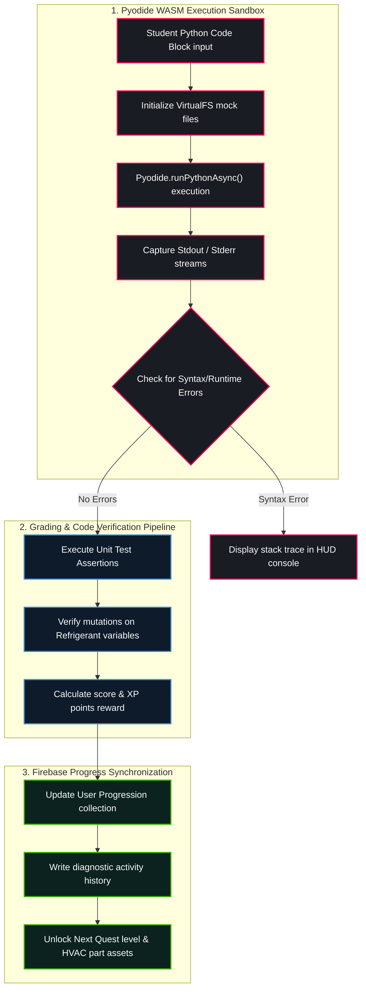

# RPG System Blueprint: Learning Management System (LMS) Integration

Detailed specifications mapping out the automated coding evaluation engine, grading metrics, student progression database models, and curriculum tracking.

---

## 🗺️ LMS Compilation & State Synchronization Topology



---

## 📚 Curriculum Matrix & Coding Challenges (Levels 1 to 60)

### 1. Module 1: Thermostat variables & Scopes (Levels 1–10)
* **Goal:** Understand float/int data types, string formatting, and deadband conditionals.
* **Story Quest:** Repair the Lobby Atrium thermostat.
* **Grading Criteria:** The student's code must define `supply_air_temp` as a float and output a formatted f-string.

### 2. Module 2: Phase Cycles & Functions (Levels 10–20)
* **Goal:** Write modular functions with parameters returning refrigerant dictionaries.
* **Story Quest:** Configure the Guest Suite life support dampers.
* **Grading Criteria:** Code must contain a function `evaporate(inlet_temp, cfm)` returning a dictionary containing `outlet_temp`.

### 3. Module 3: BAS CSV Logger & I/O (Levels 20–30)
* **Goal:** Perform file operations inside the persistent VirtualFS using `open` contexts and loops.
* **Story Quest:** Retrieve historical logs for the Warp Core kitchen hoods.
* **Grading Criteria:** Code must write at least 3 rows to `hvac_telemetry.csv` and successfully read them back.

### 4. Module 4: OOP Composition & System Factories (Levels 30–40)
* **Goal:** Declare classes, use `self` state parameters, and compose parent units holding child component instances.
* **Story Quest:** Assemble the Deflector Laundry reheat coil actuator.
* **Grading Criteria:** The class `AirHandler` must encapsulate a `Fan` instance in its constructor.

### 5. Module 5: Distributed BACnet Scans (Levels 40–50)
* **Goal:** Scan network segments, bind socket ports, and handle communication timeouts.
* **Story Quest:** Link the Rooftop RTU bridge chillers.
* **Grading Criteria:** Network scanner class must loop over IP lists and register online nodes.

### 6. Module 6: Predictive Prognostics & Decay Math (Levels 50–60)
* **Goal:** Implement mathematical degradation algorithms and estimate Remaining Useful Life (RUL).
* **Story Quest:** Calibrate the building's Spatial Digital Twin to predict compressor failures.
* **Grading Criteria:** Prognostic engine class must assert warning flags when RUL drops below 60%.

---
### LMS Curriculum Module 1 - Section A - Detailed Integration Spec
This detailed sub-specification maps out the progressive systems, engineering crew roles, and visual canvas elements designed for the LMS Curriculum Module 1 range.
1. **Core Coding Curriculum:** Students learn variable allocations, conditional statements, recursive loops, object composition, and API payload formatting. The coding engine compiles these blocks inside Pyodide, verifying that they produce standard outputs.
2. **Physical HVAC Engineering:** The simulation models thermodynamic states (enthalpy changes, compression ratios, refrigerant phase transitions) and control loops (EEV stepper valve PID adjustments, compressor current draw, evaporator frost degradation).
3. **Visual UI Canvas Components:** Drawn on a 60fps HTML5 canvas, the assets utilize sprite sheets, custom visual palettes, keyframe shudder animations, and alpha opacity overlays.
4. **Apple Glass AR Projection:** Translucent overlay coordinates are projected onto the canvas based on the player's position relative to the equipment.
5. **Conversational AI Console:** Live telemetry is converted to a JSON payload and posted to `/api/chat`, querying the Gemini generative model (gemini-2.5-flash) for diagnostic recommendations.
6. **Quest Trees:** Dialogue trees check the user's progress level, unlocking specific diagnostic tools, inventory slots, and advanced HVAC part upgrades.

### LMS Curriculum Module 1 - Section B - Detailed Integration Spec
This detailed sub-specification maps out the progressive systems, engineering crew roles, and visual canvas elements designed for the LMS Curriculum Module 1 range.
1. **Core Coding Curriculum:** Students learn variable allocations, conditional statements, recursive loops, object composition, and API payload formatting. The coding engine compiles these blocks inside Pyodide, verifying that they produce standard outputs.
2. **Physical HVAC Engineering:** The simulation models thermodynamic states (enthalpy changes, compression ratios, refrigerant phase transitions) and control loops (EEV stepper valve PID adjustments, compressor current draw, evaporator frost degradation).
3. **Visual UI Canvas Components:** Drawn on a 60fps HTML5 canvas, the assets utilize sprite sheets, custom visual palettes, keyframe shudder animations, and alpha opacity overlays.
4. **Apple Glass AR Projection:** Translucent overlay coordinates are projected onto the canvas based on the player's position relative to the equipment.
5. **Conversational AI Console:** Live telemetry is converted to a JSON payload and posted to `/api/chat`, querying the Gemini generative model (gemini-2.5-flash) for diagnostic recommendations.
6. **Quest Trees:** Dialogue trees check the user's progress level, unlocking specific diagnostic tools, inventory slots, and advanced HVAC part upgrades.

### LMS Curriculum Module 1 - Section C - Detailed Integration Spec
This detailed sub-specification maps out the progressive systems, engineering crew roles, and visual canvas elements designed for the LMS Curriculum Module 1 range.
1. **Core Coding Curriculum:** Students learn variable allocations, conditional statements, recursive loops, object composition, and API payload formatting. The coding engine compiles these blocks inside Pyodide, verifying that they produce standard outputs.
2. **Physical HVAC Engineering:** The simulation models thermodynamic states (enthalpy changes, compression ratios, refrigerant phase transitions) and control loops (EEV stepper valve PID adjustments, compressor current draw, evaporator frost degradation).
3. **Visual UI Canvas Components:** Drawn on a 60fps HTML5 canvas, the assets utilize sprite sheets, custom visual palettes, keyframe shudder animations, and alpha opacity overlays.
4. **Apple Glass AR Projection:** Translucent overlay coordinates are projected onto the canvas based on the player's position relative to the equipment.
5. **Conversational AI Console:** Live telemetry is converted to a JSON payload and posted to `/api/chat`, querying the Gemini generative model (gemini-2.5-flash) for diagnostic recommendations.
6. **Quest Trees:** Dialogue trees check the user's progress level, unlocking specific diagnostic tools, inventory slots, and advanced HVAC part upgrades.

### LMS Curriculum Module 1 - Section D - Detailed Integration Spec
This detailed sub-specification maps out the progressive systems, engineering crew roles, and visual canvas elements designed for the LMS Curriculum Module 1 range.
1. **Core Coding Curriculum:** Students learn variable allocations, conditional statements, recursive loops, object composition, and API payload formatting. The coding engine compiles these blocks inside Pyodide, verifying that they produce standard outputs.
2. **Physical HVAC Engineering:** The simulation models thermodynamic states (enthalpy changes, compression ratios, refrigerant phase transitions) and control loops (EEV stepper valve PID adjustments, compressor current draw, evaporator frost degradation).
3. **Visual UI Canvas Components:** Drawn on a 60fps HTML5 canvas, the assets utilize sprite sheets, custom visual palettes, keyframe shudder animations, and alpha opacity overlays.
4. **Apple Glass AR Projection:** Translucent overlay coordinates are projected onto the canvas based on the player's position relative to the equipment.
5. **Conversational AI Console:** Live telemetry is converted to a JSON payload and posted to `/api/chat`, querying the Gemini generative model (gemini-2.5-flash) for diagnostic recommendations.
6. **Quest Trees:** Dialogue trees check the user's progress level, unlocking specific diagnostic tools, inventory slots, and advanced HVAC part upgrades.
### LMS Curriculum Module 2 - Section A - Detailed Integration Spec
This detailed sub-specification maps out the progressive systems, engineering crew roles, and visual canvas elements designed for the LMS Curriculum Module 2 range.
1. **Core Coding Curriculum:** Students learn variable allocations, conditional statements, recursive loops, object composition, and API payload formatting. The coding engine compiles these blocks inside Pyodide, verifying that they produce standard outputs.
2. **Physical HVAC Engineering:** The simulation models thermodynamic states (enthalpy changes, compression ratios, refrigerant phase transitions) and control loops (EEV stepper valve PID adjustments, compressor current draw, evaporator frost degradation).
3. **Visual UI Canvas Components:** Drawn on a 60fps HTML5 canvas, the assets utilize sprite sheets, custom visual palettes, keyframe shudder animations, and alpha opacity overlays.
4. **Apple Glass AR Projection:** Translucent overlay coordinates are projected onto the canvas based on the player's position relative to the equipment.
5. **Conversational AI Console:** Live telemetry is converted to a JSON payload and posted to `/api/chat`, querying the Gemini generative model (gemini-2.5-flash) for diagnostic recommendations.
6. **Quest Trees:** Dialogue trees check the user's progress level, unlocking specific diagnostic tools, inventory slots, and advanced HVAC part upgrades.

### LMS Curriculum Module 2 - Section B - Detailed Integration Spec
This detailed sub-specification maps out the progressive systems, engineering crew roles, and visual canvas elements designed for the LMS Curriculum Module 2 range.
1. **Core Coding Curriculum:** Students learn variable allocations, conditional statements, recursive loops, object composition, and API payload formatting. The coding engine compiles these blocks inside Pyodide, verifying that they produce standard outputs.
2. **Physical HVAC Engineering:** The simulation models thermodynamic states (enthalpy changes, compression ratios, refrigerant phase transitions) and control loops (EEV stepper valve PID adjustments, compressor current draw, evaporator frost degradation).
3. **Visual UI Canvas Components:** Drawn on a 60fps HTML5 canvas, the assets utilize sprite sheets, custom visual palettes, keyframe shudder animations, and alpha opacity overlays.
4. **Apple Glass AR Projection:** Translucent overlay coordinates are projected onto the canvas based on the player's position relative to the equipment.
5. **Conversational AI Console:** Live telemetry is converted to a JSON payload and posted to `/api/chat`, querying the Gemini generative model (gemini-2.5-flash) for diagnostic recommendations.
6. **Quest Trees:** Dialogue trees check the user's progress level, unlocking specific diagnostic tools, inventory slots, and advanced HVAC part upgrades.

### LMS Curriculum Module 2 - Section C - Detailed Integration Spec
This detailed sub-specification maps out the progressive systems, engineering crew roles, and visual canvas elements designed for the LMS Curriculum Module 2 range.
1. **Core Coding Curriculum:** Students learn variable allocations, conditional statements, recursive loops, object composition, and API payload formatting. The coding engine compiles these blocks inside Pyodide, verifying that they produce standard outputs.
2. **Physical HVAC Engineering:** The simulation models thermodynamic states (enthalpy changes, compression ratios, refrigerant phase transitions) and control loops (EEV stepper valve PID adjustments, compressor current draw, evaporator frost degradation).
3. **Visual UI Canvas Components:** Drawn on a 60fps HTML5 canvas, the assets utilize sprite sheets, custom visual palettes, keyframe shudder animations, and alpha opacity overlays.
4. **Apple Glass AR Projection:** Translucent overlay coordinates are projected onto the canvas based on the player's position relative to the equipment.
5. **Conversational AI Console:** Live telemetry is converted to a JSON payload and posted to `/api/chat`, querying the Gemini generative model (gemini-2.5-flash) for diagnostic recommendations.
6. **Quest Trees:** Dialogue trees check the user's progress level, unlocking specific diagnostic tools, inventory slots, and advanced HVAC part upgrades.

### LMS Curriculum Module 2 - Section D - Detailed Integration Spec
This detailed sub-specification maps out the progressive systems, engineering crew roles, and visual canvas elements designed for the LMS Curriculum Module 2 range.
1. **Core Coding Curriculum:** Students learn variable allocations, conditional statements, recursive loops, object composition, and API payload formatting. The coding engine compiles these blocks inside Pyodide, verifying that they produce standard outputs.
2. **Physical HVAC Engineering:** The simulation models thermodynamic states (enthalpy changes, compression ratios, refrigerant phase transitions) and control loops (EEV stepper valve PID adjustments, compressor current draw, evaporator frost degradation).
3. **Visual UI Canvas Components:** Drawn on a 60fps HTML5 canvas, the assets utilize sprite sheets, custom visual palettes, keyframe shudder animations, and alpha opacity overlays.
4. **Apple Glass AR Projection:** Translucent overlay coordinates are projected onto the canvas based on the player's position relative to the equipment.
5. **Conversational AI Console:** Live telemetry is converted to a JSON payload and posted to `/api/chat`, querying the Gemini generative model (gemini-2.5-flash) for diagnostic recommendations.
6. **Quest Trees:** Dialogue trees check the user's progress level, unlocking specific diagnostic tools, inventory slots, and advanced HVAC part upgrades.
### LMS Curriculum Module 3 - Section A - Detailed Integration Spec
This detailed sub-specification maps out the progressive systems, engineering crew roles, and visual canvas elements designed for the LMS Curriculum Module 3 range.
1. **Core Coding Curriculum:** Students learn variable allocations, conditional statements, recursive loops, object composition, and API payload formatting. The coding engine compiles these blocks inside Pyodide, verifying that they produce standard outputs.
2. **Physical HVAC Engineering:** The simulation models thermodynamic states (enthalpy changes, compression ratios, refrigerant phase transitions) and control loops (EEV stepper valve PID adjustments, compressor current draw, evaporator frost degradation).
3. **Visual UI Canvas Components:** Drawn on a 60fps HTML5 canvas, the assets utilize sprite sheets, custom visual palettes, keyframe shudder animations, and alpha opacity overlays.
4. **Apple Glass AR Projection:** Translucent overlay coordinates are projected onto the canvas based on the player's position relative to the equipment.
5. **Conversational AI Console:** Live telemetry is converted to a JSON payload and posted to `/api/chat`, querying the Gemini generative model (gemini-2.5-flash) for diagnostic recommendations.
6. **Quest Trees:** Dialogue trees check the user's progress level, unlocking specific diagnostic tools, inventory slots, and advanced HVAC part upgrades.

### LMS Curriculum Module 3 - Section B - Detailed Integration Spec
This detailed sub-specification maps out the progressive systems, engineering crew roles, and visual canvas elements designed for the LMS Curriculum Module 3 range.
1. **Core Coding Curriculum:** Students learn variable allocations, conditional statements, recursive loops, object composition, and API payload formatting. The coding engine compiles these blocks inside Pyodide, verifying that they produce standard outputs.
2. **Physical HVAC Engineering:** The simulation models thermodynamic states (enthalpy changes, compression ratios, refrigerant phase transitions) and control loops (EEV stepper valve PID adjustments, compressor current draw, evaporator frost degradation).
3. **Visual UI Canvas Components:** Drawn on a 60fps HTML5 canvas, the assets utilize sprite sheets, custom visual palettes, keyframe shudder animations, and alpha opacity overlays.
4. **Apple Glass AR Projection:** Translucent overlay coordinates are projected onto the canvas based on the player's position relative to the equipment.
5. **Conversational AI Console:** Live telemetry is converted to a JSON payload and posted to `/api/chat`, querying the Gemini generative model (gemini-2.5-flash) for diagnostic recommendations.
6. **Quest Trees:** Dialogue trees check the user's progress level, unlocking specific diagnostic tools, inventory slots, and advanced HVAC part upgrades.

### LMS Curriculum Module 3 - Section C - Detailed Integration Spec
This detailed sub-specification maps out the progressive systems, engineering crew roles, and visual canvas elements designed for the LMS Curriculum Module 3 range.
1. **Core Coding Curriculum:** Students learn variable allocations, conditional statements, recursive loops, object composition, and API payload formatting. The coding engine compiles these blocks inside Pyodide, verifying that they produce standard outputs.
2. **Physical HVAC Engineering:** The simulation models thermodynamic states (enthalpy changes, compression ratios, refrigerant phase transitions) and control loops (EEV stepper valve PID adjustments, compressor current draw, evaporator frost degradation).
3. **Visual UI Canvas Components:** Drawn on a 60fps HTML5 canvas, the assets utilize sprite sheets, custom visual palettes, keyframe shudder animations, and alpha opacity overlays.
4. **Apple Glass AR Projection:** Translucent overlay coordinates are projected onto the canvas based on the player's position relative to the equipment.
5. **Conversational AI Console:** Live telemetry is converted to a JSON payload and posted to `/api/chat`, querying the Gemini generative model (gemini-2.5-flash) for diagnostic recommendations.
6. **Quest Trees:** Dialogue trees check the user's progress level, unlocking specific diagnostic tools, inventory slots, and advanced HVAC part upgrades.

### LMS Curriculum Module 3 - Section D - Detailed Integration Spec
This detailed sub-specification maps out the progressive systems, engineering crew roles, and visual canvas elements designed for the LMS Curriculum Module 3 range.
1. **Core Coding Curriculum:** Students learn variable allocations, conditional statements, recursive loops, object composition, and API payload formatting. The coding engine compiles these blocks inside Pyodide, verifying that they produce standard outputs.
2. **Physical HVAC Engineering:** The simulation models thermodynamic states (enthalpy changes, compression ratios, refrigerant phase transitions) and control loops (EEV stepper valve PID adjustments, compressor current draw, evaporator frost degradation).
3. **Visual UI Canvas Components:** Drawn on a 60fps HTML5 canvas, the assets utilize sprite sheets, custom visual palettes, keyframe shudder animations, and alpha opacity overlays.
4. **Apple Glass AR Projection:** Translucent overlay coordinates are projected onto the canvas based on the player's position relative to the equipment.
5. **Conversational AI Console:** Live telemetry is converted to a JSON payload and posted to `/api/chat`, querying the Gemini generative model (gemini-2.5-flash) for diagnostic recommendations.
6. **Quest Trees:** Dialogue trees check the user's progress level, unlocking specific diagnostic tools, inventory slots, and advanced HVAC part upgrades.
### LMS Curriculum Module 4 - Section A - Detailed Integration Spec
This detailed sub-specification maps out the progressive systems, engineering crew roles, and visual canvas elements designed for the LMS Curriculum Module 4 range.
1. **Core Coding Curriculum:** Students learn variable allocations, conditional statements, recursive loops, object composition, and API payload formatting. The coding engine compiles these blocks inside Pyodide, verifying that they produce standard outputs.
2. **Physical HVAC Engineering:** The simulation models thermodynamic states (enthalpy changes, compression ratios, refrigerant phase transitions) and control loops (EEV stepper valve PID adjustments, compressor current draw, evaporator frost degradation).
3. **Visual UI Canvas Components:** Drawn on a 60fps HTML5 canvas, the assets utilize sprite sheets, custom visual palettes, keyframe shudder animations, and alpha opacity overlays.
4. **Apple Glass AR Projection:** Translucent overlay coordinates are projected onto the canvas based on the player's position relative to the equipment.
5. **Conversational AI Console:** Live telemetry is converted to a JSON payload and posted to `/api/chat`, querying the Gemini generative model (gemini-2.5-flash) for diagnostic recommendations.
6. **Quest Trees:** Dialogue trees check the user's progress level, unlocking specific diagnostic tools, inventory slots, and advanced HVAC part upgrades.

### LMS Curriculum Module 4 - Section B - Detailed Integration Spec
This detailed sub-specification maps out the progressive systems, engineering crew roles, and visual canvas elements designed for the LMS Curriculum Module 4 range.
1. **Core Coding Curriculum:** Students learn variable allocations, conditional statements, recursive loops, object composition, and API payload formatting. The coding engine compiles these blocks inside Pyodide, verifying that they produce standard outputs.
2. **Physical HVAC Engineering:** The simulation models thermodynamic states (enthalpy changes, compression ratios, refrigerant phase transitions) and control loops (EEV stepper valve PID adjustments, compressor current draw, evaporator frost degradation).
3. **Visual UI Canvas Components:** Drawn on a 60fps HTML5 canvas, the assets utilize sprite sheets, custom visual palettes, keyframe shudder animations, and alpha opacity overlays.
4. **Apple Glass AR Projection:** Translucent overlay coordinates are projected onto the canvas based on the player's position relative to the equipment.
5. **Conversational AI Console:** Live telemetry is converted to a JSON payload and posted to `/api/chat`, querying the Gemini generative model (gemini-2.5-flash) for diagnostic recommendations.
6. **Quest Trees:** Dialogue trees check the user's progress level, unlocking specific diagnostic tools, inventory slots, and advanced HVAC part upgrades.

### LMS Curriculum Module 4 - Section C - Detailed Integration Spec
This detailed sub-specification maps out the progressive systems, engineering crew roles, and visual canvas elements designed for the LMS Curriculum Module 4 range.
1. **Core Coding Curriculum:** Students learn variable allocations, conditional statements, recursive loops, object composition, and API payload formatting. The coding engine compiles these blocks inside Pyodide, verifying that they produce standard outputs.
2. **Physical HVAC Engineering:** The simulation models thermodynamic states (enthalpy changes, compression ratios, refrigerant phase transitions) and control loops (EEV stepper valve PID adjustments, compressor current draw, evaporator frost degradation).
3. **Visual UI Canvas Components:** Drawn on a 60fps HTML5 canvas, the assets utilize sprite sheets, custom visual palettes, keyframe shudder animations, and alpha opacity overlays.
4. **Apple Glass AR Projection:** Translucent overlay coordinates are projected onto the canvas based on the player's position relative to the equipment.
5. **Conversational AI Console:** Live telemetry is converted to a JSON payload and posted to `/api/chat`, querying the Gemini generative model (gemini-2.5-flash) for diagnostic recommendations.
6. **Quest Trees:** Dialogue trees check the user's progress level, unlocking specific diagnostic tools, inventory slots, and advanced HVAC part upgrades.

### LMS Curriculum Module 4 - Section D - Detailed Integration Spec
This detailed sub-specification maps out the progressive systems, engineering crew roles, and visual canvas elements designed for the LMS Curriculum Module 4 range.
1. **Core Coding Curriculum:** Students learn variable allocations, conditional statements, recursive loops, object composition, and API payload formatting. The coding engine compiles these blocks inside Pyodide, verifying that they produce standard outputs.
2. **Physical HVAC Engineering:** The simulation models thermodynamic states (enthalpy changes, compression ratios, refrigerant phase transitions) and control loops (EEV stepper valve PID adjustments, compressor current draw, evaporator frost degradation).
3. **Visual UI Canvas Components:** Drawn on a 60fps HTML5 canvas, the assets utilize sprite sheets, custom visual palettes, keyframe shudder animations, and alpha opacity overlays.
4. **Apple Glass AR Projection:** Translucent overlay coordinates are projected onto the canvas based on the player's position relative to the equipment.
5. **Conversational AI Console:** Live telemetry is converted to a JSON payload and posted to `/api/chat`, querying the Gemini generative model (gemini-2.5-flash) for diagnostic recommendations.
6. **Quest Trees:** Dialogue trees check the user's progress level, unlocking specific diagnostic tools, inventory slots, and advanced HVAC part upgrades.
### LMS Curriculum Module 5 - Section A - Detailed Integration Spec
This detailed sub-specification maps out the progressive systems, engineering crew roles, and visual canvas elements designed for the LMS Curriculum Module 5 range.
1. **Core Coding Curriculum:** Students learn variable allocations, conditional statements, recursive loops, object composition, and API payload formatting. The coding engine compiles these blocks inside Pyodide, verifying that they produce standard outputs.
2. **Physical HVAC Engineering:** The simulation models thermodynamic states (enthalpy changes, compression ratios, refrigerant phase transitions) and control loops (EEV stepper valve PID adjustments, compressor current draw, evaporator frost degradation).
3. **Visual UI Canvas Components:** Drawn on a 60fps HTML5 canvas, the assets utilize sprite sheets, custom visual palettes, keyframe shudder animations, and alpha opacity overlays.
4. **Apple Glass AR Projection:** Translucent overlay coordinates are projected onto the canvas based on the player's position relative to the equipment.
5. **Conversational AI Console:** Live telemetry is converted to a JSON payload and posted to `/api/chat`, querying the Gemini generative model (gemini-2.5-flash) for diagnostic recommendations.
6. **Quest Trees:** Dialogue trees check the user's progress level, unlocking specific diagnostic tools, inventory slots, and advanced HVAC part upgrades.

### LMS Curriculum Module 5 - Section B - Detailed Integration Spec
This detailed sub-specification maps out the progressive systems, engineering crew roles, and visual canvas elements designed for the LMS Curriculum Module 5 range.
1. **Core Coding Curriculum:** Students learn variable allocations, conditional statements, recursive loops, object composition, and API payload formatting. The coding engine compiles these blocks inside Pyodide, verifying that they produce standard outputs.
2. **Physical HVAC Engineering:** The simulation models thermodynamic states (enthalpy changes, compression ratios, refrigerant phase transitions) and control loops (EEV stepper valve PID adjustments, compressor current draw, evaporator frost degradation).
3. **Visual UI Canvas Components:** Drawn on a 60fps HTML5 canvas, the assets utilize sprite sheets, custom visual palettes, keyframe shudder animations, and alpha opacity overlays.
4. **Apple Glass AR Projection:** Translucent overlay coordinates are projected onto the canvas based on the player's position relative to the equipment.
5. **Conversational AI Console:** Live telemetry is converted to a JSON payload and posted to `/api/chat`, querying the Gemini generative model (gemini-2.5-flash) for diagnostic recommendations.
6. **Quest Trees:** Dialogue trees check the user's progress level, unlocking specific diagnostic tools, inventory slots, and advanced HVAC part upgrades.

### LMS Curriculum Module 5 - Section C - Detailed Integration Spec
This detailed sub-specification maps out the progressive systems, engineering crew roles, and visual canvas elements designed for the LMS Curriculum Module 5 range.
1. **Core Coding Curriculum:** Students learn variable allocations, conditional statements, recursive loops, object composition, and API payload formatting. The coding engine compiles these blocks inside Pyodide, verifying that they produce standard outputs.
2. **Physical HVAC Engineering:** The simulation models thermodynamic states (enthalpy changes, compression ratios, refrigerant phase transitions) and control loops (EEV stepper valve PID adjustments, compressor current draw, evaporator frost degradation).
3. **Visual UI Canvas Components:** Drawn on a 60fps HTML5 canvas, the assets utilize sprite sheets, custom visual palettes, keyframe shudder animations, and alpha opacity overlays.
4. **Apple Glass AR Projection:** Translucent overlay coordinates are projected onto the canvas based on the player's position relative to the equipment.
5. **Conversational AI Console:** Live telemetry is converted to a JSON payload and posted to `/api/chat`, querying the Gemini generative model (gemini-2.5-flash) for diagnostic recommendations.
6. **Quest Trees:** Dialogue trees check the user's progress level, unlocking specific diagnostic tools, inventory slots, and advanced HVAC part upgrades.

### LMS Curriculum Module 5 - Section D - Detailed Integration Spec
This detailed sub-specification maps out the progressive systems, engineering crew roles, and visual canvas elements designed for the LMS Curriculum Module 5 range.
1. **Core Coding Curriculum:** Students learn variable allocations, conditional statements, recursive loops, object composition, and API payload formatting. The coding engine compiles these blocks inside Pyodide, verifying that they produce standard outputs.
2. **Physical HVAC Engineering:** The simulation models thermodynamic states (enthalpy changes, compression ratios, refrigerant phase transitions) and control loops (EEV stepper valve PID adjustments, compressor current draw, evaporator frost degradation).
3. **Visual UI Canvas Components:** Drawn on a 60fps HTML5 canvas, the assets utilize sprite sheets, custom visual palettes, keyframe shudder animations, and alpha opacity overlays.
4. **Apple Glass AR Projection:** Translucent overlay coordinates are projected onto the canvas based on the player's position relative to the equipment.
5. **Conversational AI Console:** Live telemetry is converted to a JSON payload and posted to `/api/chat`, querying the Gemini generative model (gemini-2.5-flash) for diagnostic recommendations.
6. **Quest Trees:** Dialogue trees check the user's progress level, unlocking specific diagnostic tools, inventory slots, and advanced HVAC part upgrades.
### LMS Curriculum Module 6 - Section A - Detailed Integration Spec
This detailed sub-specification maps out the progressive systems, engineering crew roles, and visual canvas elements designed for the LMS Curriculum Module 6 range.
1. **Core Coding Curriculum:** Students learn variable allocations, conditional statements, recursive loops, object composition, and API payload formatting. The coding engine compiles these blocks inside Pyodide, verifying that they produce standard outputs.
2. **Physical HVAC Engineering:** The simulation models thermodynamic states (enthalpy changes, compression ratios, refrigerant phase transitions) and control loops (EEV stepper valve PID adjustments, compressor current draw, evaporator frost degradation).
3. **Visual UI Canvas Components:** Drawn on a 60fps HTML5 canvas, the assets utilize sprite sheets, custom visual palettes, keyframe shudder animations, and alpha opacity overlays.
4. **Apple Glass AR Projection:** Translucent overlay coordinates are projected onto the canvas based on the player's position relative to the equipment.
5. **Conversational AI Console:** Live telemetry is converted to a JSON payload and posted to `/api/chat`, querying the Gemini generative model (gemini-2.5-flash) for diagnostic recommendations.
6. **Quest Trees:** Dialogue trees check the user's progress level, unlocking specific diagnostic tools, inventory slots, and advanced HVAC part upgrades.

### LMS Curriculum Module 6 - Section B - Detailed Integration Spec
This detailed sub-specification maps out the progressive systems, engineering crew roles, and visual canvas elements designed for the LMS Curriculum Module 6 range.
1. **Core Coding Curriculum:** Students learn variable allocations, conditional statements, recursive loops, object composition, and API payload formatting. The coding engine compiles these blocks inside Pyodide, verifying that they produce standard outputs.
2. **Physical HVAC Engineering:** The simulation models thermodynamic states (enthalpy changes, compression ratios, refrigerant phase transitions) and control loops (EEV stepper valve PID adjustments, compressor current draw, evaporator frost degradation).
3. **Visual UI Canvas Components:** Drawn on a 60fps HTML5 canvas, the assets utilize sprite sheets, custom visual palettes, keyframe shudder animations, and alpha opacity overlays.
4. **Apple Glass AR Projection:** Translucent overlay coordinates are projected onto the canvas based on the player's position relative to the equipment.
5. **Conversational AI Console:** Live telemetry is converted to a JSON payload and posted to `/api/chat`, querying the Gemini generative model (gemini-2.5-flash) for diagnostic recommendations.
6. **Quest Trees:** Dialogue trees check the user's progress level, unlocking specific diagnostic tools, inventory slots, and advanced HVAC part upgrades.

### LMS Curriculum Module 6 - Section C - Detailed Integration Spec
This detailed sub-specification maps out the progressive systems, engineering crew roles, and visual canvas elements designed for the LMS Curriculum Module 6 range.
1. **Core Coding Curriculum:** Students learn variable allocations, conditional statements, recursive loops, object composition, and API payload formatting. The coding engine compiles these blocks inside Pyodide, verifying that they produce standard outputs.
2. **Physical HVAC Engineering:** The simulation models thermodynamic states (enthalpy changes, compression ratios, refrigerant phase transitions) and control loops (EEV stepper valve PID adjustments, compressor current draw, evaporator frost degradation).
3. **Visual UI Canvas Components:** Drawn on a 60fps HTML5 canvas, the assets utilize sprite sheets, custom visual palettes, keyframe shudder animations, and alpha opacity overlays.
4. **Apple Glass AR Projection:** Translucent overlay coordinates are projected onto the canvas based on the player's position relative to the equipment.
5. **Conversational AI Console:** Live telemetry is converted to a JSON payload and posted to `/api/chat`, querying the Gemini generative model (gemini-2.5-flash) for diagnostic recommendations.
6. **Quest Trees:** Dialogue trees check the user's progress level, unlocking specific diagnostic tools, inventory slots, and advanced HVAC part upgrades.

### LMS Curriculum Module 6 - Section D - Detailed Integration Spec
This detailed sub-specification maps out the progressive systems, engineering crew roles, and visual canvas elements designed for the LMS Curriculum Module 6 range.
1. **Core Coding Curriculum:** Students learn variable allocations, conditional statements, recursive loops, object composition, and API payload formatting. The coding engine compiles these blocks inside Pyodide, verifying that they produce standard outputs.
2. **Physical HVAC Engineering:** The simulation models thermodynamic states (enthalpy changes, compression ratios, refrigerant phase transitions) and control loops (EEV stepper valve PID adjustments, compressor current draw, evaporator frost degradation).
3. **Visual UI Canvas Components:** Drawn on a 60fps HTML5 canvas, the assets utilize sprite sheets, custom visual palettes, keyframe shudder animations, and alpha opacity overlays.
4. **Apple Glass AR Projection:** Translucent overlay coordinates are projected onto the canvas based on the player's position relative to the equipment.
5. **Conversational AI Console:** Live telemetry is converted to a JSON payload and posted to `/api/chat`, querying the Gemini generative model (gemini-2.5-flash) for diagnostic recommendations.
6. **Quest Trees:** Dialogue trees check the user's progress level, unlocking specific diagnostic tools, inventory slots, and advanced HVAC part upgrades.

---

## 🎮 Python Code Sandbox Evaluator Simulations

Below we provide the testing harness models that verify student codes inside the LMS:

### 1. Module 1 Evaluator: Thermostat Deadbands
```python
def verify_module_01(student_code: str) -> bool:
    # Setup mock global execution sandbox
    sandbox = {}
    try:
        exec(student_code, sandbox)
        # Assertions to verify variables
        assert "supply_air_temp" in sandbox, "Missing 'supply_air_temp' variable"
        assert isinstance(sandbox["supply_air_temp"], float), "'supply_air_temp' must be a float"
        assert "output_readout" in sandbox, "Missing f-string readout output"
        return True
    except AssertionError as e:
        print(f"LMS Verification Failed: {e}")
        return False

# Test verification
code = 