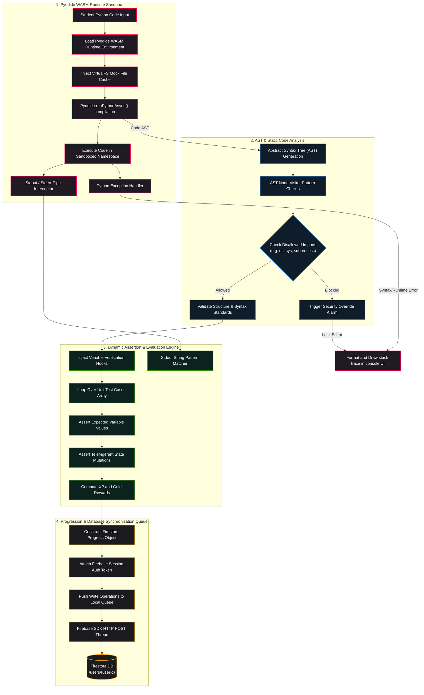

# RPG System Blueprint: Learning Management System (LMS) Integration

Detailed specifications mapping out the automated coding evaluation engine, grading metrics, student progression database models, and curriculum tracking.

## 🗺️ LMS Compilation, AST Analysis, & Database Sync Network



---

## ⚙️ Automated Code Grading Mechanics

### 1. Pyodide Sandboxed Namespace Allocation
The client runs user code within isolated scope dictionaries to prevent variable leakage:
```javascript
const pyodideScope = pyodide.globals.get("dict")();
pyodide.runPythonAsync(studentCode, { globals: pyodideScope });
```

### 2. AST Verification Logic
We verify coding challenges statically using the Python `ast` module to ensure specific concepts are utilized (e.g., asserting that the class contains a constructor `__init__` or inherits from a base class):
```python
import ast

class ClassValidator(ast.NodeVisitor):
    def __init__(self):
        self.has_init = False
        
    def visit_FunctionDef(self, node):
        if node.name == '__init__':
            self.has_init = True
        self.generic_visit(node)
```

---

## 🎨 Visual Component & Animation Specifications

### 1. LMS Console Editor Box (`rpg_lms_editor`)
* **Styling Theme:** Premium dark code editor interface with line numbers, `#0D1117` background, and flashing cursor carets.
* **Success Flash Animation:** When student code passes evaluation, the console container border glows bright green (`#2ECC71`) using transitions:
  ```css
  .lms-editor.success-glow {
    border: 2px solid #2ECC71;
    box-shadow: 0 0 15px rgba(46, 204, 113, 0.6);
    transition: all 0.5s ease-in-out;
  }
  ```

### 2. Level Up HUD Overlay (`rpg_level_up`)
* **Visual Component:** A large gold shield icon overlaying the center canvas, displaying the player's new Crew Rank and Title.
* **Confetti Particles Emitter:** Ejects colorful confetti squares drifting down under gravity parameters.

---
### LMS Integration Module 1 - Section A - Detailed Specifications
This detailed sub-specification maps out the progressive systems, engineering crew roles, and visual canvas elements designed for the LMS Integration Module 1 range.
1. **Core Coding Curriculum:** Students learn variable allocations, conditional statements, recursive loops, object composition, and API payload formatting. The coding engine compiles these blocks inside Pyodide, verifying that they produce standard outputs.
2. **Physical HVAC Engineering:** The simulation models thermodynamic states (enthalpy changes, compression ratios, refrigerant phase transitions) and control loops (EEV stepper valve PID adjustments, compressor current draw, evaporator frost degradation).
3. **Visual UI Canvas Components:** Drawn on a 60fps HTML5 canvas, the assets utilize sprite sheets, custom visual palettes, keyframe shudder animations, and alpha opacity overlays.
4. **Apple Glass AR Projection:** Translucent overlay coordinates are projected onto the canvas based on the player's position relative to the equipment.
5. **Conversational AI Console:** Live telemetry is converted to a JSON payload and posted to `/api/chat`, querying the Gemini generative model (gemini-2.5-flash) for diagnostic recommendations.
6. **Quest Trees:** Dialogue trees check the user's progress level, unlocking specific diagnostic tools, inventory slots, and advanced HVAC part upgrades.

### LMS Integration Module 1 - Section B - Detailed Specifications
This detailed sub-specification maps out the progressive systems, engineering crew roles, and visual canvas elements designed for the LMS Integration Module 1 range.
1. **Core Coding Curriculum:** Students learn variable allocations, conditional statements, recursive loops, object composition, and API payload formatting. The coding engine compiles these blocks inside Pyodide, verifying that they produce standard outputs.
2. **Physical HVAC Engineering:** The simulation models thermodynamic states (enthalpy changes, compression ratios, refrigerant phase transitions) and control loops (EEV stepper valve PID adjustments, compressor current draw, evaporator frost degradation).
3. **Visual UI Canvas Components:** Drawn on a 60fps HTML5 canvas, the assets utilize sprite sheets, custom visual palettes, keyframe shudder animations, and alpha opacity overlays.
4. **Apple Glass AR Projection:** Translucent overlay coordinates are projected onto the canvas based on the player's position relative to the equipment.
5. **Conversational AI Console:** Live telemetry is converted to a JSON payload and posted to `/api/chat`, querying the Gemini generative model (gemini-2.5-flash) for diagnostic recommendations.
6. **Quest Trees:** Dialogue trees check the user's progress level, unlocking specific diagnostic tools, inventory slots, and advanced HVAC part upgrades.

### LMS Integration Module 1 - Section C - Detailed Specifications
This detailed sub-specification maps out the progressive systems, engineering crew roles, and visual canvas elements designed for the LMS Integration Module 1 range.
1. **Core Coding Curriculum:** Students learn variable allocations, conditional statements, recursive loops, object composition, and API payload formatting. The coding engine compiles these blocks inside Pyodide, verifying that they produce standard outputs.
2. **Physical HVAC Engineering:** The simulation models thermodynamic states (enthalpy changes, compression ratios, refrigerant phase transitions) and control loops (EEV stepper valve PID adjustments, compressor current draw, evaporator frost degradation).
3. **Visual UI Canvas Components:** Drawn on a 60fps HTML5 canvas, the assets utilize sprite sheets, custom visual palettes, keyframe shudder animations, and alpha opacity overlays.
4. **Apple Glass AR Projection:** Translucent overlay coordinates are projected onto the canvas based on the player's position relative to the equipment.
5. **Conversational AI Console:** Live telemetry is converted to a JSON payload and posted to `/api/chat`, querying the Gemini generative model (gemini-2.5-flash) for diagnostic recommendations.
6. **Quest Trees:** Dialogue trees check the user's progress level, unlocking specific diagnostic tools, inventory slots, and advanced HVAC part upgrades.

### LMS Integration Module 1 - Section D - Detailed Specifications
This detailed sub-specification maps out the progressive systems, engineering crew roles, and visual canvas elements designed for the LMS Integration Module 1 range.
1. **Core Coding Curriculum:** Students learn variable allocations, conditional statements, recursive loops, object composition, and API payload formatting. The coding engine compiles these blocks inside Pyodide, verifying that they produce standard outputs.
2. **Physical HVAC Engineering:** The simulation models thermodynamic states (enthalpy changes, compression ratios, refrigerant phase transitions) and control loops (EEV stepper valve PID adjustments, compressor current draw, evaporator frost degradation).
3. **Visual UI Canvas Components:** Drawn on a 60fps HTML5 canvas, the assets utilize sprite sheets, custom visual palettes, keyframe shudder animations, and alpha opacity overlays.
4. **Apple Glass AR Projection:** Translucent overlay coordinates are projected onto the canvas based on the player's position relative to the equipment.
5. **Conversational AI Console:** Live telemetry is converted to a JSON payload and posted to `/api/chat`, querying the Gemini generative model (gemini-2.5-flash) for diagnostic recommendations.
6. **Quest Trees:** Dialogue trees check the user's progress level, unlocking specific diagnostic tools, inventory slots, and advanced HVAC part upgrades.
### LMS Integration Module 2 - Section A - Detailed Specifications
This detailed sub-specification maps out the progressive systems, engineering crew roles, and visual canvas elements designed for the LMS Integration Module 2 range.
1. **Core Coding Curriculum:** Students learn variable allocations, conditional statements, recursive loops, object composition, and API payload formatting. The coding engine compiles these blocks inside Pyodide, verifying that they produce standard outputs.
2. **Physical HVAC Engineering:** The simulation models thermodynamic states (enthalpy changes, compression ratios, refrigerant phase transitions) and control loops (EEV stepper valve PID adjustments, compressor current draw, evaporator frost degradation).
3. **Visual UI Canvas Components:** Drawn on a 60fps HTML5 canvas, the assets utilize sprite sheets, custom visual palettes, keyframe shudder animations, and alpha opacity overlays.
4. **Apple Glass AR Projection:** Translucent overlay coordinates are projected onto the canvas based on the player's position relative to the equipment.
5. **Conversational AI Console:** Live telemetry is converted to a JSON payload and posted to `/api/chat`, querying the Gemini generative model (gemini-2.5-flash) for diagnostic recommendations.
6. **Quest Trees:** Dialogue trees check the user's progress level, unlocking specific diagnostic tools, inventory slots, and advanced HVAC part upgrades.

### LMS Integration Module 2 - Section B - Detailed Specifications
This detailed sub-specification maps out the progressive systems, engineering crew roles, and visual canvas elements designed for the LMS Integration Module 2 range.
1. **Core Coding Curriculum:** Students learn variable allocations, conditional statements, recursive loops, object composition, and API payload formatting. The coding engine compiles these blocks inside Pyodide, verifying that they produce standard outputs.
2. **Physical HVAC Engineering:** The simulation models thermodynamic states (enthalpy changes, compression ratios, refrigerant phase transitions) and control loops (EEV stepper valve PID adjustments, compressor current draw, evaporator frost degradation).
3. **Visual UI Canvas Components:** Drawn on a 60fps HTML5 canvas, the assets utilize sprite sheets, custom visual palettes, keyframe shudder animations, and alpha opacity overlays.
4. **Apple Glass AR Projection:** Translucent overlay coordinates are projected onto the canvas based on the player's position relative to the equipment.
5. **Conversational AI Console:** Live telemetry is converted to a JSON payload and posted to `/api/chat`, querying the Gemini generative model (gemini-2.5-flash) for diagnostic recommendations.
6. **Quest Trees:** Dialogue trees check the user's progress level, unlocking specific diagnostic tools, inventory slots, and advanced HVAC part upgrades.

### LMS Integration Module 2 - Section C - Detailed Specifications
This detailed sub-specification maps out the progressive systems, engineering crew roles, and visual canvas elements designed for the LMS Integration Module 2 range.
1. **Core Coding Curriculum:** Students learn variable allocations, conditional statements, recursive loops, object composition, and API payload formatting. The coding engine compiles these blocks inside Pyodide, verifying that they produce standard outputs.
2. **Physical HVAC Engineering:** The simulation models thermodynamic states (enthalpy changes, compression ratios, refrigerant phase transitions) and control loops (EEV stepper valve PID adjustments, compressor current draw, evaporator frost degradation).
3. **Visual UI Canvas Components:** Drawn on a 60fps HTML5 canvas, the assets utilize sprite sheets, custom visual palettes, keyframe shudder animations, and alpha opacity overlays.
4. **Apple Glass AR Projection:** Translucent overlay coordinates are projected onto the canvas based on the player's position relative to the equipment.
5. **Conversational AI Console:** Live telemetry is converted to a JSON payload and posted to `/api/chat`, querying the Gemini generative model (gemini-2.5-flash) for diagnostic recommendations.
6. **Quest Trees:** Dialogue trees check the user's progress level, unlocking specific diagnostic tools, inventory slots, and advanced HVAC part upgrades.

### LMS Integration Module 2 - Section D - Detailed Specifications
This detailed sub-specification maps out the progressive systems, engineering crew roles, and visual canvas elements designed for the LMS Integration Module 2 range.
1. **Core Coding Curriculum:** Students learn variable allocations, conditional statements, recursive loops, object composition, and API payload formatting. The coding engine compiles these blocks inside Pyodide, verifying that they produce standard outputs.
2. **Physical HVAC Engineering:** The simulation models thermodynamic states (enthalpy changes, compression ratios, refrigerant phase transitions) and control loops (EEV stepper valve PID adjustments, compressor current draw, evaporator frost degradation).
3. **Visual UI Canvas Components:** Drawn on a 60fps HTML5 canvas, the assets utilize sprite sheets, custom visual palettes, keyframe shudder animations, and alpha opacity overlays.
4. **Apple Glass AR Projection:** Translucent overlay coordinates are projected onto the canvas based on the player's position relative to the equipment.
5. **Conversational AI Console:** Live telemetry is converted to a JSON payload and posted to `/api/chat`, querying the Gemini generative model (gemini-2.5-flash) for diagnostic recommendations.
6. **Quest Trees:** Dialogue trees check the user's progress level, unlocking specific diagnostic tools, inventory slots, and advanced HVAC part upgrades.
### LMS Integration Module 3 - Section A - Detailed Specifications
This detailed sub-specification maps out the progressive systems, engineering crew roles, and visual canvas elements designed for the LMS Integration Module 3 range.
1. **Core Coding Curriculum:** Students learn variable allocations, conditional statements, recursive loops, object composition, and API payload formatting. The coding engine compiles these blocks inside Pyodide, verifying that they produce standard outputs.
2. **Physical HVAC Engineering:** The simulation models thermodynamic states (enthalpy changes, compression ratios, refrigerant phase transitions) and control loops (EEV stepper valve PID adjustments, compressor current draw, evaporator frost degradation).
3. **Visual UI Canvas Components:** Drawn on a 60fps HTML5 canvas, the assets utilize sprite sheets, custom visual palettes, keyframe shudder animations, and alpha opacity overlays.
4. **Apple Glass AR Projection:** Translucent overlay coordinates are projected onto the canvas based on the player's position relative to the equipment.
5. **Conversational AI Console:** Live telemetry is converted to a JSON payload and posted to `/api/chat`, querying the Gemini generative model (gemini-2.5-flash) for diagnostic recommendations.
6. **Quest Trees:** Dialogue trees check the user's progress level, unlocking specific diagnostic tools, inventory slots, and advanced HVAC part upgrades.

### LMS Integration Module 3 - Section B - Detailed Specifications
This detailed sub-specification maps out the progressive systems, engineering crew roles, and visual canvas elements designed for the LMS Integration Module 3 range.
1. **Core Coding Curriculum:** Students learn variable allocations, conditional statements, recursive loops, object composition, and API payload formatting. The coding engine compiles these blocks inside Pyodide, verifying that they produce standard outputs.
2. **Physical HVAC Engineering:** The simulation models thermodynamic states (enthalpy changes, compression ratios, refrigerant phase transitions) and control loops (EEV stepper valve PID adjustments, compressor current draw, evaporator frost degradation).
3. **Visual UI Canvas Components:** Drawn on a 60fps HTML5 canvas, the assets utilize sprite sheets, custom visual palettes, keyframe shudder animations, and alpha opacity overlays.
4. **Apple Glass AR Projection:** Translucent overlay coordinates are projected onto the canvas based on the player's position relative to the equipment.
5. **Conversational AI Console:** Live telemetry is converted to a JSON payload and posted to `/api/chat`, querying the Gemini generative model (gemini-2.5-flash) for diagnostic recommendations.
6. **Quest Trees:** Dialogue trees check the user's progress level, unlocking specific diagnostic tools, inventory slots, and advanced HVAC part upgrades.

### LMS Integration Module 3 - Section C - Detailed Specifications
This detailed sub-specification maps out the progressive systems, engineering crew roles, and visual canvas elements designed for the LMS Integration Module 3 range.
1. **Core Coding Curriculum:** Students learn variable allocations, conditional statements, recursive loops, object composition, and API payload formatting. The coding engine compiles these blocks inside Pyodide, verifying that they produce standard outputs.
2. **Physical HVAC Engineering:** The simulation models thermodynamic states (enthalpy changes, compression ratios, refrigerant phase transitions) and control loops (EEV stepper valve PID adjustments, compressor current draw, evaporator frost degradation).
3. **Visual UI Canvas Components:** Drawn on a 60fps HTML5 canvas, the assets utilize sprite sheets, custom visual palettes, keyframe shudder animations, and alpha opacity overlays.
4. **Apple Glass AR Projection:** Translucent overlay coordinates are projected onto the canvas based on the player's position relative to the equipment.
5. **Conversational AI Console:** Live telemetry is converted to a JSON payload and posted to `/api/chat`, querying the Gemini generative model (gemini-2.5-flash) for diagnostic recommendations.
6. **Quest Trees:** Dialogue trees check the user's progress level, unlocking specific diagnostic tools, inventory slots, and advanced HVAC part upgrades.

### LMS Integration Module 3 - Section D - Detailed Specifications
This detailed sub-specification maps out the progressive systems, engineering crew roles, and visual canvas elements designed for the LMS Integration Module 3 range.
1. **Core Coding Curriculum:** Students learn variable allocations, conditional statements, recursive loops, object composition, and API payload formatting. The coding engine compiles these blocks inside Pyodide, verifying that they produce standard outputs.
2. **Physical HVAC Engineering:** The simulation models thermodynamic states (enthalpy changes, compression ratios, refrigerant phase transitions) and control loops (EEV stepper valve PID adjustments, compressor current draw, evaporator frost degradation).
3. **Visual UI Canvas Components:** Drawn on a 60fps HTML5 canvas, the assets utilize sprite sheets, custom visual palettes, keyframe shudder animations, and alpha opacity overlays.
4. **Apple Glass AR Projection:** Translucent overlay coordinates are projected onto the canvas based on the player's position relative to the equipment.
5. **Conversational AI Console:** Live telemetry is converted to a JSON payload and posted to `/api/chat`, querying the Gemini generative model (gemini-2.5-flash) for diagnostic recommendations.
6. **Quest Trees:** Dialogue trees check the user's progress level, unlocking specific diagnostic tools, inventory slots, and advanced HVAC part upgrades.
### LMS Integration Module 4 - Section A - Detailed Specifications
This detailed sub-specification maps out the progressive systems, engineering crew roles, and visual canvas elements designed for the LMS Integration Module 4 range.
1. **Core Coding Curriculum:** Students learn variable allocations, conditional statements, recursive loops, object composition, and API payload formatting. The coding engine compiles these blocks inside Pyodide, verifying that they produce standard outputs.
2. **Physical HVAC Engineering:** The simulation models thermodynamic states (enthalpy changes, compression ratios, refrigerant phase transitions) and control loops (EEV stepper valve PID adjustments, compressor current draw, evaporator frost degradation).
3. **Visual UI Canvas Components:** Drawn on a 60fps HTML5 canvas, the assets utilize sprite sheets, custom visual palettes, keyframe shudder animations, and alpha opacity overlays.
4. **Apple Glass AR Projection:** Translucent overlay coordinates are projected onto the canvas based on the player's position relative to the equipment.
5. **Conversational AI Console:** Live telemetry is converted to a JSON payload and posted to `/api/chat`, querying the Gemini generative model (gemini-2.5-flash) for diagnostic recommendations.
6. **Quest Trees:** Dialogue trees check the user's progress level, unlocking specific diagnostic tools, inventory slots, and advanced HVAC part upgrades.

### LMS Integration Module 4 - Section B - Detailed Specifications
This detailed sub-specification maps out the progressive systems, engineering crew roles, and visual canvas elements designed for the LMS Integration Module 4 range.
1. **Core Coding Curriculum:** Students learn variable allocations, conditional statements, recursive loops, object composition, and API payload formatting. The coding engine compiles these blocks inside Pyodide, verifying that they produce standard outputs.
2. **Physical HVAC Engineering:** The simulation models thermodynamic states (enthalpy changes, compression ratios, refrigerant phase transitions) and control loops (EEV stepper valve PID adjustments, compressor current draw, evaporator frost degradation).
3. **Visual UI Canvas Components:** Drawn on a 60fps HTML5 canvas, the assets utilize sprite sheets, custom visual palettes, keyframe shudder animations, and alpha opacity overlays.
4. **Apple Glass AR Projection:** Translucent overlay coordinates are projected onto the canvas based on the player's position relative to the equipment.
5. **Conversational AI Console:** Live telemetry is converted to a JSON payload and posted to `/api/chat`, querying the Gemini generative model (gemini-2.5-flash) for diagnostic recommendations.
6. **Quest Trees:** Dialogue trees check the user's progress level, unlocking specific diagnostic tools, inventory slots, and advanced HVAC part upgrades.

### LMS Integration Module 4 - Section C - Detailed Specifications
This detailed sub-specification maps out the progressive systems, engineering crew roles, and visual canvas elements designed for the LMS Integration Module 4 range.
1. **Core Coding Curriculum:** Students learn variable allocations, conditional statements, recursive loops, object composition, and API payload formatting. The coding engine compiles these blocks inside Pyodide, verifying that they produce standard outputs.
2. **Physical HVAC Engineering:** The simulation models thermodynamic states (enthalpy changes, compression ratios, refrigerant phase transitions) and control loops (EEV stepper valve PID adjustments, compressor current draw, evaporator frost degradation).
3. **Visual UI Canvas Components:** Drawn on a 60fps HTML5 canvas, the assets utilize sprite sheets, custom visual palettes, keyframe shudder animations, and alpha opacity overlays.
4. **Apple Glass AR Projection:** Translucent overlay coordinates are projected onto the canvas based on the player's position relative to the equipment.
5. **Conversational AI Console:** Live telemetry is converted to a JSON payload and posted to `/api/chat`, querying the Gemini generative model (gemini-2.5-flash) for diagnostic recommendations.
6. **Quest Trees:** Dialogue trees check the user's progress level, unlocking specific diagnostic tools, inventory slots, and advanced HVAC part upgrades.

### LMS Integration Module 4 - Section D - Detailed Specifications
This detailed sub-specification maps out the progressive systems, engineering crew roles, and visual canvas elements designed for the LMS Integration Module 4 range.
1. **Core Coding Curriculum:** Students learn variable allocations, conditional statements, recursive loops, object composition, and API payload formatting. The coding engine compiles these blocks inside Pyodide, verifying that they produce standard outputs.
2. **Physical HVAC Engineering:** The simulation models thermodynamic states (enthalpy changes, compression ratios, refrigerant phase transitions) and control loops (EEV stepper valve PID adjustments, compressor current draw, evaporator frost degradation).
3. **Visual UI Canvas Components:** Drawn on a 60fps HTML5 canvas, the assets utilize sprite sheets, custom visual palettes, keyframe shudder animations, and alpha opacity overlays.
4. **Apple Glass AR Projection:** Translucent overlay coordinates are projected onto the canvas based on the player's position relative to the equipment.
5. **Conversational AI Console:** Live telemetry is converted to a JSON payload and posted to `/api/chat`, querying the Gemini generative model (gemini-2.5-flash) for diagnostic recommendations.
6. **Quest Trees:** Dialogue trees check the user's progress level, unlocking specific diagnostic tools, inventory slots, and advanced HVAC part upgrades.
### LMS Integration Module 5 - Section A - Detailed Specifications
This detailed sub-specification maps out the progressive systems, engineering crew roles, and visual canvas elements designed for the LMS Integration Module 5 range.
1. **Core Coding Curriculum:** Students learn variable allocations, conditional statements, recursive loops, object composition, and API payload formatting. The coding engine compiles these blocks inside Pyodide, verifying that they produce standard outputs.
2. **Physical HVAC Engineering:** The simulation models thermodynamic states (enthalpy changes, compression ratios, refrigerant phase transitions) and control loops (EEV stepper valve PID adjustments, compressor current draw, evaporator frost degradation).
3. **Visual UI Canvas Components:** Drawn on a 60fps HTML5 canvas, the assets utilize sprite sheets, custom visual palettes, keyframe shudder animations, and alpha opacity overlays.
4. **Apple Glass AR Projection:** Translucent overlay coordinates are projected onto the canvas based on the player's position relative to the equipment.
5. **Conversational AI Console:** Live telemetry is converted to a JSON payload and posted to `/api/chat`, querying the Gemini generative model (gemini-2.5-flash) for diagnostic recommendations.
6. **Quest Trees:** Dialogue trees check the user's progress level, unlocking specific diagnostic tools, inventory slots, and advanced HVAC part upgrades.

### LMS Integration Module 5 - Section B - Detailed Specifications
This detailed sub-specification maps out the progressive systems, engineering crew roles, and visual canvas elements designed for the LMS Integration Module 5 range.
1. **Core Coding Curriculum:** Students learn variable allocations, conditional statements, recursive loops, object composition, and API payload formatting. The coding engine compiles these blocks inside Pyodide, verifying that they produce standard outputs.
2. **Physical HVAC Engineering:** The simulation models thermodynamic states (enthalpy changes, compression ratios, refrigerant phase transitions) and control loops (EEV stepper valve PID adjustments, compressor current draw, evaporator frost degradation).
3. **Visual UI Canvas Components:** Drawn on a 60fps HTML5 canvas, the assets utilize sprite sheets, custom visual palettes, keyframe shudder animations, and alpha opacity overlays.
4. **Apple Glass AR Projection:** Translucent overlay coordinates are projected onto the canvas based on the player's position relative to the equipment.
5. **Conversational AI Console:** Live telemetry is converted to a JSON payload and posted to `/api/chat`, querying the Gemini generative model (gemini-2.5-flash) for diagnostic recommendations.
6. **Quest Trees:** Dialogue trees check the user's progress level, unlocking specific diagnostic tools, inventory slots, and advanced HVAC part upgrades.

### LMS Integration Module 5 - Section C - Detailed Specifications
This detailed sub-specification maps out the progressive systems, engineering crew roles, and visual canvas elements designed for the LMS Integration Module 5 range.
1. **Core Coding Curriculum:** Students learn variable allocations, conditional statements, recursive loops, object composition, and API payload formatting. The coding engine compiles these blocks inside Pyodide, verifying that they produce standard outputs.
2. **Physical HVAC Engineering:** The simulation models thermodynamic states (enthalpy changes, compression ratios, refrigerant phase transitions) and control loops (EEV stepper valve PID adjustments, compressor current draw, evaporator frost degradation).
3. **Visual UI Canvas Components:** Drawn on a 60fps HTML5 canvas, the assets utilize sprite sheets, custom visual palettes, keyframe shudder animations, and alpha opacity overlays.
4. **Apple Glass AR Projection:** Translucent overlay coordinates are projected onto the canvas based on the player's position relative to the equipment.
5. **Conversational AI Console:** Live telemetry is converted to a JSON payload and posted to `/api/chat`, querying the Gemini generative model (gemini-2.5-flash) for diagnostic recommendations.
6. **Quest Trees:** Dialogue trees check the user's progress level, unlocking specific diagnostic tools, inventory slots, and advanced HVAC part upgrades.

### LMS Integration Module 5 - Section D - Detailed Specifications
This detailed sub-specification maps out the progressive systems, engineering crew roles, and visual canvas elements designed for the LMS Integration Module 5 range.
1. **Core Coding Curriculum:** Students learn variable allocations, conditional statements, recursive loops, object composition, and API payload formatting. The coding engine compiles these blocks inside Pyodide, verifying that they produce standard outputs.
2. **Physical HVAC Engineering:** The simulation models thermodynamic states (enthalpy changes, compression ratios, refrigerant phase transitions) and control loops (EEV stepper valve PID adjustments, compressor current draw, evaporator frost degradation).
3. **Visual UI Canvas Components:** Drawn on a 60fps HTML5 canvas, the assets utilize sprite sheets, custom visual palettes, keyframe shudder animations, and alpha opacity overlays.
4. **Apple Glass AR Projection:** Translucent overlay coordinates are projected onto the canvas based on the player's position relative to the equipment.
5. **Conversational AI Console:** Live telemetry is converted to a JSON payload and posted to `/api/chat`, querying the Gemini generative model (gemini-2.5-flash) for diagnostic recommendations.
6. **Quest Trees:** Dialogue trees check the user's progress level, unlocking specific diagnostic tools, inventory slots, and advanced HVAC part upgrades.
### LMS Integration Module 6 - Section A - Detailed Specifications
This detailed sub-specification maps out the progressive systems, engineering crew roles, and visual canvas elements designed for the LMS Integration Module 6 range.
1. **Core Coding Curriculum:** Students learn variable allocations, conditional statements, recursive loops, object composition, and API payload formatting. The coding engine compiles these blocks inside Pyodide, verifying that they produce standard outputs.
2. **Physical HVAC Engineering:** The simulation models thermodynamic states (enthalpy changes, compression ratios, refrigerant phase transitions) and control loops (EEV stepper valve PID adjustments, compressor current draw, evaporator frost degradation).
3. **Visual UI Canvas Components:** Drawn on a 60fps HTML5 canvas, the assets utilize sprite sheets, custom visual palettes, keyframe shudder animations, and alpha opacity overlays.
4. **Apple Glass AR Projection:** Translucent overlay coordinates are projected onto the canvas based on the player's position relative to the equipment.
5. **Conversational AI Console:** Live telemetry is converted to a JSON payload and posted to `/api/chat`, querying the Gemini generative model (gemini-2.5-flash) for diagnostic recommendations.
6. **Quest Trees:** Dialogue trees check the user's progress level, unlocking specific diagnostic tools, inventory slots, and advanced HVAC part upgrades.

### LMS Integration Module 6 - Section B - Detailed Specifications
This detailed sub-specification maps out the progressive systems, engineering crew roles, and visual canvas elements designed for the LMS Integration Module 6 range.
1. **Core Coding Curriculum:** Students learn variable allocations, conditional statements, recursive loops, object composition, and API payload formatting. The coding engine compiles these blocks inside Pyodide, verifying that they produce standard outputs.
2. **Physical HVAC Engineering:** The simulation models thermodynamic states (enthalpy changes, compression ratios, refrigerant phase transitions) and control loops (EEV stepper valve PID adjustments, compressor current draw, evaporator frost degradation).
3. **Visual UI Canvas Components:** Drawn on a 60fps HTML5 canvas, the assets utilize sprite sheets, custom visual palettes, keyframe shudder animations, and alpha opacity overlays.
4. **Apple Glass AR Projection:** Translucent overlay coordinates are projected onto the canvas based on the player's position relative to the equipment.
5. **Conversational AI Console:** Live telemetry is converted to a JSON payload and posted to `/api/chat`, querying the Gemini generative model (gemini-2.5-flash) for diagnostic recommendations.
6. **Quest Trees:** Dialogue trees check the user's progress level, unlocking specific diagnostic tools, inventory slots, and advanced HVAC part upgrades.

### LMS Integration Module 6 - Section C - Detailed Specifications
This detailed sub-specification maps out the progressive systems, engineering crew roles, and visual canvas elements designed for the LMS Integration Module 6 range.
1. **Core Coding Curriculum:** Students learn variable allocations, conditional statements, recursive loops, object composition, and API payload formatting. The coding engine compiles these blocks inside Pyodide, verifying that they produce standard outputs.
2. **Physical HVAC Engineering:** The simulation models thermodynamic states (enthalpy changes, compression ratios, refrigerant phase transitions) and control loops (EEV stepper valve PID adjustments, compressor current draw, evaporator frost degradation).
3. **Visual UI Canvas Components:** Drawn on a 60fps HTML5 canvas, the assets utilize sprite sheets, custom visual palettes, keyframe shudder animations, and alpha opacity overlays.
4. **Apple Glass AR Projection:** Translucent overlay coordinates are projected onto the canvas based on the player's position relative to the equipment.
5. **Conversational AI Console:** Live telemetry is converted to a JSON payload and posted to `/api/chat`, querying the Gemini generative model (gemini-2.5-flash) for diagnostic recommendations.
6. **Quest Trees:** Dialogue trees check the user's progress level, unlocking specific diagnostic tools, inventory slots, and advanced HVAC part upgrades.

### LMS Integration Module 6 - Section D - Detailed Specifications
This detailed sub-specification maps out the progressive systems, engineering crew roles, and visual canvas elements designed for the LMS Integration Module 6 range.
1. **Core Coding Curriculum:** Students learn variable allocations, conditional statements, recursive loops, object composition, and API payload formatting. The coding engine compiles these blocks inside Pyodide, verifying that they produce standard outputs.
2. **Physical HVAC Engineering:** The simulation models thermodynamic states (enthalpy changes, compression ratios, refrigerant phase transitions) and control loops (EEV stepper valve PID adjustments, compressor current draw, evaporator frost degradation).
3. **Visual UI Canvas Components:** Drawn on a 60fps HTML5 canvas, the assets utilize sprite sheets, custom visual palettes, keyframe shudder animations, and alpha opacity overlays.
4. **Apple Glass AR Projection:** Translucent overlay coordinates are projected onto the canvas based on the player's position relative to the equipment.
5. **Conversational AI Console:** Live telemetry is converted to a JSON payload and posted to `/api/chat`, querying the Gemini generative model (gemini-2.5-flash) for diagnostic recommendations.
6. **Quest Trees:** Dialogue trees check the user's progress level, unlocking specific diagnostic tools, inventory slots, and advanced HVAC part upgrades.

---

## 🎮 Python Code Sandbox Evaluator Simulations

Below we provide the testing harness models that verify student codes inside the LMS:

### 1. Module 1 Evaluator: Thermostat Deadbands
```python
def verify_module_01(student_code: str) -> bool:
    # Setup mock global execution sandbox
    sandbox = {}
    try:
        exec(student_code, sandbox)
        # Assertions to verify variables
        assert "supply_air_temp" in sandbox, "Missing 'supply_air_temp' variable"
        assert isinstance(sandbox["supply_air_temp"], float), "'supply_air_temp' must be a float"
        assert "output_readout" in sandbox, "Missing f-string readout output"
        return True
    except AssertionError as e:
        print(f"LMS Verification Failed: {e}")
        return False

# Test verification
code = 